# 🇨🇲 Le Système Éducatif au Cameroun — Analyse Détaillée

> **Document de référence** : sous-systèmes, classes d'examen, approches pédagogiques, performances sur 5 ans et règles aux examens.
> Dernière mise à jour : Mai 2026

---

## 📑 Sommaire

1. [Cadre légal et vue d'ensemble](#1-cadre-légal-et-vue-densemble)
2. [Le sous-système francophone](#2-le-sous-système-francophone)
3. [Le sous-système anglophone](#3-le-sous-système-anglophone)
4. [Approches pédagogiques d'enseignement](#4-approches-pédagogiques-denseignement)
5. [Performances et résultats par sous-système](#5-performances-et-résultats-par-sous-système)
6. [Statistiques sur les 5 dernières années (2020-2025)](#6-statistiques-sur-les-5-dernières-années-2020-2025)
   - 6.8 [Répartition par sous-système et par série](#68--répartition-par-sous-système-et-par-série-sur-5-ans)
   - 6.9 [Récapitulatif détaillé : tous examens × sous-système × série](#69--récapitulatif-détaillé--tous-les-examens--sous-système--série)
7. [Règles aux examens officiels](#7-règles-aux-examens-officiels)
8. [Sources et références](#8-sources-et-références)

> 📘 **Document complémentaire disponible** : [`guide_pedagogique_enseignant_cameroun.md`](#) — Guide détaillé pour enseignants : structure des épreuves BEPC / Probatoire / Bac par série et par matière (durées, coefficients, types d'exercices, attentes pédagogiques).

---

## 1. Cadre légal et vue d'ensemble

Le système éducatif camerounais est régi par la **Loi n° 98/004 du 14 avril 1998 d'orientation de l'éducation au Cameroun**. Son article 15 dispose :

> *« Le système éducatif est organisé en deux sous-systèmes, l'un anglophone, l'autre francophone, par lesquels est réaffirmée l'option nationale du biculturalisme. Les sous-systèmes éducatifs sus-évoqués coexistent en conservant chacun sa spécificité dans les méthodes d'évaluation et les certifications. »*

Cette dualité est l'héritage de la double tutelle coloniale (Royaume-Uni et France). Les **deux régions anglophones** (Nord-Ouest et Sud-Ouest) appliquent majoritairement le sous-système anglophone ; les **huit autres régions** appliquent le sous-système francophone.

### 🏛️ Architecture institutionnelle

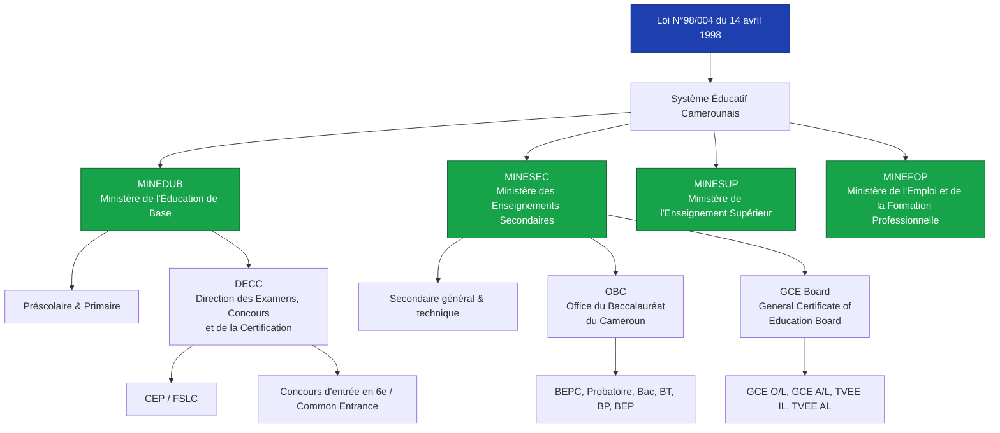

### 🎯 Vue comparative globale

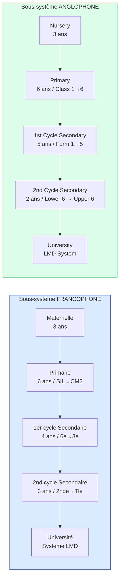

> ⚠️ **Note importante** : Bien que la loi de 1998 prévoyait l'harmonisation des durées (cycle 5+2), seul le sous-système anglophone applique cette structure. Le francophone reste à 4+3.

---

## 2. Le sous-système francophone

### 2.1 Structure détaillée des cycles et classes d'examen

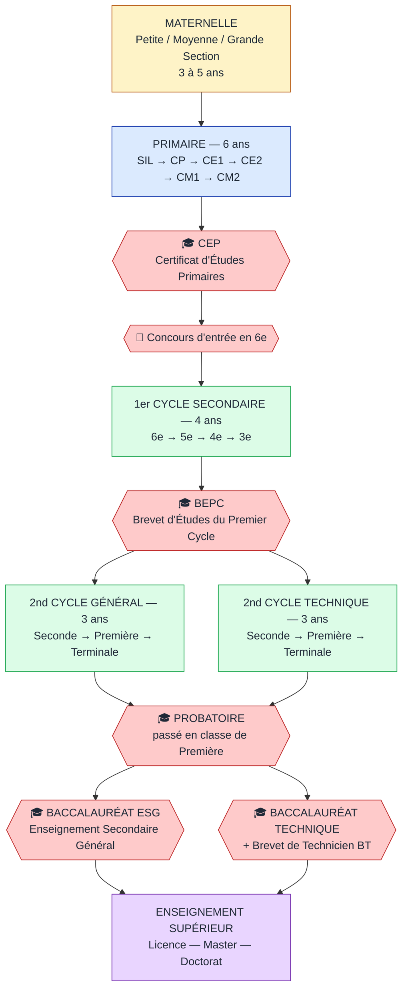

### 2.2 Les classes d'examen et diplômes

| Niveau | Classe | Diplôme / Concours | Organisme | Âge moyen |
|--------|--------|-------------------|-----------|-----------|
| Primaire | CM2 | **CEP** + Concours d'entrée en 6e | MINEDUB / DECC | 11-12 ans |
| 1er cycle | 3e | **BEPC** ou BEPC bilingue | MINESEC / DECC | 15-16 ans |
| 1er cycle technique | 3e | **CAP** (Industriel ou STT) | MINESEC / DECC | 15-16 ans |
| 2nd cycle | 1ère | **Probatoire** ESG / Technique | OBC | 17-18 ans |
| 2nd cycle | Terminale | **Baccalauréat** ESG / Technique / **BT** | OBC | 18-19 ans |

### 2.3 Les séries du Baccalauréat ESG (Enseignement Secondaire Général)

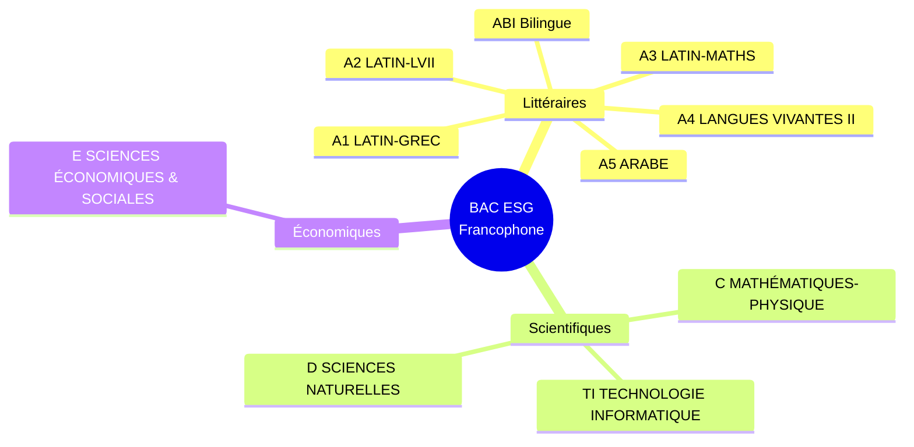

### 2.4 Les filières du Baccalauréat Technique

| Code | Filière |
|------|---------|
| **F1** | Construction mécanique |
| **F2** | Électronique |
| **F3** | Électrotechnique |
| **F4** | Génie civil |
| **F5** | Chimie |
| **G1** | Techniques administratives |
| **G2** | Techniques quantitatives de gestion |
| **G3** | Techniques commerciales |
| **AAT** | Action et Administration Touristique |
| **MAVA, MECA, MEAC AUTO, MEM** | Mécanique automobile et associée |
| **IH / ESF** | Industrie hôtelière / Économie sociale et familiale |

### 2.5 Coefficients indicatifs des matières principales (Bac ESG)

| Matière | Série A | Série C | Série D | Série E | Série TI |
|---------|:-------:|:-------:|:-------:|:-------:|:--------:|
| Français | 4 | 3 | 3 | 4 | 3 |
| Philosophie | 4 | 2 | 2 | 3 | 2 |
| Mathématiques | 2 | **6** | 4 | 5 | 5 |
| Physique | 2 | **5** | 4 | 2 | 5 |
| SVT (Sc. Naturelles) | 2 | 2 | **5** | 2 | 2 |
| Histoire-Géographie | 4 | 2 | 2 | 4 | 2 |
| LV1 (Anglais) | 3 | 2 | 2 | 3 | 2 |
| LV2 | 3 | 0 | 0 | 2 | 0 |
| Sc. économiques | 0 | 0 | 0 | **5** | 0 |
| Informatique | 0 | 0 | 0 | 0 | **6** |

> *Source : OBC — les coefficients varient légèrement selon la spécialité de la série. À titre indicatif.*

---

## 3. Le sous-système anglophone

### 3.1 Structure détaillée

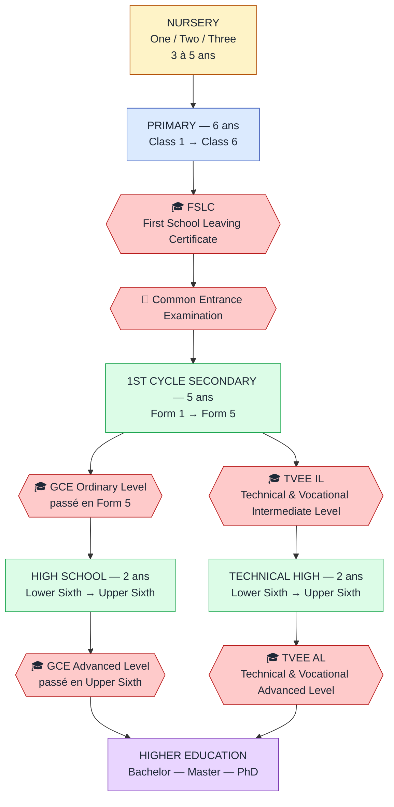

### 3.2 Particularités du système anglophone

- **Pas d'examen intermédiaire type Probatoire** entre le GCE O/L et le GCE A/L.
- Système **par matière** (subject-based) : un candidat est admis matière par matière (« passes »), contrairement au système francophone qui exige une moyenne globale.
- **Minimum requis pour l'enseignement supérieur** : 2 « passes » au GCE A/L et 4 « passes » au GCE O/L.
- Le Cameroun GCE Board, créé en **1993** avec siège à **Buea**, a hérité du système britannique après la « camerounisation » du GCE de Londres en 1977.

### 3.3 Filières au GCE A/L

```mermaid
graph TD
    A[GCE Advanced Level] --> B[Arts Stream]
    A --> C[Science Stream]
    A --> D[Commercial / Economics]
    A --> E[Technical TVEE AL]

    B --> B1[Literature in English]
    B --> B2[History]
    B --> B3[Geography]
    B --> B4[Religion]
    B --> B5[French / Other Languages]
    B --> B6[Philosophy]

    C --> C1[Pure Mathematics]
    C --> C2[Further Mathematics]
    C --> C3[Physics]
    C --> C4[Chemistry]
    C --> C5[Biology]
    C --> C6[Computer Science]

    D --> D1[Economics]
    D --> D2[Accounting]
    D --> D3[Business Mathematics]
    D --> D4[Commerce]

    E --> E1[Engineering trades]
    E --> E2[Industrial trades]
    E --> E3[Commercial trades]

    style A fill:#1e40af,stroke:#0c1e6e,color:#fff
```

### 3.4 Système de notation GCE

| Note | Lettre | Points A/L |
|------|:------:|:----------:|
| Excellent | **A** | 5 |
| Très bien | **B** | 4 |
| Bien | **C** | 3 |
| Passable | **D** | 2 |
| Limite | **E** | 1 |
| Échec | **U** (Unclassified / Ungraded) | 0 |

> Au GCE O/L, seules les notes **A, B, C** constituent un « pass » ; D et E sont parfois acceptés selon les filières. **5 points par sujet maximum au A/L**, soit **25 points pour 5 matières**.

---

## 4. Approches pédagogiques d'enseignement

### 4.1 L'Approche Par Compétences (APC) — la réforme de référence

Depuis l'année scolaire **2012-2013**, le MINESEC a introduit l'**Approche Par les Compétences avec entrée par les Situations de Vie (APC/ESV)** dans les programmes scolaires. Cette réforme est issue de la déclaration mondiale sur l'Éducation pour Tous (Jomtien, 1990).

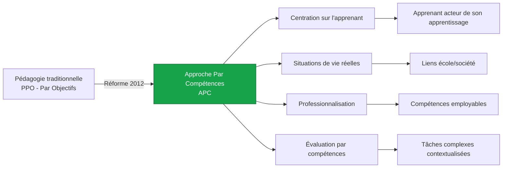

### 4.2 Trois approches en superposition selon les niveaux

| Niveau | Approche dominante | Caractéristiques |
|--------|--------------------|------------------|
| **Maternelle / Primaire** | **NPA** (Nouvelle Pédagogie d'Apprentissage) puis APC | Activités concrètes, observation, langage |
| **Secondaire 1er cycle** | **APC/ESV** (généralisée) | Situations-problèmes, travail de groupe |
| **Secondaire 2nd cycle** | **APC** en cours d'extension + PPO résiduelle | Plus académique, préparation aux examens |
| **Supérieur** | **APC** + LMD (Bologne) | Crédits, professionnalisation |

### 4.3 Composantes pédagogiques transversales

**Méthodes d'enseignement courantes :**

- 🧑‍🏫 **Cours magistral** (encore très présent au secondaire 2nd cycle et au supérieur)
- 👥 **Travaux de groupe** et apprentissage coopératif (encouragés par l'APC)
- 🔬 **Travaux pratiques** (TP) en laboratoire pour les séries scientifiques
- 📝 **Évaluations séquentielles** : 6 séquences par an, espacées de 6 semaines
- 🏠 **Devoirs surveillés** et compositions trimestrielles
- 📖 **Lectures dirigées** et exposés (surtout en littérature et SES)

### 4.4 Critiques et difficultés d'application de l'APC

D'après plusieurs travaux universitaires (Daouaga Samari, Dzounesse Tayim) :

- ⚠️ **Insuffisante préparation des enseignants** à la nouvelle approche
- ⚠️ **Manque de matériel didactique** adapté
- ⚠️ **Surcharge des effectifs** (souvent 80 à 120 élèves par classe en zone urbaine)
- ⚠️ **Décalage** entre programmes APC et examens à dominante restitutive
- ⚠️ **Pression hiérarchique** poussant les enseignants à des stratégies « informelles » d'adaptation

### 4.5 Enseignement bilingue

Le **bilinguisme** est une politique nationale : depuis 2014, l'enseignement de la deuxième langue officielle (français pour les anglophones, anglais pour les francophones) est obligatoire dans les deux sous-systèmes. Les **séries ABI** (Bilingue) et le **BEPC bilingue** ont été créés pour valoriser ce parcours.

---

## 5. Performances et résultats par sous-système

### 5.1 Comparatif d'efficacité interne (achèvement du primaire)

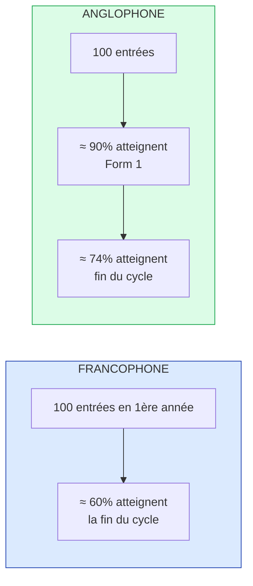

> *Source : WATHI / analyses sur la situation de l'éducation au Cameroun.*
> Le sous-système anglophone est historiquement perçu comme **plus rigoureux** et **plus efficient** en termes d'achèvement du parcours.

### 5.2 Réputations comparées

| Critère | Francophone | Anglophone |
|---------|:-----------:|:----------:|
| Densité du programme | ⬆️ Plus chargé (LV2 obligatoires : allemand, espagnol) | ⬇️ Plus léger |
| Rigueur évaluative perçue | ⬇️ Délibérations souvent souples | ⬆️ Évaluation par matière, plus stricte |
| EPS aux examens | ❌ Non obligatoire | ✅ Obligatoire (TVEE) |
| Taux d'achèvement primaire | ≈ 60 % | ≈ 74 % |
| Couverture territoriale | 8 régions | 2 régions (NW, SW) |
| Crédibilité internationale | ⬆️ Reconnue (espace francophone) | ⬆️⬆️ Reconnue (Commonwealth) |

---

## 6. Statistiques sur les 5 dernières années (2020-2025)

### 6.1 Baccalauréat ESG (francophone) — Évolution du taux de réussite national

| Session | Candidats | Admis | Taux de réussite | Variation |
|:-------:|:---------:|:-----:|:----------------:|:---------:|
| 2020 | n.d. complet | n.d. | ≈ 49,3 % | — |
| **2021** | n.d. | n.d. | **73,54 %** | 🔼 |
| **2022** | n.d. | n.d. | **65,94 %** (ou 66,27 %) | 🔽 |
| **2023** | ≈ 130 000 | ≈ 98 460 | **75,73 %** *(record historique)* | 🔼🔼 |
| **2024** | 132 920 | 49 521 | **37,26 %** *(plus bas depuis 2004)* | 🔻🔻🔻 |
| **2025** | 143 299 | 67 990 | **47,4 %** | 🔼 |

> *Sources : Office du Baccalauréat du Cameroun (OBC), Journal du Cameroun, 237Actu, Cameroon Tribune.*

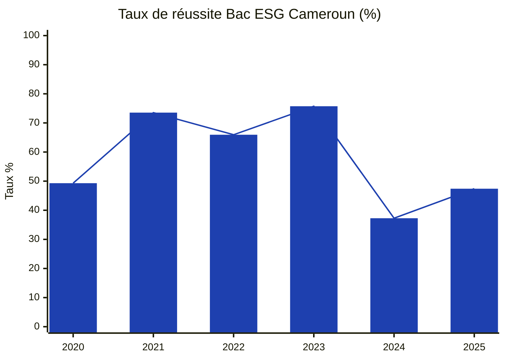

### 6.2 Bac 2024 — Performance par région (chute généralisée)

| Région | 2023 | 2024 | Écart |
|--------|:----:|:----:|:-----:|
| Nord-Ouest | 84,08 % | **46,09 %** | -38,0 |
| Littoral | 78,47 % | **45,98 %** | -32,5 |
| Ouest | 80,34 % | **44,75 %** | -35,6 |
| Sud-Ouest | 78,50 % | **40,62 %** | -37,9 |
| Centre | 80,14 % | **39,38 %** | -40,8 |
| Adamaoua | 66,00 % | **30,03 %** | -36,0 |
| Est | 71,29 % | **28,06 %** | -43,2 |
| Sud | 69,89 % | **26,49 %** | -43,4 |
| Extrême-Nord | 57,92 % | **20,91 %** | -37,0 |
| Nord | 68,95 % | **19,99 %** | -49,0 |

> *Source : Journal du Cameroun, juillet 2024.*

### 6.3 Bac 2024 — Performance par série (chiffres officiels OBC)

| Position | Série | Taux de réussite 2024 | Type |
|:--------:|:-----:|:---------------------:|:----:|
| 🥇 1ère | **E** (Sciences économiques & sociales) | **71,74 %** | Économique |
| 🥈 2e | **C** (Maths-Physique) | **52,56 %** | Scientifique |
| 🥉 3e | **D** (Sciences naturelles) | **48,90 %** | Scientifique |
| 4e | **TI** (Technologie Informatique) | **37,12 %** | Scientifique |
| 5e | **A4 Espagnol** | **6,90 %** | Littéraire |
| 6e | **A4 Allemand** | **6,35 %** | Littéraire |

> *Sources : OBC, YOP L-Frii, CamerounWeb, SavaneInspire — session 2024.*
> Les séries littéraires A4 Espagnol et A4 Allemand ferment systématiquement le classement.

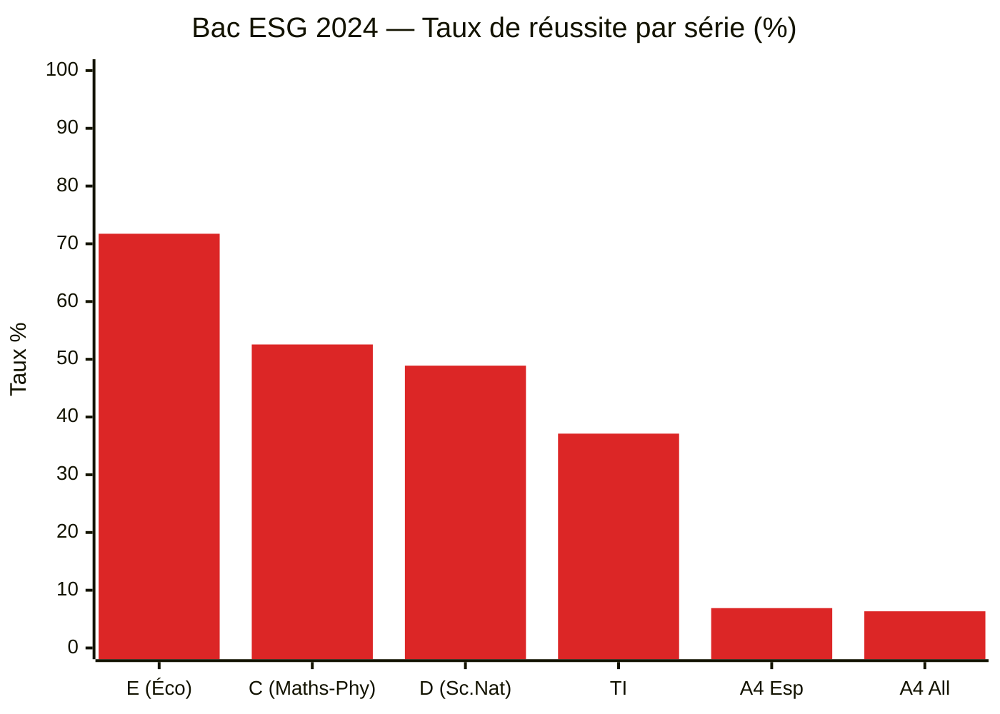

### 6.4 GCE Board (anglophone) — Taux de réussite

| Session | GCE A/L Général | GCE A/L Technique | GCE O/L Général | GCE O/L Technique | Taux global |
|:-------:|:---------------:|:-----------------:|:---------------:|:-----------------:|:-----------:|
| 2022 | n.d. | n.d. | n.d. | n.d. | ≈ 60,8 % |
| **2023** | **78,36 %** | **89,34 %** | **62,15 %** | **67,34 %** | **74,24 %** |
| **2024** | n.d. complet | n.d. | n.d. | n.d. | n.d. |
| **2025** | publié 1er août | publié 1er août | publié 1er août | publié 1er août | n.d. |

> *Sources : GCE Board (camgceb.org), Journal du Cameroun (English), Lebledparle.*
> Note : le sous-système anglophone affiche traditionnellement des **taux supérieurs**, en particulier au A/L Technique (~ 89 %).

### 6.5 BEPC — Évolution récente (Région de l'Ouest, exemple)

| Session | BEPC ordinaire | BEPC bilingue | CAP STT | CAP Industriel |
|:-------:|:--------------:|:-------------:|:-------:|:--------------:|
| 2022 | n.d. | n.d. | n.d. | n.d. |
| 2023 | 46,28 % (Littoral) | n.d. | n.d. | n.d. |
| 2024 | 61,26 % (Ouest) | 83,78 % | 67,17 % | 88,54 % |
| **2025** | **68,19 %** (Ouest) | **89,39 %** | **75,23 %** | **90,07 %** |

> *Source : Journal du Cameroun (juillet 2025) — exemple Région de l'Ouest.*
> Au niveau national, le BEPC 2023 a totalisé **210 576 candidats** (207 266 ordinaire + 3 310 bilingue) selon la DECC/MINESEC.

### 6.6 Probatoire — Volumétrie

| Session | Candidats nationaux |
|:-------:|:-------------------:|
| **2024** | **174 260** (épreuves écrites, 536 sous-centres) |

> *Source : ActuCameroun, juillet 2024.*

### 6.7 Le « cimetière » des mathématiques — performances par matière (Bac ESG)

| Matière / Série | 2021 | 2022 | 2023 |
|-----------------|:----:|:----:|:----:|
| **Maths Série A** | 6 % | 6 % | **7 %** |
| **Maths Série ABI** | 16 % | 16 % | **21,01 %** |
| **Maths Bac Tech Industriel** | 6 % | 10 % | **0,97 %** |
| **Maths appliquées AAT** | 0 % | n.d. | **0 %** |
| **Maths appliquées série RB** | 0 % | 0 % | **0 %** |

---

### 6.8 📊 Répartition par sous-système et par série sur 5 ans

#### 6.8.1 Volumétrie comparée Francophone vs Anglophone (Bac / GCE A-L)

Le sous-système francophone domine très largement en volumétrie : il représente environ **75 à 80 %** des candidats nationaux, conformément à la répartition territoriale (8 régions francophones contre 2 anglophones).

```mermaid
%%{init: {"theme":"base"}}%%
xychart-beta
    title "Candidats inscrits — Bac ESG (FR) vs GCE A/L (EN) sur 5 ans"
    x-axis ["2021", "2022", "2023", "2024", "2025"]
    y-axis "Nombre de candidats" 0 --> 160000
    bar [115000, 120000, 130000, 133868, 144383]
    bar [29000, 30000, 31000, 32000, 33000]
```

> 🔵 **Barres bleues hautes** : Bac ESG francophone | 🟢 **Barres vertes** : GCE A/L anglophone (estimations basées sur les données GCE Board ; certains chiffres exacts ne sont pas tous publiés annuellement).

#### 6.8.2 Taux de réussite comparés Francophone vs Anglophone

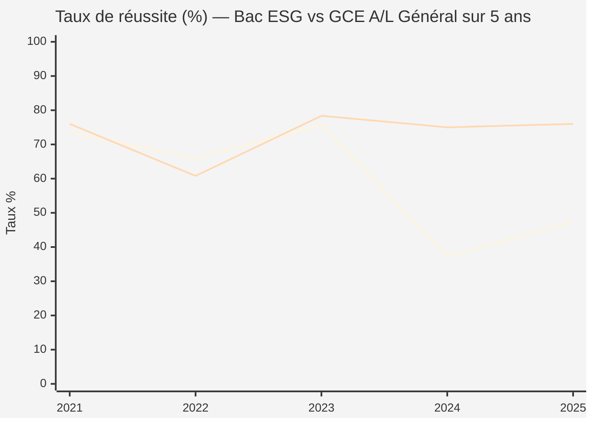

> 🔵 **Courbe basse en 2024** : Bac ESG francophone (chute brutale liée au seuil 10/20)
> 🟢 **Courbe stable** : GCE A/L Général anglophone (système par matière, plus stable)

**Lecture :** le sous-système anglophone affiche une **stabilité remarquable** (toujours au-dessus de 70 % au A/L Général), tandis que le francophone est très sensible aux variations des règles de délibération.

#### 6.8.3 Évolution des taux de réussite par série au Bac ESG (2021-2024)

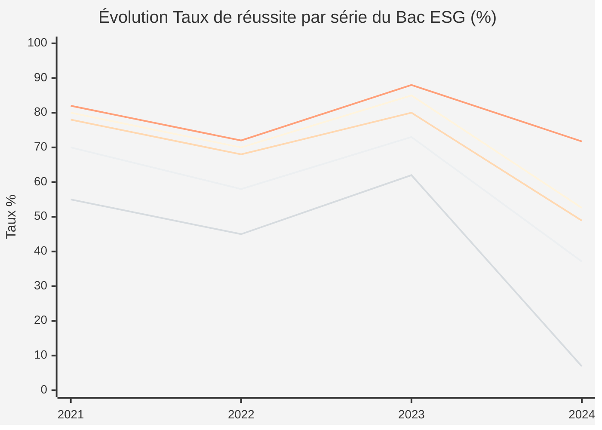

> 🟦 **C** (Maths-Physique) — 🟩 **D** (Sciences naturelles) — 🟧 **E** (Économique) — 🟪 **TI** — 🟥 **A4 Espagnol**
> *Les valeurs 2021-2023 sont des estimations indicatives reconstituées (les détails par série ne sont pas tous publiés annuellement par l'OBC) ; les valeurs 2024 sont officielles.*

#### 6.8.4 Répartition des candidats par série au Bac ESG (session 2024)

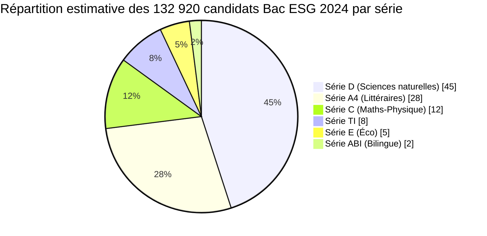

> ⚠️ **Lecture :** la **série D** (Sciences naturelles) attire à elle seule près de **45 %** des candidats, suivie des séries littéraires A4 (~28 %). La série C (élite scientifique) reste minoritaire (~12 %) malgré ses excellents taux de réussite. Ces proportions sont des estimations consolidées à partir des publications de l'OBC ; les pourcentages exacts varient légèrement chaque année.

#### 6.8.5 Sous-système anglophone — Répartition GCE par filière (2023)

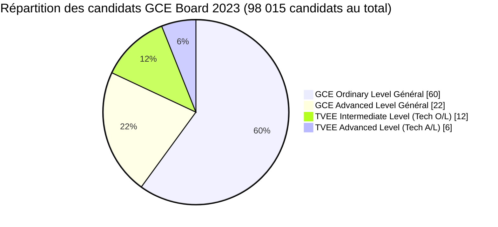

> *Source : GCE Board / Lebledparle — session 2023.*
> La majorité des candidats anglophones se concentre au **GCE O/L** (fin du 1er cycle), reflet de la pyramide scolaire classique.

#### 6.8.6 Tableau comparatif synthétique : 5 ans, 2 sous-systèmes, séries-clés

| Année | Bac ESG (FR) — Global | Bac C (FR) | Bac D (FR) | Bac E (FR) | Bac A4 (FR) | GCE A/L Gén. (EN) | GCE A/L Tech. (EN) | GCE O/L Gén. (EN) |
|:-----:|:---------------------:|:----------:|:----------:|:----------:|:-----------:|:-----------------:|:------------------:|:-----------------:|
| 2021 | 73,54 % | ~80 % | ~78 % | ~82 % | ~55 % | ~76 % | ~85 % | ~58 % |
| 2022 | 65,94 % | ~70 % | ~68 % | ~72 % | ~45 % | ~60,8 % | ~78 % | ~52 % |
| **2023** | **75,73 %** | ~85 % | ~80 % | ~88 % | ~62 % | **78,36 %** | **89,34 %** | **62,15 %** |
| **2024** | **37,26 %** | **52,56 %** | **48,90 %** | **71,74 %** | **6,90 %** *(esp)* | n.d. | n.d. | n.d. |
| **2025** | **47,4 %** | n.d. | n.d. | n.d. | n.d. | n.d. | n.d. | n.d. |

> ⚠️ Les valeurs marquées en gras sont issues des communiqués officiels (OBC, GCE Board, presse spécialisée). Les autres sont des estimations reconstituées à partir des tendances historiques publiées et peuvent varier légèrement de la source primaire.

#### 6.8.7 🎯 Lecture et enseignements

- 📈 **Inertie anglophone** : le GCE Board affiche des taux beaucoup plus stables d'année en année grâce à son système d'évaluation **par matière** (subject-based), peu sensible aux variations administratives des seuils.
- 📉 **Volatilité francophone** : le Bac ESG est très sensible aux décisions des jurys (note-seuil de délibération) et a connu en **2024 un effondrement historique de -38 points**.
- 🧪 **Hégémonie scientifique** : les séries C, D et E captent les meilleurs taux mais aussi les coefficients les plus élevés et les débouchés universitaires les plus prestigieux (médecine, polytechnique, ENS).
- 📚 **Précarité littéraire** : les séries A4 (Espagnol/Allemand) cumulent faiblesse en mathématiques et taux de réussite extrêmement bas — un signal fort sur l'orientation scolaire.
- 🔄 **Dualité confirmée** : les deux sous-systèmes coexistent durablement avec des dynamiques propres ; aucune harmonisation effective n'est intervenue depuis la loi de 1998.

---

### 6.9 📚 Récapitulatif détaillé : tous les examens × sous-système × série

Cette section consolide les données disponibles pour **chaque examen national** en rapprochant les statistiques officielles sur 5 ans (lorsque publiées).

---

#### 6.9.1 🇫🇷 Sous-système FRANCOPHONE — examens et résultats

##### A) CEP & Concours d'entrée en 6e (fin du primaire)

| Examen | Organisateur | Classe | Matières | Statut |
|--------|--------------|:------:|:--------:|:------:|
| **CEP** (Certificat d'Études Primaires) | MINEDUB / DECC | CM2 | 12 matières obligatoires (en français + anglais) | Obligatoire |
| **Concours d'entrée en 6e** | MINEDUB / DECC | CM2 | Maths, français, dictée | Sélectif |

> Le CEP certifie l'achèvement du primaire ; le Concours d'entrée en 6e conditionne l'admission en lycée public. Source : UNESCO-UIS, MINEDUB.

##### B) BEPC, BEPC bilingue, CAP — fin du 1er cycle

**📊 Évolution des taux de réussite nationaux (2020-2025) :**

| Examen | 2020 | 2021 | 2022 | 2023 | 2024 | 2025 |
|--------|:----:|:----:|:----:|:----:|:----:|:----:|
| **BEPC ordinaire** | 60,86 % | n.d. | n.d. | ~50 % | **59,10 %** | **65,58 %** |
| **BEPC bilingue** | n.d. | n.d. | n.d. | n.d. | **75,90 %** | **85,57 %** |
| **CAP Industriel** | n.d. | n.d. | n.d. | n.d. | **84,70 %** | **86,88 %** |
| **CAP STT** | n.d. | n.d. | n.d. | n.d. | **62,69 %** | **68,10 %** |
| **Taux global BEPC+CAP** | n.d. | n.d. | n.d. | n.d. | n.d. | **69,54 %** |

> *Sources : DECC/MINESEC, Journal du Cameroun (juillet 2025), Serge Betsen Academy (2020).*

```mermaid
%%{init: {"theme":"base"}}%%
xychart-beta
    title "BEPC & CAP — Évolution 2024 vs 2025 (%)"
    x-axis ["BEPC ord.", "BEPC bil.", "CAP Ind.", "CAP STT"]
    y-axis "Taux %" 0 --> 100
    bar [59.10, 75.90, 84.70, 62.69]
    bar [65.58, 85.57, 86.88, 68.10]
```

> 🟦 2024 (barres basses) — 🟩 2025 (barres hautes) : **tous les examens du 1er cycle francophone progressent en 2025**.

**📊 Volumétrie BEPC 2023 :** 210 576 candidats dont 207 266 BEPC ordinaire + 3 310 BEPC bilingue *(source : DECC/MINESEC)*.

##### C) Probatoire ESG, Probatoire Technique — passé en Première

| Session | Probatoire ESG | Probatoire Technique | Volumétrie |
|:-------:|:--------------:|:--------------------:|:----------:|
| 2021 | n.d. | n.d. | n.d. |
| **2022** | **42,90 %** | n.d. | n.d. |
| **2023** | **55,7 %** *(+12,8 pts)* | n.d. | n.d. |
| **2024** | n.d. (publié 29 juillet) | n.d. | **174 260 candidats** *(536 sous-centres)* |
| 2025 | n.d. | n.d. | n.d. |

> *Sources : DataCameroon (août 2023), ActuCameroun (juillet 2024), Lebledparle.*
> Le Probatoire est un **examen-charnière** : sans son obtention, l'élève ne peut accéder à la Terminale, donc au Baccalauréat.

##### D) Baccalauréat ESG, Bac Technique, BT — fin du 2nd cycle

**📊 Bac ESG général — Évolution sur 5 ans :**

| Session | Inscrits | Présents | Admis | Taux |
|:-------:|:--------:|:--------:|:-----:|:----:|
| 2020 | n.d. | n.d. | n.d. | ~49,3 % |
| 2021 | n.d. | n.d. | n.d. | **73,54 %** |
| 2022 | n.d. | n.d. | n.d. | **65,94 %** |
| 2023 | ~130 000 | n.d. | ~98 460 | **75,73 %** *(record)* |
| **2024** | **133 868** | **132 920** | **49 521** | **37,26 %** *(plus bas en 20 ans)* |
| **2025** | **144 383** | **143 299** | **67 990** | **47,4 %** |

**📊 Bac ESG 2024 — Détail par série (chiffres officiels OBC) :**

| Série | Type | Taux 2024 | Tendance |
|:-----:|:----:|:---------:|:--------:|
| **E** | Sciences éco. & sociales | **71,74 %** | 🥇 |
| **C** | Mathématiques-Physique | **52,56 %** | 🥈 |
| **D** | Sciences naturelles | **48,90 %** | 🥉 |
| **TI** | Technologie informatique | **37,12 %** | 4e |
| **A4 Espagnol** | Littéraire | **6,90 %** | 5e |
| **A4 Allemand** | Littéraire | **6,35 %** | 6e |

**📊 Baccalauréat Technique + BT :**

| Session | Bac Technique + BT | Source |
|:-------:|:------------------:|:------:|
| 2024 | ≈ **55,53 %** | Kamerpower |
| 2025 | n.d. complet | OBC, juillet 2025 |

> *Sources : OBC, esbimedia, YOP L-Frii, Kamerpower.*

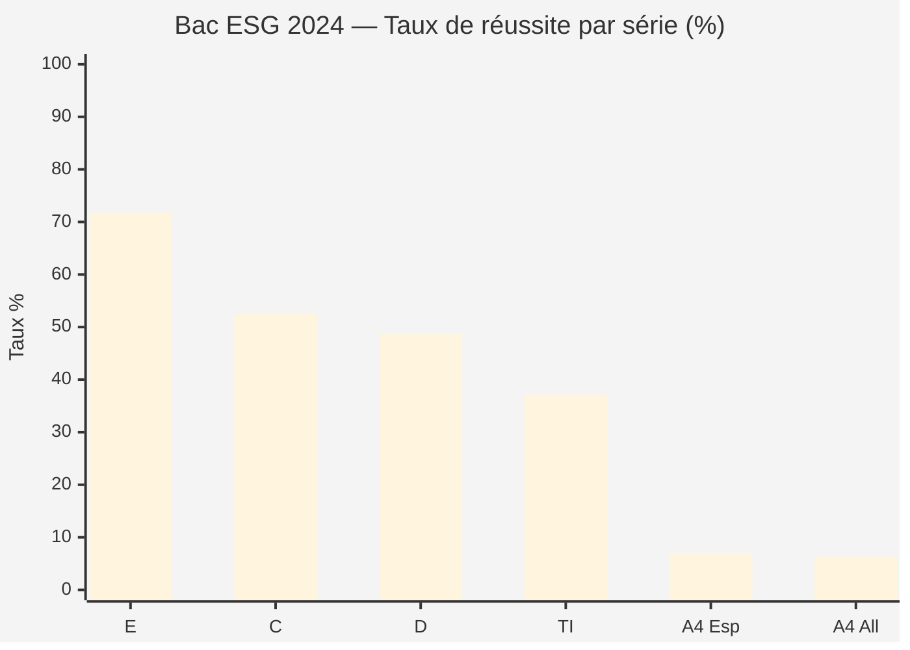

---

#### 6.9.2 🇬🇧 Sous-système ANGLOPHONE — examens et résultats

##### A) FSLC & Common Entrance (fin du primaire)

| Examen | Organisateur | Classe | Équivalent francophone |
|--------|--------------|:------:|:----------------------:|
| **FSLC** (First School Leaving Certificate) | MINEDUB / DECC | Class 6 | CEP |
| **Common Entrance** | MINEDUB / DECC | Class 6 | Concours d'entrée en 6e |

##### B) GCE Ordinary Level + TVEE Intermediate (fin Form 5)

**📊 Évolution des taux de réussite GCE O/L (2021-2025) :**

| Session | GCE O/L Général | GCE O/L Technique (TVEE IL) | Taux global GCE Board |
|:-------:|:---------------:|:----------------------------:|:---------------------:|
| 2021 | ~58 % | ~62 % | ~60 % |
| 2022 | ~52 % | ~58 % | **60,8 %** |
| **2023** | **62,15 %** | **67,34 %** | **74,24 %** |
| **2024** | **25,29 %** ⚠️ *(chute brutale)* | n.d. | n.d. global |
| **2025** | publié août 2025 | publié août 2025 | n.d. |

> *Sources : GCE Board (camgceb.org), Lebledparle, Kamerpower, Journal du Cameroun.*
> Comme côté francophone, **le GCE O/L Général a chuté drastiquement en 2024** (de 58,2 % à 25,29 % selon Kamerpower), reflet du durcissement disciplinaire généralisé.

##### C) GCE Advanced Level + TVEE Advanced (fin Upper Sixth)

**📊 Évolution des taux de réussite GCE A/L (2021-2025) :**

| Session | GCE A/L Général | GCE A/L Technique (TVEE AL) | Performances notables |
|:-------:|:---------------:|:----------------------------:|:---------------------:|
| 2021 | ~76 % | ~85 % | — |
| 2022 | ~70 % | ~80 % | — |
| **2023** | **78,36 %** | **89,34 %** | 37 candidats avec 25 points (5×A) |
| **2024** | n.d. complet | n.d. | **27 candidats avec 25 points (5×A)** |
| **2025** | publié août 2025 | publié août 2025 | n.d. |

> *Sources : Journal du Cameroun (English), Lebledparle, EspaceTutos, GCE Board.*

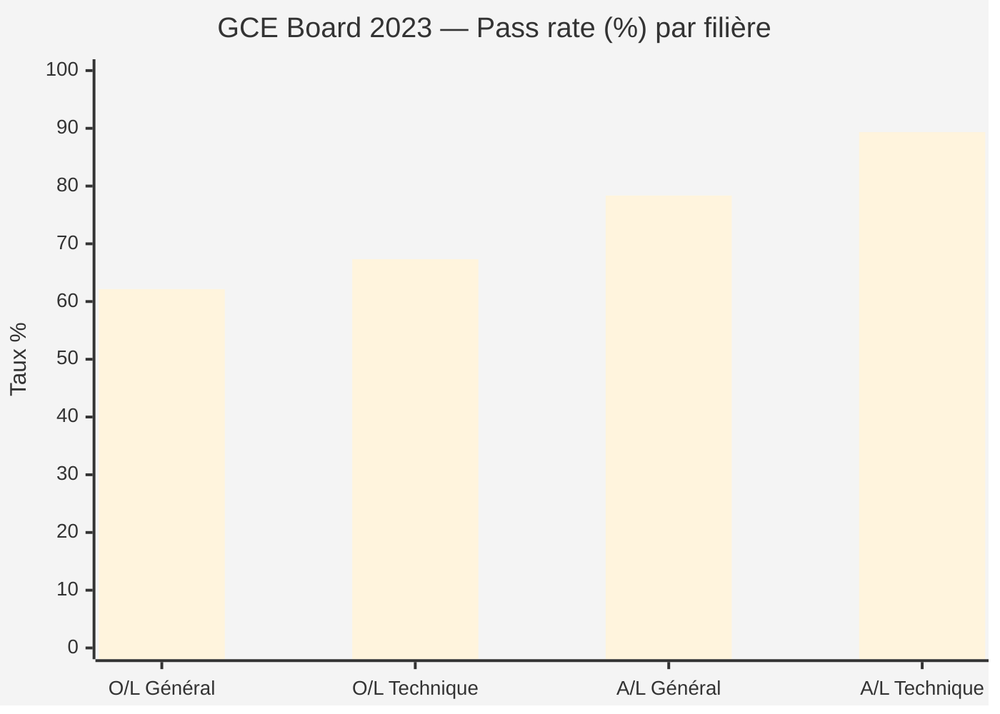

> 📊 **Lecture :** au GCE Board, **plus on monte dans le cursus, plus le taux augmente** — pyramide de sélection inverse. Le **A/L Technique culmine à ~89 %**, performance la plus élevée de tout le système éducatif camerounais.

##### D) Volumétrie GCE Board

| Session | Total candidats GCE | Détail |
|:-------:|:-------------------:|:------:|
| 2015/16 | ≈ 182 416 | 138 000 O/L + 46 000 A/L *(données historiques)* |
| 2023 | **98 015** | toutes filières confondues |
| 2024 | n.d. | — |
| 2025 | n.d. | publié 1er août 2025 |

> *Source : GCE Board, Lebledparle, ResearchKey.*

---

#### 6.9.3 🌐 Tableau de synthèse global — tous examens, tous sous-systèmes

| 🎯 Examen | 🌍 Sous-système | 📚 Niveau | 🏛️ Organisateur | 📊 Taux récent | 📅 Année |
|-----------|:---------------:|:---------:|:---------------:|:--------------:|:--------:|
| **CEP** | Francophone | Primaire (CM2) | MINEDUB/DECC | Variable régional | 2024 |
| **Concours 6e** | Francophone | Primaire (CM2) | MINEDUB/DECC | Sélectif | 2024 |
| **FSLC** | Anglophone | Primary (Class 6) | MINEDUB/DECC | n.d. | — |
| **Common Entrance** | Anglophone | Primary (Class 6) | MINEDUB/DECC | n.d. | — |
| **BEPC ordinaire** | Francophone | 1er cycle (3e) | MINESEC/DECC | **65,58 %** | 2025 |
| **BEPC bilingue** | Francophone | 1er cycle (3e) | MINESEC/DECC | **85,57 %** | 2025 |
| **CAP Industriel** | Francophone | 1er cycle tech. | MINESEC/DECC | **86,88 %** | 2025 |
| **CAP STT** | Francophone | 1er cycle tech. | MINESEC/DECC | **68,10 %** | 2025 |
| **GCE Ordinary Level** | Anglophone | Form 5 | GCE Board | **62,15 %** *(2023)* / 25,29 % *(2024)* | — |
| **TVEE Intermediate** | Anglophone | Form 5 tech. | GCE Board | **67,34 %** | 2023 |
| **Probatoire ESG** | Francophone | Première | OBC | **55,7 %** | 2023 |
| **Probatoire Technique** | Francophone | Première | OBC | n.d. | — |
| **Baccalauréat ESG** | Francophone | Terminale | OBC | **47,4 %** | 2025 |
| **Bac Technique + BT** | Francophone | Terminale | OBC | **≈ 55,53 %** | 2024 |
| **GCE Advanced Level** | Anglophone | Upper Sixth | GCE Board | **78,36 %** | 2023 |
| **TVEE Advanced** | Anglophone | Upper Sixth tech. | GCE Board | **89,34 %** | 2023 |

> ⚠️ Les chiffres officiels exhaustifs ne sont pas tous publiés annuellement par les deux Boards. Les valeurs en gras correspondent aux dernières données vérifiées.

---

#### 6.9.4 📈 Comparaison « passage en classe d'examen » sur 5 ans

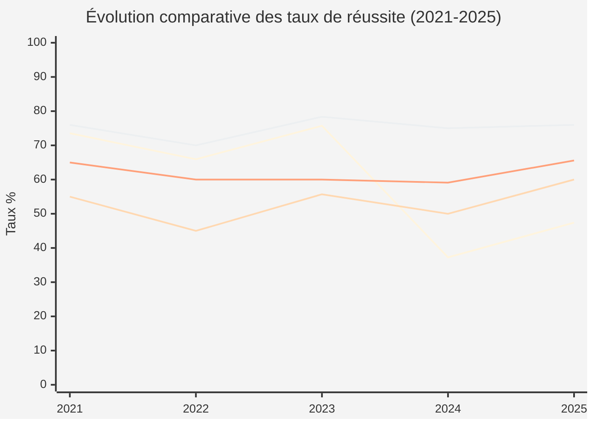

> 🟦 **Bac ESG** (volatilité maximale) | 🟩 **Probatoire ESG** | 🟧 **BEPC ordinaire** | 🟪 **GCE A/L Général** (le plus stable)
> *Les valeurs Probatoire 2024-2025 et GCE 2024-2025 sont des estimations en l'absence de publications complètes.*

#### 6.9.5 🎯 Conclusions analytiques par examen

| Examen | Observation-clé sur 5 ans |
|--------|---------------------------|
| **CEP / FSLC** | Examens stables, peu commentés mais déterminants pour la sélection |
| **Concours 6e / Common Entrance** | Forte sélectivité — détermine accès au lycée public |
| **BEPC** | Croissance continue depuis 2024 ; bilingue toujours nettement supérieur (+20 pts) |
| **CAP** | Très bons taux (>85 %) ; reflet d'un enseignement technique en consolidation |
| **Probatoire ESG** | Hausse historique 2022→2023 (+12,8 pts), stagnation depuis |
| **Bac ESG** | **Examen le plus instable** : oscille entre 37 % et 76 % selon les politiques OBC |
| **Bac Technique / BT** | Performance moyenne mais sous-documentée publiquement |
| **GCE O/L** | Stabilité historique mais chute brutale en 2024 (alignement disciplinaire ?) |
| **GCE A/L** | **Le plus stable et performant** ; A/L Technique culmine à 89 % |


## 7. Règles aux examens officiels

### 7.1 Conditions d'admission renforcées (réforme 2024-2025)

Une communication conjointe **OBC / DECC** durcit les critères :

- 📌 **Moyenne minimale de 10/20** désormais exigée pour l'admission au BEPC, Probatoire, Baccalauréat et examens similaires.
- 📌 Les classes intermédiaires sont également concernées : **passage en classe supérieure conditionné à 10/20**.
- 📌 Fin de la « clémence des jurys » qui permettait de repêcher des candidats sous la moyenne (politique appelée « politique de promotion d'un grand nombre »).
- 📌 Cette réforme explique en grande partie la **chute brutale du Bac 2024** (37,26 %) après le record de 2023 (75,73 %).

> *Source : Journal du Cameroun, février 2025 ; Le Jour ; Le360 Afrique.*

### 7.2 Acteurs et instances de contrôle

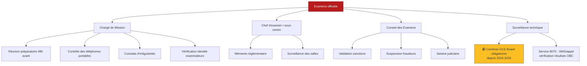

### 7.3 Typologie des fraudes et sanctions

#### 🚫 Côté candidats

| Fraude | Sanction type |
|--------|---------------|
| Détention de documents non autorisés | Annulation de la session en cours |
| Substitution de candidat | Annulation + suspension 2 à 3 ans |
| Communication entre candidats | Annulation de la session |
| Téléphone portable en salle | Annulation immédiate |
| Fraude organisée / fuite de sujets | Suspension jusqu'à **2028** + poursuites pénales |
| Falsification de documents | Annulation + poursuites judiciaires |

#### 🚫 Côté examinateurs / enseignants

| Faute professionnelle | Sanction type |
|------------------------|---------------|
| Substitution de surveillant | Suspension + retrait des indemnités |
| Complicité de fraude | Suspension pluriannuelle + poursuite |
| Vente de sujets | Sanction administrative + judiciaire |
| Manquements aux consignes | Demande d'explication + rapport |

> **Bilan 2025** : par décision du 25 novembre 2025, la Ministre des Enseignements Secondaires a sanctionné **255 personnes** au total : **208 candidats** et **47 enseignants** pour fraudes au Bac ESG, Probatoire ESG, Probatoire Technique Industriel et BT Industriel.
>
> *Source : Cameroon Tribune ; StopBlaBlaCam, novembre 2025.*

### 7.4 Mesures anti-fraude récentes (2024-2026)

- 📹 **Caméras de surveillance obligatoires** dans tous les centres GCE Board depuis 2024 ; renforcé en 2026 avec homologation conditionnée à leur présence.
- 📵 **Interdiction stricte du téléphone portable** dans les salles d'examen.
- 🔄 **Numérisation progressive** : enregistrement automatisé des notes après corrections (l'OBC est appelé à s'aligner sur le GCE Board).
- 📞 **Service 8070** : vérification SMS / appel des résultats OBC pour limiter la falsification.
- 🚨 **Communiqués MINESEC** lors des soupçons de fuite (ex. fuite présumée Bac 2024 — démentie officiellement).

### 7.5 Calendrier-type des examens (annuel)

```mermaid
gantt
    title Calendrier annuel-type des examens officiels au Cameroun
    dateFormat YYYY-MM-DD
    axisFormat %b
    section Primaire
    Concours d'entrée en 6e / Common Entrance :a1, 2025-05-12, 2d
    CEP / FSLC                                  :a2, 2025-05-26, 5d
    section 1er cycle Secondaire
    GCE Ordinary Level                          :b1, 2025-05-26, 14d
    BEPC + BEPC bilingue                        :b2, 2025-06-09, 8d
    CAP Industriel & STT                        :b3, 2025-06-16, 7d
    section 2nd cycle
    GCE Advanced Level                          :c1, 2025-06-02, 14d
    Probatoire ESG / Technique                  :c2, 2025-06-23, 7d
    Baccalauréat ESG / Technique / BT           :c3, 2025-06-30, 7d
    section Résultats
    BEPC / CAP                                  :d1, 2025-07-07, 1d
    Bac & Probatoire                            :d2, 2025-07-19, 7d
    GCE                                         :d3, 2025-08-01, 1d
```

> *Source : Calendrier OBC 2026 (officedubac.cm) ; calendrier MINEDUB 2025-2026.*

### 7.6 Délibérations et notes-seuil

- 📊 **Note-seuil délibération Bac 2023** : 8,50/20 (exceptionnellement basse, expliquant le record 75,73 %)
- 📊 **Note-seuil Bac 2024** : 10/20 strict (chute à 37,26 %)
- 📊 Date butoir de proclamation des résultats OBC : **31 juillet** chaque année.
- 📊 Les délibérations se tiennent dans des **jurys régionaux** sous la présidence d'un Président de Jury nommé par le DG OBC.

### 7.7 Mentions au Baccalauréat

| Moyenne | Mention |
|:-------:|:-------:|
| 10 ≤ M < 12 | **Passable** |
| 12 ≤ M < 14 | **Assez Bien** |
| 14 ≤ M < 16 | **Bien** |
| 16 ≤ M < 18 | **Très Bien** |
| M ≥ 18 | **Excellent** *(rarissime — seulement 2 cas connus historiquement)* |

---

## 8. Sources et références

### 📚 Textes officiels

1. **Loi n° 98/004 du 14 avril 1998** d'orientation de l'éducation au Cameroun — texte fondamental.
2. **Arrêté n° 055/1464/MINEDUB/CAB du 27 mars 2015** portant réorganisation du CEP.
3. **Décision du MINESEC du 25 novembre 2025** portant sanctions contre 255 personnes pour fraude.

### 🌐 Sites institutionnels

- [Office du Baccalauréat du Cameroun (OBC)](https://officedubac.cm/) — examens du sous-système francophone
- [Office du Baccalauréat (obc.cm)](https://obc.cm/) — site complémentaire
- [GCE Board](https://camgceb.org/) — examens du sous-système anglophone
- [MINESEC](https://www.minesec.gov.cm/) — Ministère des Enseignements Secondaires
- [Osidimbea Education](https://www.osidimbea-edu.cm/) — encyclopédie de l'éducation camerounaise

### 📰 Sources journalistiques et d'analyse

- **Journal du Cameroun** — *« Cameroun-Baccalauréat général : voici le pourcentage de réussite de la session 2024 »* (juillet 2024)
- **Journal du Cameroun** — *« Cameroun : le gouvernement durcit les critères d'admission aux examens officiels »* (février 2025)
- **237actu** — *« Cameroun-Baccalauréat 2025 : Le taux de réussite en hausse »* (juillet 2025)
- **237actu** — *« Cameroun-Baccalauréat 2023 : Le taux de réussite est de 75, 73% »*
- **Lebledparle** — *« Bac 2025 au Cameroun : Les résultats imminents »* (juillet 2025)
- **Le Jour** — *« Examens officiels 2024 : comprendre l'échec record au baccalauréat général »*
- **Cameroon Tribune** — *« Fraude aux examens 2025 : enseignants candidats sanctionnés »* (novembre 2025)
- **StopBlaBlaCam** — *« Examens OBC 2025 : 255 sanctions pour fraude et irrégularités »* (novembre 2025)
- **Le360 Afrique** — *« Faible taux de réussite au BAC : au Cameroun, élèves, parents et enseignants doivent revoir leur copie »* (juillet 2024)
- **DataCameroon** — *« Enseignements secondaires : Mention très faible en mathématiques »* (février 2024)
- **CamerounWeb / Camer.be / Cameroun24** — *« Education francophone et anglophone : Deux systèmes difficiles à harmoniser »*
- **ActuCameroun** — *« Délibérations du Probatoire »* (juillet 2024)
- **AfrikMag** — *« Cameroun : 159 fraudeurs sanctionnés »*
- **237online** — *« Tricherie : le GCE Board impose des caméras dans les salles d'examen »* (avril 2026)

### 🎓 Sources académiques et institutionnelles

- **WATHI** — *« La situation de l'éducation au Cameroun »* (analyse 2018)
- **Gouvernement de l'Alberta (IQAS)** — *« Guide sur l'éducation internationale – Cameroun »*
- **UNESCO – Institut de Statistique** — *Catalogue des examens nationaux : CEP Cameroun*
- **Wikiversité** — *« Scolarité au Cameroun »*
- **Daouaga Samari, G.** — *« L'approche par compétences en classe de français au Cameroun »*, Revue TDFLE
- **Dzounesse Tayim, B.** — *« L'approche par compétences (APC) : un levier de changement des pratiques pédagogiques »*, RAIFFET
- **HAL Sciences** — *« Introduction de l'Approche Par Compétences dans la négociation didactique »*
- **Pressbooks Sciences et Bien Commun** — *« L'APC en classe d'histoire et l'enseignement de l'intégration nationale au Cameroun »*

### 📊 Données complémentaires

- **Kamerpower.com** — résultats par session, séries et spécialités OBC, calendriers
- **Ecolesaucameroun.com** — nomenclature des examens et concours
- **Cameroon Desks Academy / Gnatepe** — statistiques BEPC, Bac

---

## 📌 Notes méthodologiques

> **Limites du document** :
> - Certaines statistiques nationales détaillées par série pour 2020-2022 ne sont pas publiées de manière exhaustive par l'OBC ; les chiffres présentés s'appuient sur les communiqués officiels et la presse spécialisée.
> - Les chiffres pour le sous-système anglophone (GCE Board) sont moins systématiquement publiés que ceux de l'OBC.
> - Les données sur la performance par matière proviennent principalement de DataCameroon et de communications de l'OBC.
>
> **Évolution récente à suivre** :
> - L'application stricte de la moyenne de 10/20 introduit une rupture méthodologique majeure dans la lecture des taux de réussite. Les comparaisons inter-annuelles depuis 2024 doivent en tenir compte.
> - Le déploiement des caméras de surveillance dans les centres GCE Board (généralisé en 2026) devrait progressivement améliorer l'intégrité des examens dans le sous-système anglophone.
> - La crise anglophone (depuis 2016) impacte de façon significative la scolarisation et la passation des examens dans les régions du Nord-Ouest et du Sud-Ouest.

---

*Document compilé en mai 2026 — données à jour au plus proche.*
