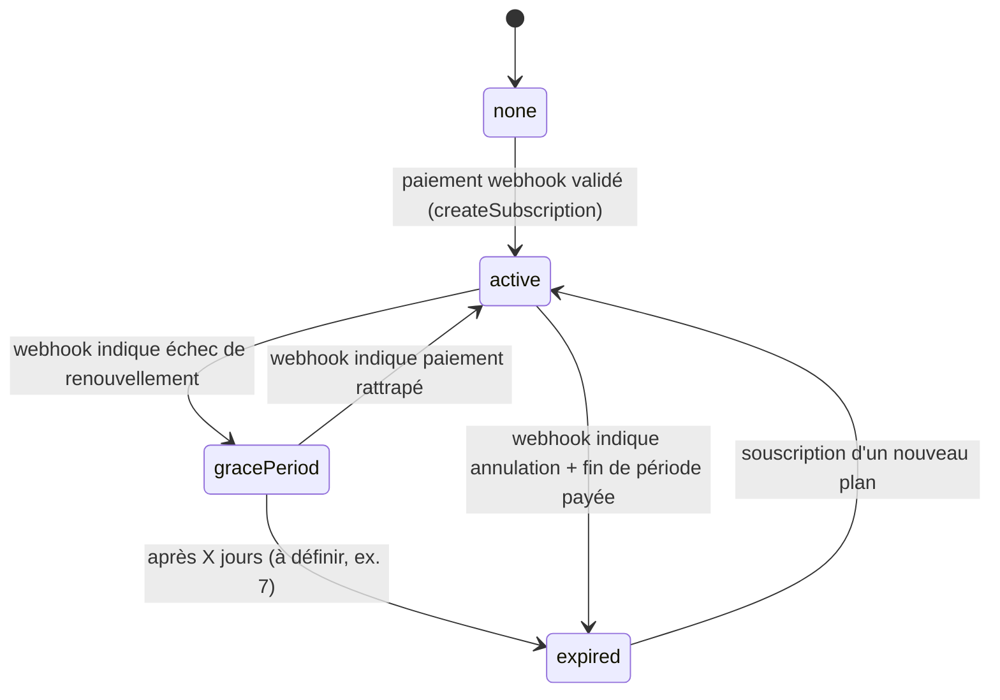

# Algorithmes métier

> **Lead de maintenance** : équipe backend (la logique métier vit côté serveur dans des services TypeScript testables).
> **Co-mainteneur** : équipe mobile (pour les algorithmes qui ont une composante client).
> **Statut global** : 🟡 **En cours** — squelette posé d'après les docs d'architecture, à figer pendant la Phase 3 du MVP (quand le scoring sera implémenté).

---

## Pourquoi ce document est critique pour l'admin

La console admin affiche :
- Les **scores** des élèves
- Le niveau de **santé scolaire** par notion
- Les **points** et les **classements**
- Le statut **premium** et le solde de **crédits**

Si l'admin recalcule ces valeurs avec une formule différente du backend, elle affiche des chiffres faux. Ce document fixe la formule.

> **Règle d'or pour l'admin** : ne **jamais recalculer** un agrégat à partir des collections sources si ce calcul peut être lu directement (par ex. `users/{uid}/stats.totalPoints`). L'admin **lit** les résultats des algorithmes, elle ne les recalcule pas. Si un recalcul est nécessaire (par ex. après correction d'un bug serveur), c'est une **Cloud Function admin dédiée** (cf. § « Algorithmes administratifs »).

---

## Table des matières

1. [Dérivation profil → matières + examens](#1-dérivation-profil--matières--examens)
2. [Calcul de score d'un exercice / quiz](#2-calcul-de-score-dun-exercice--quiz)
3. [Calcul de l'impact santé par notion](#3-calcul-de-limpact-santé-par-notion)
4. [Calcul des points de gamification](#4-calcul-des-points-de-gamification)
5. [Moteur de recommandations](#5-moteur-de-recommandations)
6. [Classements (5 boards)](#6-classements-5-boards)
7. [État d'abonnement — machine à états](#7-état-dabonnement--machine-à-états)
8. [Débit de crédits](#8-débit-de-crédits)
9. [Idempotence — la mécanique transversale](#9-idempotence--la-mécanique-transversale)
10. [Détection d'inactivité et plafonds de notifications](#10-détection-dinactivité-et-plafonds-de-notifications)
11. [Algorithmes administratifs](#11-algorithmes-administratifs)

---

## 1. Dérivation profil → matières + examens

**Statut** : 🟢 Validé Story 1.1a (pivot Firestore-driven, cf. [ADR-015](../../project_manage/planning-artifacts/architecture/adrs/ADR-015-catalogue-firestore-runtime-activation.md)).

**Lieu d'exécution V1** : Helper Dart pur dans `CatalogueRepository.derive()` (mobile, Story 1.1c). Résultat retourné via `Either<CatalogueFailure, DerivedProfile>` (NFR-7) et persisté dans `users/{uid}.derivedSubjects` et `users/{uid}.examTargets` au moment de la création du profil (Story 1.3).

**Pourquoi côté client V1** : ce dépôt est mobile-only ; pas de Cloud Function déployée à ce stade. Cohérent avec ADR-015. Migration future vers Cloud Function `deriveProfile(uid)` triggered Firestore reste possible sans refactor mobile (le repository encapsule la dérivation derrière une interface stable `Future<Either<CatalogueFailure, DerivedProfile>> derive(...)`).

**Source de vérité** : les 6 collections catalogue Firestore (`filieres`, `niveaux`, `series`, `subjects`, `exam_targets`, `derivation_rules`) seedées par `scripts/firebase_seed/seed_catalogue.py` (Story 1.1b). Cf. [BASE-DE-DONNEES.md § Catalogue scolaire](BASE-DE-DONNEES.md#catalogue-scolaire-6-collections--story-11a).

### Entrée
- `subSystem` ∈ {`francophone`, `anglophone`}
- `filiere` ∈ {`generale`, `technique`} — réf vers `filieres/{id}` Firestore
- `niveau` — réf vers `niveaux/{id}` Firestore (ex. `francophone_terminale`, `anglophone_form_5`)
- `serie` — réf vers `series/{id}` Firestore (ex. `francophone_terminale_d`, `anglophone_upper_sixth_s2`) ou `null` si le niveau n'a pas de série

### Algorithme

```typescript
// 1. Match la première derivation_rule active compatible
rule = derivation_rules.firstWhere(r =>
    r.isActive
    && r.matchSubSystem === user.subSystem
    && (r.matchFiliere === "*" || r.matchFiliere === user.filiere)
    && r.matchNiveau === user.niveau
    && (r.matchSerie === null || r.matchSerie === user.serie)
)

// 2. Résoudre les references vers subjects + exam_targets (filtrer isActive)
subjects = rule.subjectIds.map(id =>
    subjects.firstWhere(s => s.subjectId === id && s.isActive)
)
examens = rule.examTargetIds.map(id =>
    exam_targets.firstWhere(e => e.examTargetId === id && e.isActive)
)
```

**Cas pas de match** : `derive()` retourne `Left(CatalogueFailure.noMatchingRule(profile))` — l'écran récap (Story 1.3) affiche un message d'erreur clair et permet à l'utilisateur de corriger son profil. Ne devrait pas arriver en pratique si la matrice catalogue est complète (cf. AC1 Story 1.1a → 🟢).

**Cas catalogue vide + offline** : `derive()` n'est même pas atteint — l'écran « En attente de connexion » bloquant (UX-DR-24, Story 1.1c) est affiché en amont. Cf. ADR-015 § Conséquences négatives.

### Règles d'exception (retrait de matières)

L'élève peut retirer une matière de `derivedSubjects` (la mettre dans `optedOutSubjects`) **uniquement dans les cas suivants** :

- Anglophones, dès **Form 3** : retrait possible des matières non présentées à l'examen
- Lower Sixth / Upper Sixth (toutes filières) : le **stream** (Sciences / Arts) détermine la combinaison

Source runtime : flag `series/{id}.canOptOut: bool` Firestore. Story 1.4 lit ce flag via `CatalogueRepository` au lieu d'un helper Dart hardcoded (amendement sprint-change-proposal-2026-06-05.md).

Dans tous les autres cas, `optedOutSubjects` doit être vide. La règle Firestore `users/{uid}` (Story 1.4) valide `optedOutSubjects ⊂ derivedSubjects` côté serveur.

### Référence pour les matières dérivables

Voir [DONNEES-REFERENCE.md § Tableau de dérivation](DONNEES-REFERENCE.md#tableau-de-d%C3%A9rivation-subsystem-filiere-niveau-serie--examtargetids) — la matrice (subSystem, filiere, niveau, serie) → (matières, examens) est exhaustive 🟢 (79 `derivation_rules` totales, ~50 activées au seed initial, 29 étendues `isActive: false` runtime).

### Implications pour l'admin

L'admin **ne dérive jamais elle-même** les matières d'un profil — elle lit `derivedSubjects` du document `users/{uid}`. Pour modifier la dérivation d'un élève, l'admin met à jour son profil (filière / niveau / série) ; la dérivation est re-calculée côté client à la prochaine action (Story 1.3) OU re-déclenchée par Cloud Function admin si nécessaire (future). Pour activer/désactiver une série au niveau **catalogue**, l'admin toggle `series/{id}.isActive` depuis Firebase Console — l'effet est immédiat pour tous les utilisateurs (les `CatalogueRepository.watch*()` streams réémettent).

---

## 2. Calcul de score d'un exercice / quiz

**Statut** : 🟡 En cours
**Lieu d'exécution** : Cloud Function (`completeExercise`, `submitQuiz`).
**Lieu de documentation du code** : `functions/src/exercises/scoring.ts` (testable en TypeScript pur).

### 2.1 Score d'un quiz (questions QCM / vrai-faux / texte à trous / appariement)

```typescript
function computeQuizScore(answers: Record<string, Answer>): number {
  const total = Object.keys(answers).length;
  const correct = Object.values(answers).filter(a => a.isCorrect).length;
  return Math.round((correct / total) * 100);
}
```

Renvoie un entier 0-100.

### 2.2 Score d'un exercice Mode 1 (correction IA texte/photo)

Plus complexe — la correction IA distingue 4 statuts :
- `correct` (juste)
- `incorrect` (faux)
- `incomplete` (partiel)
- `rephrasing_needed` (à mieux rédiger)

```typescript
function computeMode1Score(stepResults: Mode1StepResult[]): number {
  // Pondération par défaut, à ajuster en Phase 3
  const weights = { correct: 1.0, incomplete: 0.5, rephrasing_needed: 0.7, incorrect: 0 };
  const sum = stepResults.reduce((acc, r) => acc + weights[r.status], 0);
  return Math.round((sum / stepResults.length) * 100);
}
```

> 🔴 **Pondérations à valider** avec un panel d'enseignants en Phase 3.

### 2.3 Score d'un exercice Mode 2 (étapes résolues / non résolues)

```typescript
function computeMode2Score(stepStatuses: Record<string, "solved" | "unsolved">): number {
  const total = Object.keys(stepStatuses).length;
  const solved = Object.values(stepStatuses).filter(s => s === "solved").length;
  return Math.round((solved / total) * 100);
}
```

### 2.4 Score d'un sujet d'examen (mode examen)

Le sujet est noté **partie par partie** selon le barème officiel.

```typescript
function computeExamScore(parts: ExamPartResult[]): { total: number; mention: string } {
  const totalPossible = parts.reduce((acc, p) => acc + p.maxPoints, 0);
  const totalObtained = parts.reduce((acc, p) => acc + p.obtainedPoints, 0);
  const score = Math.round((totalObtained / totalPossible) * 20);  // sur 20
  return { total: score, mention: deriveMention(score) };
}

function deriveMention(scoreSur20: number): string {
  if (scoreSur20 >= 16) return "Très Bien";
  if (scoreSur20 >= 14) return "Bien";
  if (scoreSur20 >= 12) return "Assez Bien";
  if (scoreSur20 >= 10) return "Passable";
  return "Insuffisant";
}
```

> 🔴 **Mentions à confirmer** avec les barèmes officiels MINESEC / GCE.

---

## 3. Calcul de l'impact santé par notion

**Statut** : 🟡 En cours
**Lieu d'exécution** : Cloud Function (dans la même transaction que le score, cf. § 9 Idempotence).

### Principe

Chaque exercice évalue 1+ notions (`exercise.notionIds`). À la complétion, on calcule un **delta** sur la santé de chaque notion impliquée :

```typescript
function computeNotionImpacts(
  stepStatuses: Record<string, "solved" | "unsolved">,
  exercise: ExerciseDoc
): NotionImpact[] {
  const impactPerNotion: Record<string, number> = {};

  for (const notionId of exercise.notionIds) {
    const relevantSteps = exercise.steps.filter(s => s.targetsNotion === notionId);
    // À adapter : si l'archi finale lie les étapes aux notions

    const solvedCount = relevantSteps.filter(s => stepStatuses[s.index] === "solved").length;
    const ratio = solvedCount / relevantSteps.length;

    // Delta linéaire entre -5 (tout raté) et +5 (tout réussi) — à ajuster
    impactPerNotion[notionId] = Math.round((ratio - 0.5) * 10);
  }

  return Object.entries(impactPerNotion).map(([notionId, delta]) => ({ notionId, delta }));
}
```

### Application du delta sur `health/{notionId}.level`

```typescript
newLevel = clamp(currentLevel + delta, 0, 100);
newLabel = deriveLabel(newLevel);
newTrend = deriveTrend(currentLevel, newLevel, recentHistory);
```

### Dérivation `level → label`

```typescript
function deriveLabel(level: number): "solide" | "à renforcer" | "priorité" {
  if (level >= 70) return "solide";
  if (level >= 40) return "à renforcer";
  return "priorité";
}
```

> 🔴 **Seuils à valider** en Phase 5.

### Dérivation `trend`

Comparaison avec le `level` d'il y a N jours :

```typescript
function deriveTrend(current: number, previous: number, threshold = 5): "up" | "stable" | "down" {
  const diff = current - previous;
  if (diff >= threshold) return "up";
  if (diff <= -threshold) return "down";
  return "stable";
}
```

### Implications pour l'admin

L'admin affiche `health[notionId].level` et `health[notionId].label` directement depuis Firestore. **Pas de recalcul.**

---

## 4. Calcul des points de gamification

**Statut** : 🟡 En cours

### Sources de points

| Action | Points (proposition) |
|---|---|
| Quiz complété | `score * 0.5` (max 50) |
| Exercice complété en Mode 1 | `score * 0.8` (max 80) |
| Exercice complété en Mode 2 | `score * 0.6` (max 60) |
| Exercice complété en Mode 3 | `score * 0.4` (max 40) — Mode 3 coûte des crédits, donc moins de points |
| Sujet d'examen complété | `score * 5` (max 100) **+ bonus 50 si mention obtenue** |
| Cours / notion consulté (premier passage) | 5 |
| Streak +1 jour | 10 |
| Streak 7 jours d'affilée | 50 bonus |

> 🔴 **Pondérations à confirmer en Phase 5** avec mesure d'engagement.

### Règle critique : pas de double comptage

Une action ne crédite des points **qu'une seule fois**. La garde est sur le `sessionId` (cf. § 9 Idempotence) ou sur la date pour les actions journalières (streak).

```typescript
async function awardPoints(uid: string, sessionId: string, amount: number) {
  return runTransaction(async tx => {
    const sessionRef = doc(`users/${uid}/completions/${sessionId}`);
    const existing = await tx.get(sessionRef);
    if (existing.exists && existing.data.pointsAwarded) {
      return; // déjà crédité
    }
    // sinon : crédite + marque la transaction
  });
}
```

### Application atomique

La mise à jour de `totalPoints`, `weeklyPoints`, `health/*` et la marque d'idempotence se font **dans une seule transaction Firestore** (cf. § 9). Tout réussit, ou rien.

---

## 5. Moteur de recommandations

**Statut** : 🟡 En cours
**Lieu d'exécution** : Cloud Function périodique (cron quotidien) + déclenchée après chaque alimentation santé.

### Algorithme

L'élève voit **jusqu'à 3 recommandations** sur son dashboard.

```typescript
function generateRecommendations(uid: string, health: NotionHealth[]): Recommendation[] {
  const recos: Recommendation[] = [];

  // 1. Priorité absolue : notions étiquetées "priorité" (level < 40)
  const priorities = health.filter(h => h.label === "priorité").slice(0, 2);
  for (const p of priorities) {
    recos.push({
      type: "weak_notion",
      targetType: "lesson",
      targetId: findLessonForNotion(p.notionId),
      rationale: { fr: `Niveau bas sur "${p.notionTitle}" — révise cette leçon`, en: ... }
    });
  }

  // 2. Règle d'équilibre : au moins une reco sur cinq vise une notion DÉJÀ SOLIDE
  //    (entretenir > pomper sur les points faibles)
  if (Math.random() < 0.2 || recos.length === 0) {
    const strong = health.filter(h => h.label === "solide").sample();
    if (strong) {
      recos.push({
        type: "consolidation_strong_notion",
        targetType: "exercise",
        targetId: findExerciseForNotion(strong.notionId),
        rationale: { fr: `Maintiens ton niveau sur "${strong.notionTitle}"`, en: ... }
      });
    }
  }

  // 3. Compléter avec next_step si moins de 3
  while (recos.length < 3) {
    const next = findNextLogicalStep(uid);
    if (!next) break;
    recos.push(next);
  }

  return recos.slice(0, 3);
}
```

### Règle d'équilibre — critique

> « Au moins une recommandation sur cinq vise une notion déjà solide » (cf. PRD / Decoupage MVP).

C'est la règle qui évite que l'élève ne voie que des points faibles et se décourage. En l'absence de cette règle d'équilibre, le moteur est démotivant.

### Cycle de vie d'une reco

- Créée par le moteur
- L'élève peut la marquer **« faite »** ou **« ignorer »** → `status = "done" | "ignored"` → disparaît du dashboard
- `expiresAt` (optionnel) : reco temporaire

### Implications pour l'admin

L'admin peut **voir** les recos actives d'un élève, mais **ne les modifie pas**. Pour forcer une regénération, Cloud Function admin dédiée (cf. § 11).

---

## 6. Classements (5 boards)

**Statut** : 🟡 En cours

### Les 5 boards

| Board | Données | Reset |
|---|---|---|
| `general` | Cumul depuis toujours | Jamais |
| `weekly` | Points de la semaine | Chaque lundi 00:00 (heure Cameroun = UTC+1) |
| `subject_{id}` | Points liés à une matière donnée | Jamais (mais on peut imaginer une variante hebdo plus tard) |
| `class_{niveau}_{serie}_{schoolId}` | Sur le périmètre de la classe (école renseignée) | Jamais |
| `school_{schoolId}` | Sur le périmètre de l'école | Jamais |

### Algorithme de mise à jour

Déclenché par un Firestore trigger sur `users/{uid}/stats` (cf. archi backend § 4.2).

```typescript
onWrite("users/{uid}/stats", async (event) => {
  const before = event.before;
  const after = event.after;
  if (before.totalPoints === after.totalPoints) return; // pas de changement réel

  const boards = computeAffectedBoards(after);
  for (const board of boards) {
    await upsertRankingEntry(board, after);
  }
});
```

> **Piège anti-boucle** : le trigger écrit dans `rankings/{board}/entries/*`, **jamais** dans `users/{uid}/stats` qui le déclencherait à nouveau (cf. archi backend § 9.4).

### Calcul du rang

Le `rank` n'est pas figé à chaque écriture (trop coûteux). Deux approches possibles :

- **Approche A (recommandée MVP)** : recalcul périodique (cron quotidien) du `rank` et `previousRank` pour les top N par board.
- **Approche B** : calcul à la lecture (paginé) — possible si Firestore + index suffisent.

🔴 **À trancher en Phase 5** selon volumétrie.

### Reset hebdomadaire

```
Cron : lundi 00:00 heure Cameroun (UTC+1)
Action : pour chaque uid, reset weeklyPoints à 0 dans stats,
         puis effacer et reconstruire rankings/weekly/entries
```

### Implications pour l'admin

L'admin peut afficher les boards et y naviguer (chercher un élève dans un classement). Ne modifie pas.

---

## 7. État d'abonnement — machine à états

**Statut** : 🟡 En cours

### Transitions



### Règles

- L'état est calculé **côté serveur uniquement**. Le mobile ne décide jamais (cf. archi backend § 10.2).
- L'annulation par l'élève ne bascule pas immédiatement en `expired` — `cancelledAt` est noté, mais le statut reste `active` jusqu'à `expiresAt`.
- `gracePeriod` est une fenêtre où l'élève garde l'accès premium même si le paiement de renouvellement a échoué — laisse le temps de rattraper.

### Implications pour le mobile

Le mobile lit `subscriptions/{uid}` en **stream**. Pour l'accès au Mode 2 et autres features premium, la règle locale (cf. archi mobile § 17.4) accorde l'accès si `status ∈ {"active", "gracePeriod"}`. **Mais le vrai verrou est dans les règles Firestore** (cf. BASE-DE-DONNEES.md § Règles d'accès).

### Implications pour l'admin

L'admin affiche `status`, `plan`, `startedAt`, `expiresAt`, `cancelledAt`. Pour révoquer manuellement un abonnement (cas extrême : litige), Cloud Function admin dédiée (cf. § 11).

---

## 8. Débit de crédits

**Statut** : 🟡 En cours

### Coût par action (proposition)

| Action | Coût |
|---|---|
| Correction Mode 1 (texte) | 3 crédits |
| Correction Mode 1 (photo) | 5 crédits |
| Session Mode 3 (illimitée en messages, par session) | 10 crédits |

🔴 **À calibrer en Phase 4** selon coût IA réel.

### Packs proposés

| Pack | Crédits | Bonus | Total |
|---|---|---|---|
| Pack 10 | 10 | 0 | 10 |
| Pack 25 | 25 | 5 | 30 |
| Pack 60 | 60 | 20 | 80 |

### Règle critique : débit une seule fois

```typescript
async function debitCredits(uid: string, sessionId: string, amount: number, reason: string) {
  return runTransaction(async tx => {
    const txnRef = doc(`credits/${uid}/transactions/${sessionId}`);
    const existing = await tx.get(txnRef);
    if (existing.exists) return; // déjà débité

    const creditsRef = doc(`credits/${uid}`);
    const credits = (await tx.get(creditsRef)).data;
    if (credits.balance < amount) {
      throw new DomainError("payment", "Crédits insuffisants");
    }

    tx.set(creditsRef, { balance: credits.balance - amount, totalSpent: credits.totalSpent + amount, updatedAt: now }, { merge: true });
    tx.set(txnRef, { type: "debit", delta: -amount, reason, sessionId, createdAt: now });
  });
}
```

> La clé `sessionId` est la **même** que celle utilisée pour l'idempotence de l'action elle-même. Un retry réseau qui déclenche deux fois la Cloud Function ne débite qu'une fois.

### Affichage du coût avant action

Le mobile affiche **le coût avant de confirmer une action payante** (cf. PRD Phase 4). Le coût est lu dans une config Remote Config (Firebase) pour être ajustable sans redéploiement.

---

## 9. Idempotence — la mécanique transversale

**Statut** : 🟢 **Stable conceptuellement** — c'est la pierre angulaire de tout ce qui touche aux écritures côté serveur.

### Le problème

Sur un réseau instable, une Cloud Function peut être appelée **deux fois** pour la même action (l'app n'a pas reçu la réponse, elle retente ; l'élève tape deux fois « soumettre »). Sans protection :
- Double comptage de points
- Double débit de crédits
- Double mise à jour de santé scolaire

### La solution : `sessionId` + garde dans la transaction

Le mobile génère un **`sessionId` unique** côté client au début de chaque action (UUID v4). Toutes les retries de cette action utilisent **le même** `sessionId`.

Côté serveur, la Cloud Function fait **dans une seule transaction Firestore** :

```typescript
await db.runTransaction(async tx => {
  const completionRef = doc(`users/${uid}/completions/${sessionId}`);
  const existing = await tx.get(completionRef);
  if (existing.exists) {
    return existing.data; // déjà traité, renvoyer le résultat existant SANS rien recréditer
  }

  // Calcul des effets
  const score = computeScore(...);
  const impacts = computeNotionImpacts(...);
  const points = computePoints(...);

  // Écriture atomique : santé + points + marque d'idempotence
  tx.set(completionRef, { sessionId, score, impacts, pointsAwarded: points, completedAt: now });
  for (const impact of impacts) {
    tx.set(doc(`users/${uid}/health/${impact.notionId}`), { delta: impact.delta }, { merge: true });
  }
  tx.set(doc(`users/${uid}/stats`), { totalPoints: increment(points), weeklyPoints: increment(points) }, { merge: true });

  return { score, impacts, pointsAwarded: points };
});
```

### Pourquoi la garde DOIT être DANS la transaction

Si la lecture « déjà traité ? » est faite **hors** transaction, deux appels simultanés peuvent tous deux passer la vérification avant que l'un ait écrit la marque (condition de course). Firestore garantit l'atomicité de la transaction, ce qui élimine cette course. C'est pourquoi le `tx.get(completionRef)` est **à l'intérieur** de `runTransaction`.

### Application

| Type d'action | Clé d'idempotence | Documents écrits ensemble |
|---|---|---|
| Compléter exercice | `sessionId` généré côté mobile | `completions/{sessionId}` + `health/*` + `stats` |
| Compléter quiz | `sessionId` | idem |
| Compléter examen | `sessionId` | idem |
| Débit Mode 1 | `sessionId` (même que la complétion) | `credits` + `credits/transactions/{sessionId}` |
| Débit Mode 3 | `sessionId` (1 par session, pas par message) | idem |
| Webhook paiement | `aggregator_event_id` (pas un `sessionId`) | `webhook_events/{eventId}` + `subscriptions/{uid}` ou `credits/{uid}` + `payment_intents/{intentId}` |

---

## 10. Détection d'inactivité et plafonds de notifications

**Statut** : 🟡 En cours
**Lieu d'exécution** : Cloud Function planifiée (cron) + triggers.

### Détection d'inactivité

Cron quotidien :

```
Pour chaque uid :
  inactif_depuis = now - users/{uid}/stats.lastActivityAt
  si inactif_depuis >= 3 jours ET pas de notif d'inactivité envoyée dans la fenêtre :
    créer notification de type "inactivity_reminder"
    envoyer push FCM
    marquer la fenêtre
```

### Plafonds par type

Pour éviter le harcèlement (cf. PRD Phase 5 : « un seul rappel par période d'absence ») :

| Type | Plafond |
|---|---|
| `inactivity_reminder` | 1 par période d'absence (pas un par jour) |
| `quiz_recap` | 1 par quiz complété |
| `exam_recap` | 1 par sujet d'examen complété |
| `weekly_ranking` | 1 par semaine (envoyée lundi matin) |
| `payment_confirmation` | 1 par paiement |
| `low_credits` | 1 par seuil franchi (à 10, à 5, à 0) — pas un à chaque débit |
| `new_recommendation` | 1 par batch de recos générées |
| `shared_link_opened` | 1 par ouverture (peut être agrégée si beaucoup) |
| `subject_unfinished` | 1 par sujet, après 24 h sans reprise |

### Implémentation

Chaque notification écrit un champ `dedupKey` (par exemple `"inactivity_reminder:2026-W23"` pour la semaine 23 de 2026). Avant d'envoyer, on vérifie que cette `dedupKey` n'existe pas déjà.

---

## 11. Algorithmes administratifs

**Statut** : 🔴 **À compléter** — sera défini par l'équipe admin pendant qu'elle construit sa console.

### Algorithmes admin envisagés

Liste prévisionnelle ; chaque entrée sera une Cloud Function admin protégée par App Check + claim `admin` sur le token Firebase Auth.

| Algorithme | Description | Validation |
|---|---|---|
| `adminRecomputeUserHealth` | Recalculer la santé scolaire d'un élève à partir de tous ses `completions` (utile après correction d'un bug de scoring) | À spécifier |
| `adminGrantCredits` | Créditer manuellement un solde (compensation, geste commercial) | Audit log obligatoire |
| `adminRevokeSubscription` | Révoquer un abonnement (cas litige) | Audit log obligatoire |
| `adminForcePremium` | Accorder le premium gratuit (élève pilote, partenariat école) | Audit log obligatoire, durée limite |
| `adminApproveSchool` | Valider une école demandée par un élève | — |
| `adminMergeUserAccounts` | Fusionner deux comptes (cas exceptionnel) | Validation manuelle, audit |
| `adminExportUserData` | Export RGPD complet d'un utilisateur | — |
| `adminDeleteAccount` | Forcer la suppression (sans le délai de grâce de 7 j) | Audit obligatoire |

### Règles

- Chaque algorithme admin écrit un **log d'audit** dans une collection `admin_audit/{eventId}` avec : `adminUid`, `targetUid`, `action`, `payload`, `timestamp`, `justification`.
- Aucun algorithme admin ne modifie un solde / abonnement sans `justification` (champ texte obligatoire dans l'appel).
- Tous les algorithmes admin requièrent un claim `role: "admin"` sur le token Firebase Auth (à vérifier dans la Function avant action).

---

## Implications pour l'équipe admin

| Tu veux afficher… | Tu lis… | Tu ne recalcules pas |
|---|---|---|
| Le score d'un élève sur un exercice | `users/{uid}/completions/{sessionId}.score` | les réponses brutes |
| Le niveau de santé d'une notion | `users/{uid}/health/{notionId}.level` | les `impacts` historiques |
| Les points totaux | `users/{uid}/stats.totalPoints` | la somme de `completions` |
| Le rang dans un classement | `rankings/{board}/entries/{uid}.rank` | un tri manuel |
| Le statut premium | `subscriptions/{uid}.status` | la date `expiresAt` |
| Le solde de crédits | `credits/{uid}.balance` | la somme des transactions |

> **Si tu as besoin d'une métrique non listée dans Firestore** : demande à l'équipe backend d'ajouter le calcul, plutôt que de le faire côté admin. Sinon, divergence garantie.

---

## Historique

| Date | Auteur | Modification |
|---|---|---|
| 2026-06-03 | Setup initial | Création du squelette à partir des docs d'architecture et du Decoupage MVP |
| 2026-06-05 | DelRoos / Claude (Amelia agent) | Story 1.1a — § 1 « Dérivation profil → matières + examens » amendé : statut 🟡 → 🟢, lieu d'exécution V1 = helper Dart pur dans `CatalogueRepository.derive()` (mobile-only, pas de Cloud Function déployée), pseudo-code mis à jour pour matcher `derivation_rules` Firestore (ADR-015). Règle d'exception retrait : `series/{id}.canOptOut` lu Firestore (amendement Story 1.4 sprint-change-proposal-2026-06-05.md). Sprint-change-proposal-2026-06-05.md. |
