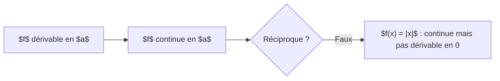

# Guide de rédaction des cours — Valide School

> **À qui s'adresse ce guide ?**  
> Aux enseignants et créateurs de contenu qui rédigent les leçons dans `content_demo.json` (ou via le futur outil admin). Ce guide définit les conventions de mise en forme pour que tous les cours s'affichent de façon cohérente dans l'application.

---

## Sommaire

1. [Structure d'une leçon](#1-structure-dune-leçon)
2. [Titre de leçon](#2-titre-de-leçon)
3. [Blocs pédagogiques (callouts)](#3-blocs-pédagogiques-callouts)
4. [Mathématiques et LaTeX](#4-mathématiques-et-latex)
5. [Tableaux](#5-tableaux)
6. [Listes](#6-listes)
7. [Texte mis en valeur](#7-texte-mis-en-valeur)
8. [Diagrammes Mermaid](#8-diagrammes-mermaid)
9. [Citations](#9-citations)
10. [Bonnes pratiques](#10-bonnes-pratiques)
11. [Exemple complet](#11-exemple-complet)

---

## 1. Structure d'une leçon

Une leçon bien structurée suit toujours ce plan :

```
# Titre de la leçon

[Phrase d'accroche ou contexte — 1 à 2 phrases max]

:::definition
[La notion centrale définie formellement]
:::

[Développement, interprétation, exemples]

:::theoreme
[Résultat important à démontrer ou admettre]
:::

:::demonstration
[Preuve, si elle est au programme]
:::

:::exemple
[Application numérique ou cas concret]
:::

:::methode
[Comment résoudre ce type de problème, étape par étape]
:::

:::retenir
[Résumé des points essentiels de la leçon]
:::
```

> **Règle générale :** on commence toujours par un bloc `:::definition`, on développe, on illustre avec un `:::exemple`, on conclut avec un `:::retenir`.

---

## 2. Titre de leçon

Le titre s'écrit avec un `#` (niveau 1). Il doit être **court** et **identique** au champ `title` de la leçon.

```markdown
# Nombre dérivé et fonction dérivée
```

Les sous-sections utilisent `##` ou `###` :

```markdown
## Interprétation géométrique

### Cas particuliers
```

---

## 3. Blocs pédagogiques (callouts)

Les blocs sont la brique principale des cours. Chaque bloc s'ouvre avec `:::type` sur sa propre ligne et se ferme avec `:::` sur sa propre ligne.

```
:::type
Contenu du bloc (Markdown + LaTeX autorisés à l'intérieur)
:::
```

### Tableau de référence des blocs

| Type | Couleur | Icône | Usage |
|---|---|---|---|
| `:::definition` | Bleu | 📄 | Définition formelle d'une notion |
| `:::theoreme` | Violet | ✨ | Résultat démontrable admis ou prouvé |
| `:::demonstration` | Bleu clair | ∫ | Preuve d'un théorème |
| `:::propriete` | Vert | ✓ | Propriété ou formule à retenir |
| `:::methode` | Orange | 📋 | Procédure pas à pas pour résoudre |
| `:::attention` | Rouge | ⚠ | Erreur fréquente, piège, cas limite |
| `:::retenir` | Jaune | 💡 | Récapitulatif des points essentiels |
| `:::exemple` | Gris | ✏ | Application numérique ou cas concret |
| `:::figure` | Teal | 🖼 | Illustration, schéma, graphe |

### Exemples

**Définition**
```markdown
:::definition
Une fonction $f$ est **continue** en $a$ si :

$$\lim_{x \to a} f(x) = f(a)$$
:::
```

**Théorème**
```markdown
:::theoreme
Si $f$ est dérivable en $a$, alors $f$ est continue en $a$.

La réciproque est **fausse**.
:::
```

**Démonstration**
```markdown
:::demonstration
Soit $h \neq 0$. On écrit :

$$f(a+h) - f(a) = \frac{f(a+h) - f(a)}{h} \cdot h$$

Quand $h \to 0$, le premier facteur tend vers $f'(a)$ et le second vers $0$, donc $f(a+h) - f(a) \to 0$.
:::
```

**Propriété**
```markdown
:::propriete
Pour tous réels $u$ et $v$ dérivables :

$$[u \cdot v]' = u'v + uv'$$

$$\left[\frac{u}{v}\right]' = \frac{u'v - uv'}{v^2} \quad (v \neq 0)$$
:::
```

**Méthode**
```markdown
:::methode
Pour calculer $\lim_{x \to +\infty} \frac{3x^2 - 1}{x^2 + 5}$ :

1. Identifier la forme indéterminée ($\frac{\infty}{\infty}$)
2. Factoriser par le terme dominant au numérateur et au dénominateur
3. Simplifier puis calculer la limite

$$\frac{3x^2 - 1}{x^2 + 5} = \frac{x^2(3 - \frac{1}{x^2})}{x^2(1 + \frac{5}{x^2})} \to \frac{3}{1} = 3$$
:::
```

**Attention**
```markdown
:::attention
$f$ continue en $a$ **n'implique pas** que $f$ est dérivable en $a$.

Contre-exemple : $f(x) = |x|$ est continue en $0$ mais n'est pas dérivable en $0$.
:::
```

**À retenir**
```markdown
:::retenir
- La limite d'une somme est la somme des limites (si les deux existent).
- La limite d'un produit est le produit des limites.
- Les formes $\frac{0}{0}$, $\frac{\infty}{\infty}$, $\infty - \infty$ sont **indéterminées** → factoriser.
:::
```

**Exemple**
```markdown
:::exemple
Pour $f(x) = x^3$ en $a = 2$ :

$$f'(2) = \lim_{h \to 0} \frac{(2+h)^3 - 8}{h} = \lim_{h \to 0} \frac{12h + 6h^2 + h^3}{h} = 12$$
:::
```

---

## 4. Mathématiques et LaTeX

L'application supporte le LaTeX pour les formules mathématiques.

### LaTeX en ligne

Entourer l'expression avec `$...$` :

```markdown
Soit $f$ une fonction dérivable sur $\mathbb{R}$.
```

Rendu : Soit $f$ une fonction dérivable sur $\mathbb{R}$.

### LaTeX en display (formule centrée)

Entourer l'expression avec `$$...$$` sur ses propres lignes :

```markdown
$$\int_a^b f(x)\,dx = F(b) - F(a)$$
```

### Symboles fréquents

| Symbole | LaTeX |
|---|---|
| Flèche limite → | `\to` |
| Infini ∞ | `\infty` |
| Vecteur $\vec{F}$ | `\vec{F}` |
| Fraction $\frac{a}{b}$ | `\frac{a}{b}` |
| Puissance $x^{n}$ | `x^{n}` |
| Indice $x_{i}$ | `x_{i}` |
| Racine $\sqrt{x}$ | `\sqrt{x}` |
| Intégrale $\int_a^b$ | `\int_a^b` |
| Somme $\sum_{i=1}^{n}$ | `\sum_{i=1}^{n}` |
| Limite $\lim_{x \to a}$ | `\lim_{x \to a}` |
| Ensemble $\mathbb{R}$ | `\mathbb{R}` |
| Entiers $\mathbb{Z}$ | `\mathbb{Z}` |
| Appartient $\in$ | `\in` |
| Pour tout $\forall$ | `\forall` |
| Il existe $\exists$ | `\exists` |
| Implique $\Rightarrow$ | `\Rightarrow` |
| Équivalent $\Leftrightarrow$ | `\Leftrightarrow` |
| Combinaison $\binom{n}{k}$ | `\binom{n}{k}` |

### Notation décimale française

Pour la virgule décimale dans un nombre français, utiliser `{,}` :

```markdown
$3{,}14$ et non $3.14$
```

---

## 5. Tableaux

Les tableaux s'affichent avec un en-tête TABLEAU, un fond alterné par ligne et un scroll horizontal sur mobile.

```markdown
| Fonction $f(x)$ | Dérivée $f'(x)$ | Remarque |
|---|---|---|
| $c$ (constante) | $0$ | $c \in \mathbb{R}$ |
| $x^n$ | $nx^{n-1}$ | $n \in \mathbb{Z}^*$ |
| $\sqrt{x}$ | $\dfrac{1}{2\sqrt{x}}$ | $x > 0$ |
| $e^x$ | $e^x$ | — |
| $\ln x$ | $\dfrac{1}{x}$ | $x > 0$ |
```

> **Conseil :** garder les tableaux à 3-4 colonnes maximum pour la lisibilité sur téléphone.

---

## 6. Listes

**Liste à puces :**
```markdown
- Premier élément
- Deuxième élément
  - Sous-élément (deux espaces d'indentation)
- Troisième élément
```

**Liste numérotée (pour les méthodes) :**
```markdown
1. Identifier la forme de la limite
2. Factoriser par le terme dominant
3. Simplifier et conclure
```

---

## 7. Texte mis en valeur

| Rendu | Syntaxe |
|---|---|
| **Gras** | `**texte**` |
| *Italique* | `*texte*` |
| ~~Barré~~ | `~~texte~~` |
| `Code inline` | `` `code` `` |

> **Règle :** réserver le **gras** aux termes définis pour la première fois et aux mots-clés importants. Éviter de mettre des phrases entières en gras.

---

## 8. Diagrammes Mermaid

Pour les graphes, schémas de processus et arbres de décision. Utiliser un bloc de code avec le langage `mermaid` :

````markdown

````

**Types de diagrammes disponibles :**

```mermaid
graph TD  ← graphe orienté de haut en bas
graph LR  ← graphe orienté de gauche à droite
sequenceDiagram  ← diagramme de séquence
flowchart LR  ← flowchart
```

> ⚠ **Limitation :** les diagrammes nécessitent une connexion internet (rendu serveur). En mode hors-ligne, le source brut est affiché à la place.

---

## 9. Citations

Les citations (blockquotes) s'affichent avec un guillemet décoratif et un fond légèrement coloré. Utiliser pour les citations de définitions officielles ou les références historiques.

```markdown
> « Les mathématiques sont la reine des sciences. »  
> — Carl Friedrich Gauss
```

---

## 10. Bonnes pratiques

### À faire ✅

- **Un seul `#` par leçon** (le titre principal). Utiliser `##` et `###` pour les sous-sections.
- **Toujours commencer par `:::definition`** pour la notion principale.
- **Terminer par `:::retenir`** avec les points clés sous forme de liste à puces.
- **`:::methode` avec une liste numérotée** pour les procédures de résolution.
- **`:::attention`** pour les pièges classiques — une par leçon maximum.
- Alterner bloc et texte libre pour éviter des successions de blocs fermés.
- Tester les formules LaTeX complexes avant de publier.

### À éviter ❌

- ❌ Plusieurs `#` dans une même leçon (un seul titre principal).
- ❌ Mettre des images dans des blocs `:::` (mettre les images dans le texte libre).
- ❌ Imbriquer des blocs `:::` (pas de callout dans un callout).
- ❌ Faire des blocs trop longs — si un `:::theoreme` dépasse 10 lignes, le découper.
- ❌ Oublier de fermer un bloc (toujours terminer avec `:::` seul sur sa ligne).
- ❌ Virgule décimale en LaTeX sans `{,}` — `$3.14$` affiche un point, pas une virgule.
- ❌ Mélanger langue FR et EN dans le même champ de contenu.

---

## 11. Exemple complet

Voici une leçon complète, prête à être saisie dans `content_demo.json` (champ `content.fr`) :

```markdown
# Continuité d'une fonction

Une fonction peut être définie en un point sans y être continue. La continuité formalise l'idée qu'il n'y a « pas de saut » dans le graphe.

:::definition
On dit que $f$ est **continue en $a$** si les trois conditions sont satisfaites :

1. $f$ est définie en $a$ (c'est-à-dire $a \in D_f$)
2. $\lim_{x \to a} f(x)$ existe et est finie
3. $\lim_{x \to a} f(x) = f(a)$
:::

## Continuité sur un intervalle

$f$ est continue sur $[a, b]$ si elle est continue en tout point de $[a, b]$.

:::theoreme
**Théorème des valeurs intermédiaires (TVI)** : Si $f$ est continue sur $[a, b]$, alors $f$ prend toutes les valeurs comprises entre $f(a)$ et $f(b)$.

En particulier, si $f(a)$ et $f(b)$ sont de signes opposés, il existe $c \in ]a, b[$ tel que $f(c) = 0$.
:::

:::exemple
Montrons que $f(x) = x^3 - 2x - 5$ admet une racine dans $[2, 3]$ :

$$f(2) = 8 - 4 - 5 = -1 < 0$$

$$f(3) = 27 - 6 - 5 = 16 > 0$$

$f$ est continue (polynôme) et $f(2) \cdot f(3) < 0$, donc il existe $c \in ]2, 3[$ tel que $f(c) = 0$.
:::

:::attention
Le TVI garantit l'**existence** d'une racine, pas son unicité. Il peut y en avoir plusieurs.
:::

:::methode
Pour démontrer qu'une équation $f(x) = 0$ admet une solution sur $[a, b]$ par le TVI :

1. Vérifier que $f$ est **continue** sur $[a, b]$
2. Calculer $f(a)$ et $f(b)$
3. Vérifier que $f(a)$ et $f(b)$ sont de **signes opposés** ($f(a) \cdot f(b) < 0$)
4. Conclure : il existe $c \in ]a, b[$ tel que $f(c) = 0$
:::

:::retenir
- $f$ continue en $a$ $\Leftrightarrow$ $\lim_{x \to a} f(x) = f(a)$
- Tout polynôme est continu sur $\mathbb{R}$
- Toute fraction rationnelle est continue là où elle est définie
- **TVI** : $f$ continue + signe opposé aux bornes → existence d'une racine
:::
```

---

## Référence rapide

```
:::definition   → notion principale (bleu)
:::theoreme     → résultat important (violet)
:::demonstration → preuve (bleu clair)
:::propriete    → formule/propriété (vert)
:::methode      → procédure pas à pas (orange)
:::attention    → piège, erreur fréquente (rouge)
:::retenir      → récapitulatif final (jaune)
:::exemple      → application numérique (gris)
:::figure       → illustration ou graphe (teal)
```

LaTeX inline : `$formule$`  
LaTeX display : `$$formule$$` (sur sa propre ligne)  
Virgule décimale FR : `$3{,}14$`

---

*Document maintenu par l'équipe Valide School — mettre à jour si de nouveaux types de blocs sont ajoutés dans `pedagogical_content.dart`.*
