# Architecture Cloud Functions — Guide complet pour l'équipe backend

**Projet :** Application EdTech mobile (Cameroun) — préparation aux examens du secondaire
**Côté serveur :** Cloud Functions for Firebase, **2nd gen**, en **TypeScript** (Node.js)
**Public de ce document :** toute personne qui développe le backend, y compris quelqu'un qui n'a aucun contexte préalable et n'a pas lu le guide mobile.
**Statut :** document de référence autonome. Tout ce qui est nécessaire pour écrire des Cloud Functions conformes s'y trouve.

---

## Comment utiliser ce document

Lisez les sections 1 à 4 en entier : elles posent pourquoi le backend existe, ce qui lui appartient (et ce qui ne lui appartient pas), et les principes. Ensuite, utilisez le document comme référence.

Comme pour le guide mobile, chaque règle est suivie d'un **pourquoi**. Le code est du TypeScript réel pour Cloud Functions 2nd gen. Les schémas sont en Mermaid.

Ce document est le **pendant serveur** du guide d'architecture mobile. Là où le guide mobile dit « l'app appelle une Cloud Function », ce document décrit cette Cloud Function. La section 5 fait la correspondance explicite entre les deux.

---

## Sommaire

1. Pourquoi un backend séparé (et pas tout dans l'app)
2. La frontière : ce qui vit côté serveur, ce qui vit côté app
3. Les principes directeurs du backend
4. Les types de Cloud Functions et quand les utiliser
5. Le contrat app ↔ serveur (la correspondance des deux côtés)
6. L'architecture en couches d'une Cloud Function
7. La structure de dossiers complète, fichier par fichier
8. Le domaine partagé : types et erreurs communs
9. Les transactions et l'idempotence (alimentation santé + points)
10. Les paiements et webhooks (la logique premium)
11. L'IA et le RAG (appels au modèle, protection de la clé)
12. La sécurité serveur (App Check, règles, secrets)
13. Le logging et l'observabilité côté serveur
14. La gestion des erreurs côté serveur
15. Les tests côté serveur
16. Le déploiement et l'environnement
17. Conventions d'équipe et checklist de revue
18. Récapitulatif des dépendances backend

---

## 1. Pourquoi un backend séparé (et pas tout dans l'app)

Votre préoccupation est juste : une application qui « gère tout » devient un sac de nœuds impossible à maintenir. Mais au-delà de la maintenabilité, certaines choses ne **peuvent pas** vivre dans l'app pour des raisons de sécurité et de cohérence. Le backend existe pour quatre raisons précises.

**1. Protéger les secrets.** La clé d'API du modèle IA (Claude) ne doit jamais se trouver dans l'application : une app mobile est décompilable, n'importe qui pourrait extraire la clé et l'utiliser à vos frais. La clé vit donc côté serveur, et l'app demande au serveur de faire l'appel IA pour elle.

**2. Garantir les règles, pas seulement les suggérer.** Tout code qui tourne dans l'app est contournable. « L'élève est-il premium ? » vérifié côté app n'est qu'une suggestion. Le serveur, lui, est hors de portée du client : c'est le seul endroit où une règle est réellement appliquée et infalsifiable.

**3. Assurer la cohérence des écritures liées.** Quand un exercice se termine, trois choses changent ensemble : la santé scolaire, le niveau, les points. Si l'app faisait ces trois écritures et plantait au milieu, on aurait un état incohérent (des points crédités sans mise à jour de la santé). Le serveur peut faire les trois dans **une seule transaction atomique** — tout réussit, ou rien.

**4. Valider ce qui vient de l'extérieur.** Un paiement mobile money est confirmé par un **webhook** que l'agrégateur (Tranzak, Campay…) envoie à votre serveur. L'app ne peut pas recevoir ni vérifier ce webhook de façon fiable. Le serveur le reçoit, le vérifie, et décide.

En résumé : **le backend gère le sensible, le coûteux et le partagé. L'app gère l'expérience.** Cette séparation est ce qui rend les deux côtés maintenables indépendamment.

---

## 2. La frontière : ce qui vit côté serveur, ce qui vit côté app

C'est la section la plus importante : elle trace la ligne. La règle de décision tient en une question.

> **Cette opération doit-elle être infalsifiable, protéger un secret, garantir une cohérence multi-écritures, ou recevoir un événement externe ?**
> Si oui → **serveur**. Sinon → **app**.

### 2.1 Ce qui vit côté serveur (Cloud Functions)

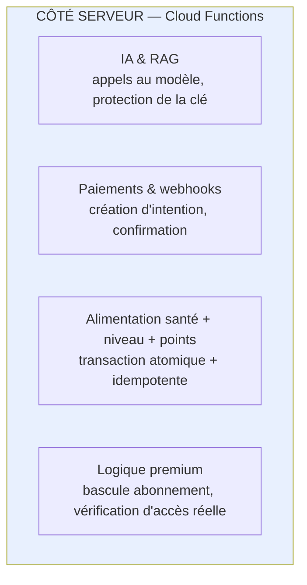

Concrètement, les quatre domaines confirmés :

- **IA / RAG** : tout appel au modèle Claude, l'orchestration RAG (récupération de contexte + génération), le streaming des réponses du tuteur (Mode 3) et du chat (M6). La clé d'API ne quitte jamais le serveur.
- **Paiements / webhooks** : créer l'intention de paiement chez l'agrégateur, recevoir et vérifier le webhook de confirmation, basculer l'abonnement à « actif ».
- **Alimentation santé + niveau + points** : à la fin d'un exercice ou d'un quiz, mettre à jour atomiquement la santé scolaire (par notion), le niveau, et les points de gamification.
- **Logique premium** : décider réellement de l'accès aux fonctionnalités payantes, indépendamment de ce que prétend l'app.

### 2.2 Ce qui reste côté app

L'affichage, la navigation, l'état des écrans, la composition d'un brouillon, le marquage local « résolu/non-résolu », la révélation d'un indice déjà présent dans les données de l'exercice, et **les lectures de contenu** (cours, énoncés) — qui passent directement par Firestore avec son cache, sans Cloud Function. Faire transiter une simple lecture de cours par une Cloud Function n'apporterait rien et coûterait en latence et en argent.

### 2.3 Le cas limite à retenir : lecture directe vs Cloud Function

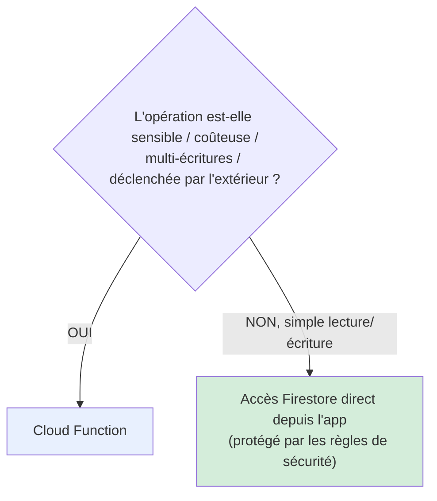

**Exemple concret :** lire un cours = accès Firestore direct (les règles de sécurité suffisent à protéger). Terminer un exercice = Cloud Function (multi-écritures + cohérence + idempotence). Ne pas mettre une simple lecture derrière une Cloud Function « par principe » : ce serait de la complexité gratuite.

---

## 3. Les principes directeurs du backend

Quatre principes, parallèles à ceux du mobile, adaptés au serveur.

**Séparation stricte des responsabilités.** Une Cloud Function fait une chose et la fait bien. Le code d'orchestration (la Function) est mince ; la logique métier vit dans des services testables séparés. On ne met pas 300 lignes de logique dans le corps d'une Function.

**Testabilité sans déploiement.** La logique métier (calcul du score, calcul de l'impact santé, vérification d'idempotence) se teste en pur TypeScript, sans déployer ni lancer l'émulateur. Comme côté mobile : la logique est isolée des dépendances externes (Firestore, Claude) derrière des abstractions.

**Sécurité par défaut.** Toute Function part du principe que l'appelant est potentiellement malveillant. On vérifie App Check, on vérifie l'authentification, on valide les entrées, avant toute action. Aucune Function ne fait confiance aveuglément à ce que l'app envoie.

**Idempotence et cohérence.** Toute opération qui écrit plusieurs documents le fait en transaction. Toute opération qui peut être rejouée (retry réseau, double-tap) est idempotente. Ce sont des exigences, pas des options.

---

## 4. Les types de Cloud Functions et quand les utiliser

Cloud Functions 2nd gen offre plusieurs déclencheurs. On en utilise trois. Connaître lequel choisir évite des erreurs d'architecture.

### 4.1 Callable functions (`onCall`) — l'app appelle directement

C'est le type principal. L'app appelle la Function comme une méthode distante. Firebase gère automatiquement l'authentification et le contexte App Check.

**Quand :** l'app a besoin d'un résultat en réponse à une action de l'élève (terminer un exercice, créer un paiement, poser une question à l'IA).

```typescript
import { onCall, HttpsError } from "firebase-functions/v2/https";

export const completeExercise = onCall(
  { enforceAppCheck: true },           // rejette si App Check absent/invalide
  async (request) => {
    if (!request.auth) {
      throw new HttpsError("unauthenticated", "Connexion requise");
    }
    // … logique déléguée à un service (voir section 6)
  }
);
```

**Pourquoi `onCall` plutôt que `onRequest` :** `onCall` gère pour nous le jeton d'authentification et App Check (`request.auth`, `enforceAppCheck`). Avec `onRequest` (HTTP brut), il faudrait tout vérifier à la main. On réserve `onRequest` aux webhooks (4.3).

### 4.2 Firestore triggers (`onDocumentWritten`…) — réagir à un changement

Une Function qui se déclenche quand un document change, sans que l'app l'appelle.

**Quand :** une conséquence automatique d'un changement de données. Par exemple, recalculer un classement quand des points changent, ou envoyer une notification quand une recommandation est créée.

```typescript
import { onDocumentWritten } from "firebase-functions/v2/firestore";

export const onPointsChanged = onDocumentWritten(
  "users/{uid}/stats/points",
  async (event) => {
    // … mettre à jour les classements dérivés
  }
);
```

**Pourquoi :** évite que l'app orchestre des effets en cascade. L'app écrit une chose ; le serveur réagit aux conséquences. Attention au risque de boucle (un trigger qui écrit ce qui le redéclenche) — voir section 9.4.

### 4.3 HTTP requests (`onRequest`) — recevoir un webhook externe

Une Function exposée comme endpoint HTTP, appelée par un système tiers.

**Quand :** uniquement pour les webhooks des agrégateurs de paiement, qui appellent votre serveur pour confirmer une transaction. Ce n'est pas l'app qui appelle ; c'est Tranzak/Campay.

```typescript
import { onRequest } from "firebase-functions/v2/https";

export const paymentWebhook = onRequest(async (req, res) => {
  // vérifier la signature de l'agrégateur AVANT toute action (section 10)
  // …
  res.status(200).send("OK");
});
```

**Pourquoi `onRequest` ici :** un agrégateur externe ne sait pas appeler une `onCall` Firebase ; il envoie une requête HTTP POST standard. On doit donc exposer un endpoint HTTP, et vérifier nous-mêmes la signature (puisqu'il n'y a ni `request.auth` ni App Check sur un appel externe).

### 4.4 Le tableau de décision

| Déclencheur de l'opération | Type de Function | Exemple |
|---|---|---|
| L'élève fait une action, attend un résultat | `onCall` | completeExercise, askTutor, createSubscription |
| Un document Firestore change | `onDocumentWritten` / `onDocumentCreated` | recalcul de classement, notification |
| Un système externe notifie | `onRequest` | webhook de paiement |

---

## 5. Le contrat app ↔ serveur (la correspondance des deux côtés)

C'est ce qui relie ce document au guide mobile. Pour chaque Cloud Function, on définit un **contrat** : le nom, ce que l'app envoie, ce que le serveur renvoie. Les deux équipes (ou les deux côtés de votre travail) s'accordent sur ce contrat ; ensuite, chacun avance de son côté.

### 5.1 Le principe du contrat

Côté app, le datasource appelle `httpsCallable('completeExercise')`. Côté serveur, une Function s'appelle `completeExercise`. **Le nom est le contrat.** Si le nom, la forme de l'entrée ou de la sortie change d'un côté, l'autre casse. On documente donc chaque contrat dans un seul endroit partagé (idéalement des types TypeScript partagés, section 8).

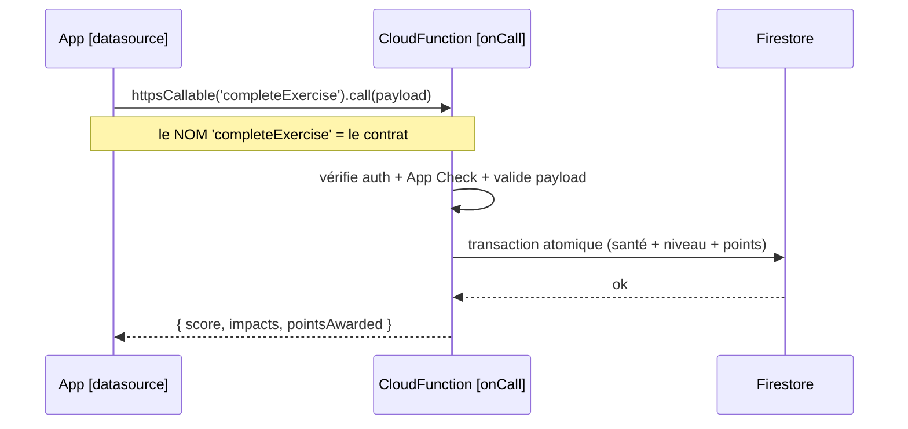

### 5.2 Le catalogue des contrats du MVP

Voici les Cloud Functions du périmètre « tout le sensible », avec leur contrat. C'est la table de référence partagée entre l'app et le serveur.

| Function | Type | L'app envoie | Le serveur renvoie | Domaine |
|---|---|---|---|---|
| `completeExercise` | onCall | `{ exerciseId, sessionId, stepStatuses }` | `{ score, impacts[], pointsAwarded }` | Alimentation |
| `submitQuiz` | onCall | `{ quizId, sessionId, answers }` | `{ score, impacts[], pointsAwarded }` | Alimentation |
| `askTutor` | onCall (streaming) | `{ exerciseId, stepIndex, studentWork }` | flux de texte (réponse du tuteur) | IA Mode 3 |
| `chatMessage` | onCall (streaming) | `{ conversationId, message, context }` | flux de texte + diagrammes | IA chat M6 |
| `correctMode1` | onCall | `{ exerciseId, submission }` (coûte des crédits) | `{ correction, creditsSpent }` | IA Mode 1 |
| `createSubscription` | onCall | `{ plan }` | `{ paymentUrl, intentId }` | Paiement |
| `purchaseCredits` | onCall | `{ packId }` | `{ paymentUrl, intentId }` | Paiement |
| `paymentWebhook` | onRequest | (appelé par l'agrégateur) | `200 OK` | Paiement |
| `checkPremiumAccess` | onCall | `{ feature }` | `{ granted: bool }` | Premium |

Note sur `checkPremiumAccess` : l'app fait **aussi** une vérification locale (pour l'UX, éviter d'afficher un écran inutile), mais le verrou réel reste les règles Firestore + cette Function côté serveur. Voir section 12.

### 5.3 Comment les contrats évoluent sans casser

Règle : on **n'enlève jamais** un champ d'un contrat sans transition ; on **ajoute** des champs optionnels. Si `completeExercise` doit changer de forme, on crée `completeExerciseV2` et on migre l'app, plutôt que de casser l'existant. Comme les utilisateurs ont des versions d'app différentes (ils ne mettent pas tous à jour en même temps), le serveur doit supporter les anciens contrats un temps.

---

## 6. L'architecture en couches d'une Cloud Function

Comme côté mobile, on sépare les couches. Le but : une Function mince qui délègue à des services testables. On distingue trois niveaux.

### 6.1 Les trois niveaux

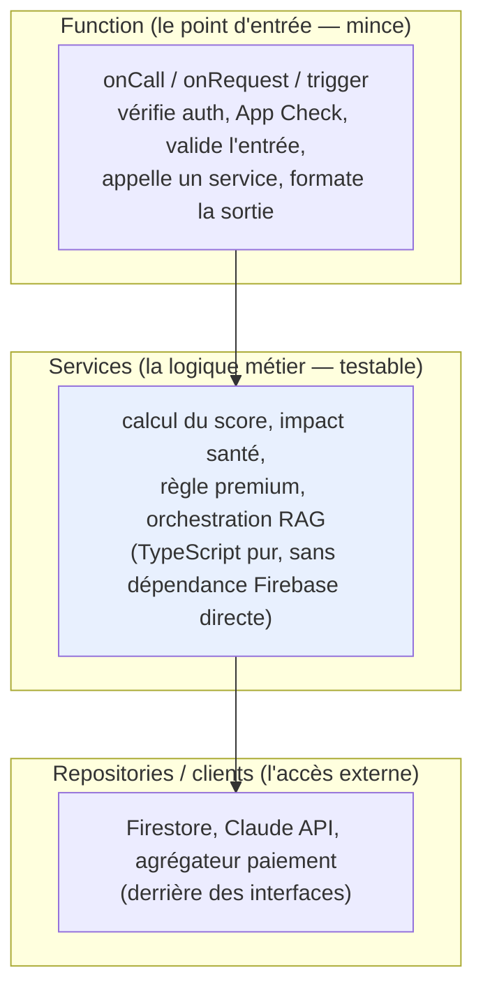

**La Function** est le point d'entrée. Elle ne contient pas de logique métier : elle vérifie la sécurité, valide l'entrée, appelle un service, met en forme la réponse. Quelques dizaines de lignes maximum.

**Le service** porte la logique métier. Il est en TypeScript pur, reçoit ses dépendances par injection (les repositories), et se teste sans Firebase. C'est l'équivalent serveur du « use case » mobile.

**Le repository / client** encapsule l'accès externe (Firestore, Claude, agrégateur). Derrière une interface, pour que le service ne dépende pas directement du SDK.

### 6.2 Exemple complet : `completeExercise`

**Niveau 1 — la Function (mince) :**

```typescript
// functions/src/exercises/complete_exercise.function.ts
import { onCall, HttpsError } from "firebase-functions/v2/https";
import { CompleteExerciseService } from "./complete_exercise.service";
import { FirestoreProgressRepository } from "./progress.repository";
import { validateCompletePayload } from "./complete_exercise.schema";
import { logger } from "../core/logging";

export const completeExercise = onCall(
  { enforceAppCheck: true, region: "europe-west1" },
  async (request) => {
    // 1. Sécurité
    if (!request.auth) {
      throw new HttpsError("unauthenticated", "Connexion requise");
    }
    const uid = request.auth.uid;

    // 2. Validation de l'entrée (jamais faire confiance au client)
    const payload = validateCompletePayload(request.data); // lève si invalide

    logger.info("completeExercise: début", { uid, exerciseId: payload.exerciseId });

    // 3. Délégation au service (toute la logique métier est là)
    const service = new CompleteExerciseService(
      new FirestoreProgressRepository()
    );
    const result = await service.execute(uid, payload);

    // 4. Réponse
    logger.info("completeExercise: succès", { uid, score: result.score });
    return result;
  }
);
```

**Niveau 2 — le service (testable, logique métier) :**

```typescript
// functions/src/exercises/complete_exercise.service.ts
import { ProgressRepository } from "./progress.repository";
import { CompletePayload, CompletionResult } from "../shared/types";
import { computeScore, computeNotionImpacts, computePoints } from "./scoring";

export class CompleteExerciseService {
  constructor(private readonly progress: ProgressRepository) {}

  async execute(uid: string, payload: CompletePayload): Promise<CompletionResult> {
    // IDEMPOTENCE : si ce sessionId a déjà été traité, on renvoie le résultat
    // existant sans rien recréditer (voir section 9).
    const existing = await this.progress.findCompletion(uid, payload.sessionId);
    if (existing) return existing;

    // LOGIQUE MÉTIER PURE : calculs testables sans Firebase
    const score = computeScore(payload.stepStatuses);
    const impacts = computeNotionImpacts(payload.stepStatuses, payload.exerciseId);
    const points = computePoints(score);

    const result: CompletionResult = {
      exerciseId: payload.exerciseId,
      score, impacts, pointsAwarded: points,
    };

    // TRANSACTION ATOMIQUE : santé + niveau + points + marque d'idempotence
    await this.progress.applyCompletionAtomically(uid, payload.sessionId, result);

    return result;
  }
}
```

**Niveau 3 — le repository (accès Firestore, derrière une interface) :**

```typescript
// functions/src/exercises/progress.repository.ts
import { getFirestore } from "firebase-admin/firestore";
import { CompletionResult } from "../shared/types";

export interface ProgressRepository {
  findCompletion(uid: string, sessionId: string): Promise<CompletionResult | null>;
  applyCompletionAtomically(
    uid: string, sessionId: string, result: CompletionResult
  ): Promise<void>;
}

export class FirestoreProgressRepository implements ProgressRepository {
  private db = getFirestore();

  async findCompletion(uid: string, sessionId: string) {
    const doc = await this.db.doc(`users/${uid}/completions/${sessionId}`).get();
    return doc.exists ? (doc.data() as CompletionResult) : null;
  }

  async applyCompletionAtomically(uid: string, sessionId: string, result: CompletionResult) {
    await this.db.runTransaction(async (tx) => {
      const completionRef = this.db.doc(`users/${uid}/completions/${sessionId}`);
      // garde d'idempotence dans la transaction elle-même
      const snap = await tx.get(completionRef);
      if (snap.exists) return; // déjà appliqué, on ne double pas

      tx.set(completionRef, result);                          // marque d'idempotence
      // santé scolaire par notion
      for (const impact of result.impacts) {
        const healthRef = this.db.doc(`users/${uid}/health/${impact.notionId}`);
        tx.set(healthRef, { delta: impact.delta }, { merge: true });
      }
      // points
      const pointsRef = this.db.doc(`users/${uid}/stats/points`);
      tx.set(pointsRef, { total: result.pointsAwarded }, { merge: true });
    });
  }
}
```

### 6.3 Pourquoi cette séparation

Le service `CompleteExerciseService` se teste **sans Firebase** : on lui passe un faux `ProgressRepository` et on vérifie le calcul du score, l'impact santé, l'idempotence. Exactement comme un use case mobile se teste avec un faux repository. La Function elle-même, étant mince, a peu à tester. La logique de calcul (`scoring.ts`) est du TypeScript pur, testable trivialement.

---

## 7. La structure de dossiers complète, fichier par fichier

Le backend vit dans le dossier `functions/` à la racine du projet Firebase, séparé du code Flutter. Voici l'arborescence.

```
functions/
│
├── package.json                          # dépendances Node, engines: node 22
├── tsconfig.json                         # config TypeScript
├── .eslintrc.js                          # lint
│
└── src/
    │
    ├── index.ts                          # ⚠ SEUL point d'export : ré-exporte toutes les Functions
    │
    ├── core/                             # transversal serveur (équivalent du core/ mobile)
    │   ├── logging.ts                    # logger structuré (firebase-functions/logger)
    │   ├── errors.ts                     # erreurs métier serveur + mapping vers HttpsError
    │   ├── app_check.ts                  # helpers de vérification sécurité
    │   ├── validation.ts                 # helpers de validation d'entrée (zod)
    │   └── firestore.ts                  # init firebase-admin, accès getFirestore()
    │
    ├── shared/                           # types partagés (idéalement avec l'app — section 8)
    │   ├── types.ts                      # CompletePayload, CompletionResult, SubscriptionStatus...
    │   └── contracts.ts                  # noms et formes des contrats app↔serveur
    │
    ├── exercises/                        # domaine : exercices & alimentation
    │   ├── complete_exercise.function.ts # onCall (mince)
    │   ├── complete_exercise.service.ts  # logique métier (testable)
    │   ├── complete_exercise.schema.ts   # validation de l'entrée (zod)
    │   ├── scoring.ts                    # calculs purs : score, impacts, points
    │   └── progress.repository.ts        # accès Firestore (interface + impl)
    │
    ├── quizzes/
    │   └── submit_quiz.function.ts       # même structure que exercises/
    │
    ├── ai/                               # domaine : IA & RAG
    │   ├── ask_tutor.function.ts         # onCall streaming (Mode 3)
    │   ├── chat_message.function.ts      # onCall streaming (chat M6)
    │   ├── correct_mode1.function.ts     # onCall (correction Mode 1, coûte des crédits)
    │   ├── claude.client.ts              # client Claude (interface + impl) — clé via secret
    │   ├── rag.service.ts                # orchestration RAG (récupération + prompt)
    │   └── ai.repository.ts              # accès au corpus de cours (Firestore/Storage)
    │
    ├── billing/                          # domaine : paiements & premium
    │   ├── create_subscription.function.ts # onCall
    │   ├── purchase_credits.function.ts    # onCall
    │   ├── payment_webhook.function.ts     # onRequest (webhook agrégateur)
    │   ├── check_premium_access.function.ts # onCall (verrou serveur)
    │   ├── subscription.service.ts         # logique premium + crédits
    │   ├── aggregator.client.ts            # client agrégateur (interface + impl)
    │   └── billing.repository.ts           # accès Firestore (abonnements, crédits)
    │
    └── gamification/                      # domaine : classements dérivés
        ├── on_points_changed.trigger.ts  # onDocumentWritten (recalcul classement)
        └── ranking.service.ts
```

### 7.1 Le rôle de `index.ts`

`index.ts` est le **seul** fichier qui exporte les Functions vers Firebase. Il ré-exporte celles définies dans chaque domaine. C'est ce que Firebase déploie.

```typescript
// functions/src/index.ts
export { completeExercise } from "./exercises/complete_exercise.function";
export { submitQuiz } from "./quizzes/submit_quiz.function";
export { askTutor } from "./ai/ask_tutor.function";
export { chatMessage } from "./ai/chat_message.function";
export { correctMode1 } from "./ai/correct_mode1.function";
export { createSubscription } from "./billing/create_subscription.function";
export { purchaseCredits } from "./billing/purchase_credits.function";
export { paymentWebhook } from "./billing/payment_webhook.function";
export { checkPremiumAccess } from "./billing/check_premium_access.function";
export { onPointsChanged } from "./gamification/on_points_changed.trigger";
```

**Pourquoi un seul point d'export :** Firebase scanne `index.ts` pour découvrir les Functions à déployer. Centraliser les exports rend explicite la liste complète des Functions déployées — on voit d'un coup d'œil tout ce que le serveur expose.

### 7.2 La convention de nommage des fichiers

Le suffixe dit la nature du fichier : `.function.ts` (point d'entrée déployé), `.service.ts` (logique métier), `.repository.ts` / `.client.ts` (accès externe), `.schema.ts` (validation), `.trigger.ts` (déclencheur Firestore). Cette discipline rend la couche d'un fichier lisible dès son nom.

---

## 8. Le domaine partagé : types et erreurs communs

Le `shared/` contient les types qui définissent les contrats. Un point d'attention majeur : **ces types doivent rester synchronisés avec l'app Flutter.** L'app et le serveur échangent du JSON ; si leurs définitions divergent, les bugs sont silencieux.

### 8.1 Les types des contrats

```typescript
// functions/src/shared/types.ts

export type StepStatus = "solved" | "unsolved";

export interface CompletePayload {
  exerciseId: string;
  sessionId: string;                       // clé d'idempotence
  stepStatuses: Record<string, StepStatus>;
}

export interface NotionImpact {
  notionId: string;
  delta: number;
}

export interface CompletionResult {
  exerciseId: string;
  score: number;                           // sur 100
  impacts: NotionImpact[];
  pointsAwarded: number;
}

export type SubscriptionStatus = "none" | "active" | "gracePeriod" | "expired";
```

### 8.2 Le problème de la synchronisation avec Dart

Côté app, ces mêmes structures existent en Dart (les models, dans `data/models/`). Deux définitions de la même chose dans deux langages = risque de divergence. Trois stratégies, du plus simple au plus robuste :

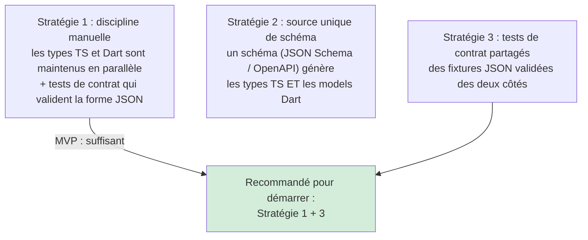

**Recommandation MVP :** stratégie 1 + 3. On maintient les types des deux côtés manuellement (le périmètre est petit, ~9 contrats), et on ajoute des **tests de contrat** : des fixtures JSON d'exemple que l'app et le serveur valident chacun de leur côté. Si un côté change la forme, son test casse. On n'investit dans la génération de code (stratégie 2) que si le nombre de contrats explose.

**Règle d'équipe :** tout changement d'un type dans `shared/types.ts` impose de vérifier le model Dart correspondant **dans la même PR** (ou une PR liée). Un type de contrat ne se modifie jamais d'un seul côté.

### 8.3 Les erreurs serveur et leur mapping

Les Functions communiquent les erreurs à l'app via `HttpsError`, dont les codes sont compris par le SDK Flutter. On définit un mapping clair entre nos erreurs métier et ces codes.

```typescript
// functions/src/core/errors.ts
import { HttpsError } from "firebase-functions/v2/https";

export class DomainError extends Error {
  constructor(
    public readonly code: "validation" | "access_denied" | "not_found" | "payment" | "ai",
    message: string
  ) { super(message); }
}

// Traduit une erreur métier en HttpsError (le seul format que l'app comprend).
export function toHttpsError(e: unknown): HttpsError {
  if (e instanceof DomainError) {
    switch (e.code) {
      case "validation":    return new HttpsError("invalid-argument", e.message);
      case "access_denied": return new HttpsError("permission-denied", e.message);
      case "not_found":     return new HttpsError("not-found", e.message);
      case "payment":       return new HttpsError("failed-precondition", e.message);
      case "ai":            return new HttpsError("internal", e.message);
    }
  }
  return new HttpsError("internal", "Erreur interne");
}
```

Côté app, ces codes deviennent des `Failure` (le guide mobile, section sur les erreurs). La boucle est bouclée : une `DomainError` serveur → `HttpsError` → `FirebaseFunctionsException` côté app → `Failure` → message clair pour l'élève.

---

## 9. Les transactions et l'idempotence (alimentation santé + points)

C'est le cœur de ce qui justifie le backend. On l'a vu en code (section 6.2) ; ici on explique le pourquoi en profondeur, car ce sont les bugs les plus coûteux.

### 9.1 Le problème de cohérence

Terminer un exercice modifie trois choses : santé scolaire (par notion), niveau, points. Si on les écrivait séparément et qu'une panne survenait entre la 2ᵉ et la 3ᵉ écriture, l'élève se retrouverait dans un état impossible (santé mise à jour, points non crédités). Sur la durée, ces incohérences s'accumulent et faussent la gamification et la santé scolaire — deux piliers du produit.

**Solution : la transaction Firestore.** Toutes les écritures liées sont dans `db.runTransaction(...)`. Firestore garantit que **soit toutes réussissent, soit aucune**. Pas d'état intermédiaire.

### 9.2 Le problème de la répétition (idempotence)

Le réseau du marché est instable. Un appel peut être rejoué : l'app n'a pas reçu la réponse, elle retente ; ou l'élève tape deux fois « soumettre ». Sans protection, l'alimentation s'appliquerait deux fois → points doublés, santé faussée.

**Solution : la clé d'idempotence.** Chaque session d'exercice a un `sessionId` unique généré côté app. Le serveur enregistre, dans la transaction, une marque « ce sessionId a été traité ». Si le même `sessionId` revient, le serveur détecte la marque et renvoie le résultat existant sans rien recréditer.

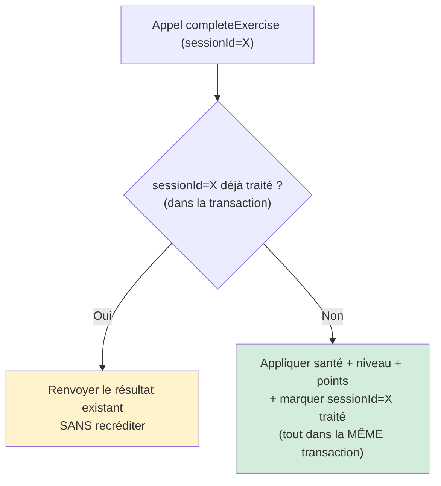

### 9.3 Pourquoi la garde d'idempotence est DANS la transaction

Point technique subtil mais critique : la vérification « déjà traité ? » et l'écriture de la marque doivent être dans **la même transaction** que les écritures de données. Sinon, deux appels simultanés pourraient tous deux passer la vérification avant que l'un ait écrit la marque (condition de course). Firestore garantit l'atomicité de la transaction, ce qui élimine cette course. C'est pourquoi, dans le code de la section 6.2, le `tx.get(completionRef)` est à l'intérieur de `runTransaction`.

### 9.4 Le piège des triggers en boucle

Si une Function trigger (`onDocumentWritten`) écrit un document qui la redéclenche, on crée une boucle infinie (et une facture). Règle : un trigger ne doit jamais écrire le document qui le déclenche, ou doit vérifier qu'un changement réel a eu lieu avant d'agir. Pour le recalcul de classement (`onPointsChanged`), le trigger écrit dans une collection **différente** (`rankings/`), pas dans `stats/points` qui le déclenche.

---

## 10. Les paiements et webhooks (la logique premium)

Le flux de paiement est le plus délicat car il implique un tiers (l'agrégateur) et de l'argent. La règle d'or : **la confirmation ne vient jamais du client, toujours du webhook serveur vérifié.**

### 10.1 Le flux complet

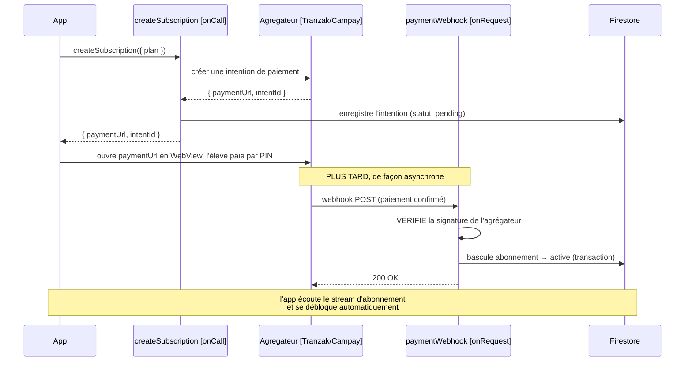

### 10.2 Les trois règles non négociables du paiement

**1. Vérifier la signature du webhook avant toute action.** N'importe qui peut envoyer une requête POST à votre endpoint webhook. Seul l'agrégateur connaît le secret de signature. La Function vérifie cette signature en premier ; si elle est absente ou invalide, on rejette sans rien faire.

```typescript
// functions/src/billing/payment_webhook.function.ts (extrait)
export const paymentWebhook = onRequest(async (req, res) => {
  const signature = req.headers["x-aggregator-signature"];
  if (!verifySignature(req.rawBody, signature, AGGREGATOR_SECRET.value())) {
    logger.warn("Webhook: signature invalide, rejet");
    res.status(401).send("Invalid signature");
    return;                                  // on ne fait RIEN d'autre
  }
  // … signature valide : traiter le paiement
});
```

**2. L'app ne décide jamais du statut premium.** Quand l'app revient de la WebView, elle ne dit pas « j'ai payé donc active-moi ». Elle attend que le webhook ait basculé l'abonnement côté serveur, et le voit via le stream Firestore. Si l'app pouvait s'auto-déclarer premium, le freemium serait contournable en une minute.

**3. L'idempotence s'applique aussi aux paiements.** Un agrégateur peut renvoyer le même webhook plusieurs fois (retry de son côté). On traite chaque `intentId` une seule fois, avec la même garde transactionnelle qu'en section 9.

### 10.3 La cohérence avec le verrou d'accès

Une fois l'abonnement basculé à `active` côté serveur, l'accès au Mode 2 (et autres fonctionnalités premium) est garanti par les **règles de sécurité Firestore** : un document de session Mode 2 ne peut être créé que si l'abonnement de l'utilisateur est actif. La Function `checkPremiumAccess` et la vérification locale de l'app ne sont que des optimisations d'UX par-dessus ce verrou réel (section 12).

---

## 11. L'IA et le RAG (appels au modèle, protection de la clé)

Tout ce qui touche au modèle Claude vit côté serveur, pour protéger la clé d'API et contrôler les coûts.

### 11.1 Pourquoi côté serveur, impérativement

La clé d'API Claude donne accès à un service payant. Dans une app mobile décompilable, une clé incluse serait extraite et utilisée par des tiers à vos frais en quelques heures. **La clé ne quitte jamais le serveur.** L'app envoie la question ; le serveur appelle Claude avec la clé ; le serveur renvoie la réponse.

### 11.2 Le client Claude derrière une interface

```typescript
// functions/src/ai/claude.client.ts
import Anthropic from "@anthropic-ai/sdk";
import { defineSecret } from "firebase-functions/params";

export const CLAUDE_API_KEY = defineSecret("CLAUDE_API_KEY"); // jamais en clair

export interface AiClient {
  generate(prompt: string, context: string): Promise<string>;
  stream(prompt: string, context: string): AsyncIterable<string>;
}

export class ClaudeClient implements AiClient {
  private client = new Anthropic({ apiKey: CLAUDE_API_KEY.value() });

  async generate(prompt: string, context: string): Promise<string> {
    const res = await this.client.messages.create({
      model: "claude-sonnet-4-20250514",
      max_tokens: 1024,
      messages: [{ role: "user", content: `${context}\n\n${prompt}` }],
    });
    return res.content.filter(b => b.type === "text").map(b => (b as any).text).join("");
  }

  async *stream(prompt: string, context: string): AsyncIterable<string> {
    const s = await this.client.messages.stream({
      model: "claude-sonnet-4-20250514",
      max_tokens: 1024,
      messages: [{ role: "user", content: `${context}\n\n${prompt}` }],
    });
    for await (const event of s) {
      if (event.type === "content_block_delta" && event.delta.type === "text_delta") {
        yield event.delta.text;
      }
    }
  }
}
```

La clé passe par un **secret** Firebase (`defineSecret`), jamais codée en dur ni dans un fichier versionné. Le service RAG dépend de l'interface `AiClient`, pas de `ClaudeClient` — donc testable avec un faux client.

### 11.3 Le RAG, orchestré côté serveur

Le RAG (Retrieval-Augmented Generation) récupère les portions de cours pertinentes avant d'interroger le modèle. Cette orchestration vit dans un service serveur.

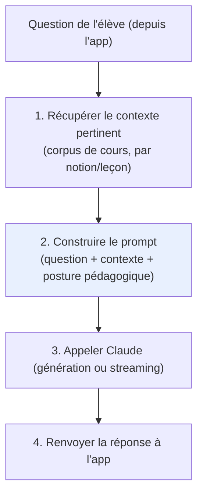

L'app n'orchestre rien de tout cela : elle envoie la question et reçoit la réponse (en streaming pour le Mode 3 et le chat, pour l'effet « réponse qui s'écrit »). Toute la logique RAG, le choix du modèle, la construction du prompt et la posture pédagogique (« accompagner sans donner la solution ») vivent côté serveur, où on peut les faire évoluer sans republier l'app.

### 11.4 Le contrôle des coûts IA

Les appels IA coûtent de l'argent à chaque requête. Trois protections côté serveur : **App Check** (rejeter les appels qui ne viennent pas de l'app authentique), la **vérification des crédits/quota** avant l'appel (Mode 1 et Mode 3 coûtent des crédits ; le chat a un quota quotidien), et une **limite de tokens** par requête. La Function vérifie le quota/crédit avant d'appeler Claude, jamais après.

---

## 12. La sécurité serveur (App Check, règles, secrets)

Le backend est la dernière ligne de défense. Tout ce qui a une conséquence (argent, accès payant, points) doit y être verrouillé. Quatre mécanismes.

### 12.1 App Check : seules les requêtes de l'app authentique

Toute Function `onCall` sensible active `enforceAppCheck: true`. Firebase rejette alors automatiquement les appels qui ne proviennent pas de votre app authentique (vérifiée par Play Integrity / App Attest). Cela bloque les scripts qui tenteraient d'appeler vos Functions directement — protection directe contre l'abus des appels IA coûteux.

```typescript
export const askTutor = onCall({ enforceAppCheck: true }, async (request) => { /* … */ });
```

### 12.2 Authentification : qui est l'appelant

`request.auth` contient l'identité de l'élève (vérifiée par Firebase Auth). Toute Function qui agit sur des données d'utilisateur vérifie `request.auth` en premier et refuse si absent. On n'utilise jamais un `uid` envoyé dans le payload (falsifiable) ; on utilise `request.auth.uid` (vérifié par Firebase).

### 12.3 Validation des entrées : ne jamais faire confiance au client

Tout ce que l'app envoie est potentiellement malveillant ou malformé. Chaque Function valide la forme de son entrée avant de l'utiliser (avec `zod`, par exemple). Une entrée invalide → erreur `invalid-argument`, jamais d'action.

```typescript
// functions/src/exercises/complete_exercise.schema.ts
import { z } from "zod";
import { DomainError } from "../core/errors";

const schema = z.object({
  exerciseId: z.string().min(1),
  sessionId: z.string().min(1),
  stepStatuses: z.record(z.enum(["solved", "unsolved"])),
});

export function validateCompletePayload(data: unknown) {
  const r = schema.safeParse(data);
  if (!r.success) throw new DomainError("validation", "Entrée invalide");
  return r.data;
}
```

### 12.4 Les règles de sécurité Firestore : le vrai verrou d'accès

Les Cloud Functions protègent les opérations qui passent par elles. Mais l'app lit et écrit aussi **directement** dans Firestore (les lectures de contenu, par exemple). Ces accès directs sont protégés par les **règles de sécurité Firestore**, qui s'exécutent sur le serveur de Google.

C'est ici que vit le vrai verrou premium pour les accès directs : une règle interdit à un compte non-premium de créer un document de session Mode 2. Même si l'app était modifiée pour contourner sa vérification locale, la règle Firestore refuserait l'écriture.

```
// extrait conceptuel de firestore.rules
match /users/{uid}/mode2_sessions/{sessionId} {
  allow create: if request.auth.uid == uid
                && get(/databases/$(database)/documents/subscriptions/$(uid)).data.status == "active";
}
```

**La répartition complète des verrous :**

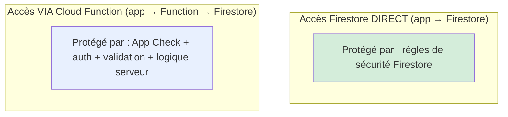

### 12.5 Les secrets : jamais dans le code

Les clés (Claude, secret de signature des agrégateurs) sont des **secrets Firebase** (`defineSecret`), stockés dans Secret Manager, jamais dans le code ni dans un fichier versionné. On les déclare et on y accède via `.value()` dans la Function. Une clé trouvée dans le dépôt Git est un incident de sécurité.

---

## 13. Le logging et l'observabilité côté serveur

Comme côté mobile, **tout est loggé** côté serveur. Mais on utilise le logger intégré de `firebase-functions`, pas le package `logger` (qui est spécifique à Dart). Les logs serveur remontent automatiquement dans Cloud Logging (Google Cloud Console).

### 13.1 Le logger structuré

```typescript
// functions/src/core/logging.ts
import { logger as fnLogger } from "firebase-functions/v2";

export const logger = {
  debug: (msg: string, data?: object) => fnLogger.debug(msg, data),
  info:  (msg: string, data?: object) => fnLogger.info(msg, data),
  warn:  (msg: string, data?: object) => fnLogger.warn(msg, data),
  error: (msg: string, data?: object) => fnLogger.error(msg, data),
};
```

`firebase-functions/logger` produit des logs **structurés** (JSON), ce qui permet de filtrer et chercher dans Cloud Logging par champ (par `uid`, par `exerciseId`…). C'est bien plus puissant que des messages texte.

### 13.2 Que logger côté serveur

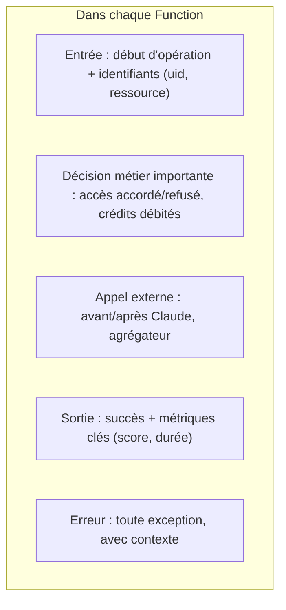

**Règle d'équipe :** chaque Function logge son début (avec les identifiants), ses décisions métier, ses appels externes (IA, paiement), son issue, et toute erreur. Une Function muette est indébogable en production.

### 13.3 Ce qu'on ne logge jamais (identique au mobile)

Jamais : la clé d'API Claude, le secret de signature des agrégateurs, les codes PIN, les jetons, les numéros de téléphone complets, le contenu personnel sensible. On logge des identifiants (`uid`, `intentId`), pas des secrets ni des données sensibles.

### 13.4 Crashlytics vs Cloud Logging

Les erreurs **de l'app** remontent dans Crashlytics (côté mobile). Les erreurs **du serveur** remontent dans Cloud Logging (côté Functions). Ce sont deux systèmes distincts. Pour diagnostiquer un bug de bout en bout (l'élève voit une erreur après une action serveur), on corrèle les deux par les identifiants communs (`uid`, `sessionId`) — d'où l'importance de logger ces identifiants des deux côtés.

---

## 14. La gestion des erreurs côté serveur

Le parallèle avec le mobile : côté app, les exceptions deviennent des `Failure` ; côté serveur, les erreurs métier deviennent des `HttpsError` que l'app sait interpréter.

### 14.1 Le flux d'une erreur serveur

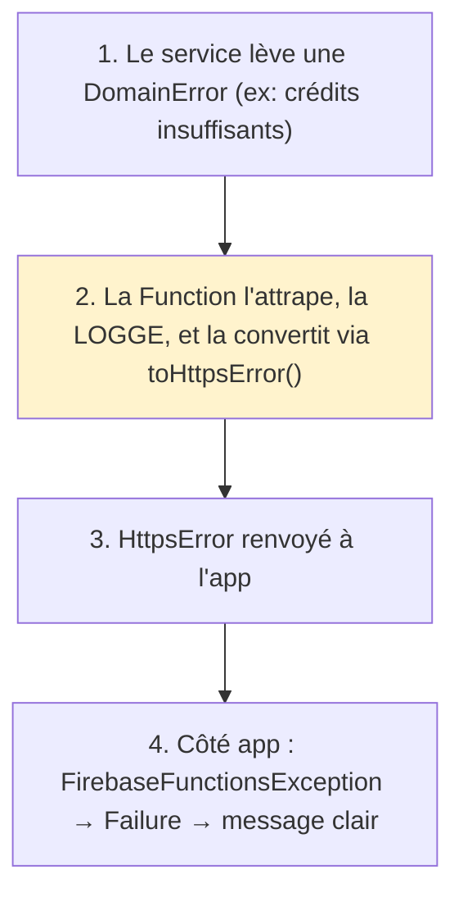

### 14.2 Le pattern dans chaque Function

```typescript
export const correctMode1 = onCall({ enforceAppCheck: true }, async (request) => {
  try {
    if (!request.auth) throw new DomainError("access_denied", "Connexion requise");
    const payload = validateMode1Payload(request.data);
    const service = new CorrectMode1Service(/* deps */);
    return await service.execute(request.auth.uid, payload);
  } catch (e) {
    logger.error("correctMode1 échoué", { error: String(e) });
    throw toHttpsError(e);                  // jamais d'erreur brute non mappée
  }
});
```

**Règle :** aucune Function ne laisse échapper une erreur brute non mappée. Toute erreur est attrapée, loggée, et convertie en `HttpsError` avec un code que l'app comprend. Une erreur non mappée arrive à l'app comme `internal` opaque, sans message utile pour l'élève.

---

## 15. Les tests côté serveur

L'architecture en couches (section 6) rend les tests naturels, comme côté mobile.

### 15.1 Tests de logique pure (les plus nombreux)

Les calculs (`scoring.ts` : score, impacts, points) sont du TypeScript pur, testables trivialement, sans Firebase.

```typescript
// functions/test/scoring.test.ts
import { computeScore } from "../src/exercises/scoring";

test("computeScore : tout résolu = 100", () => {
  expect(computeScore({ "0": "solved", "1": "solved" })).toBe(100);
});

test("computeScore : moitié résolu = 50", () => {
  expect(computeScore({ "0": "solved", "1": "unsolved" })).toBe(50);
});
```

### 15.2 Tests de services (avec faux repositories)

Le service se teste avec un faux `ProgressRepository`, sans Firebase. On vérifie notamment l'idempotence.

```typescript
test("execute : ne recrédite pas si sessionId déjà traité", async () => {
  const fakeRepo = {
    findCompletion: async () => existingResult,   // déjà traité
    applyCompletionAtomically: jest.fn(),
  };
  const service = new CompleteExerciseService(fakeRepo);
  const result = await service.execute("uid1", payload);

  expect(result).toEqual(existingResult);
  expect(fakeRepo.applyCompletionAtomically).not.toHaveBeenCalled(); // aucune réécriture
});
```

### 15.3 Tests d'intégration (émulateur Firebase)

Pour valider les transactions réelles, les règles de sécurité, et le câblage des Functions, on utilise l'**émulateur Firebase** localement. Moins nombreux (plus lents), réservés aux flux critiques : la transaction d'alimentation, le webhook de paiement, les règles d'accès Mode 2.

### 15.4 Ce qu'on teste en priorité

Par ordre : la logique de calcul (pure, rapide), l'idempotence (critique pour la gamification), la vérification de signature des webhooks (critique pour l'argent), les règles de sécurité Firestore (critique pour le freemium). Le reste suit.

---

## 16. Le déploiement et l'environnement

### 16.1 Le runtime

Cloud Functions **2nd gen**, runtime **Node.js 22** (LTS), en **TypeScript** compilé. La génération et le runtime se déclarent dans `package.json` et `firebase.json`.

```json
// functions/package.json (extrait)
{
  "engines": { "node": "22" },
  "main": "lib/index.js",
  "dependencies": {
    "firebase-admin": "^12.0.0",
    "firebase-functions": "^7.0.0",
    "@anthropic-ai/sdk": "^0.30.0",
    "zod": "^3.23.0"
  }
}
```

### 16.2 La région

On déploie dans une région proche des utilisateurs pour réduire la latence (par exemple `europe-west1`, à confirmer selon la latence mesurée vers le Cameroun). Toutes les Functions déclarent la même région pour la cohérence.

### 16.3 Les secrets

Les clés sont gérées via Secret Manager (`firebase functions:secrets:set CLAUDE_API_KEY`). Jamais dans le code, jamais dans `.env` versionné. Une Function qui utilise un secret le déclare dans ses options pour y avoir accès.

### 16.4 Le déploiement sélectif

On déploie une Function précise sans toucher aux autres : `firebase deploy --only functions:completeExercise`. Pendant le développement, l'émulateur local (`firebase emulators:start`) permet de tester sans déployer.

### 16.5 Cohérence des contrats au déploiement

**Règle critique :** ne jamais déployer un changement de contrat serveur (forme d'entrée/sortie d'une Function) sans que l'app correspondante soit prête à l'utiliser, car les utilisateurs ont des versions d'app différentes. On suit la règle d'évolution des contrats (section 5.3) : ajouter, ne pas casser ; versionner si nécessaire.

---

## 17. Conventions d'équipe et checklist de revue

### 17.1 Les règles non négociables

1. Une Function est **mince** : sécurité + validation + délégation à un service + mise en forme. Pas de logique métier dans le corps de la Function.
2. La logique métier vit dans des **services** testables, qui reçoivent leurs dépendances par injection (interfaces, pas SDK direct).
3. Toute Function sensible active **`enforceAppCheck: true`** et vérifie **`request.auth`**.
4. On utilise **`request.auth.uid`**, jamais un `uid` venant du payload.
5. Toute entrée est **validée** (zod) avant usage.
6. Toute écriture multi-documents est **transactionnelle**.
7. Toute opération rejouable est **idempotente** (clé d'idempotence dans la transaction).
8. Les **webhooks vérifient la signature** avant toute action.
9. L'app **ne décide jamais** d'un statut premium ; seul le serveur (webhook + règles) le fait.
10. La **clé Claude et les secrets** passent par Secret Manager, jamais dans le code.
11. **Tout est loggé** (début, décisions, appels externes, issue, erreurs) ; jamais de secret ni de donnée sensible dans les logs.
12. Toute erreur est **attrapée, loggée, et convertie en HttpsError** mappé.
13. Un changement de type dans `shared/` impose de **vérifier le model Dart** correspondant.
14. Un trigger n'écrit **jamais** le document qui le déclenche (anti-boucle).

### 17.2 La checklist de revue (à copier dans le template de PR backend)

```
COUCHES
[ ] La Function est mince ; la logique est dans un service testable
[ ] Le service reçoit ses dépendances par interface (testable sans Firebase)

SÉCURITÉ
[ ] enforceAppCheck activé sur les Functions sensibles
[ ] request.auth vérifié ; uid pris de request.auth, pas du payload
[ ] Entrée validée (zod) avant toute action
[ ] Secrets via Secret Manager, aucun secret dans le code
[ ] Webhook : signature vérifiée avant toute action

COHÉRENCE
[ ] Écritures multi-documents dans une transaction
[ ] Opération rejouable protégée par clé d'idempotence (dans la transaction)
[ ] Trigger n'écrit pas le document qui le déclenche

CONTRAT
[ ] Le contrat (nom, entrée, sortie) est documenté dans shared/
[ ] Changement de type → model Dart correspondant vérifié dans la PR
[ ] Évolution de contrat : ajout sans casser, ou versionné

LOGGING & ERREURS
[ ] Début, décisions, appels externes, issue et erreurs loggés
[ ] Aucune donnée sensible loggée
[ ] Toute erreur attrapée, loggée, convertie en HttpsError mappé

TESTS
[ ] Logique pure testée ; idempotence testée ; signature webhook testée
```

---

## 18. Récapitulatif des dépendances backend

| Domaine | Paquet | Rôle |
|---|---|---|
| SDK Functions | `firebase-functions` (v7, 2nd gen) | Déclencheurs onCall / onRequest / triggers |
| SDK Admin | `firebase-admin` | Accès Firestore/Auth côté serveur (privilégié) |
| IA | `@anthropic-ai/sdk` | Client Claude (clé via Secret Manager) |
| Validation | `zod` | Validation des entrées des Functions |
| Logging | `firebase-functions/logger` (intégré) | Logs structurés vers Cloud Logging |
| Tests | `jest` (ou `vitest`) + émulateur Firebase | Tests unitaires et d'intégration |
| Langage | TypeScript | Tout le backend |

---

## Annexe — Les principes serveur en cinq phrases

1. **Le backend gère le sensible, le coûteux et le partagé** ; l'app gère l'expérience. La frontière : infalsifiable / secret / cohérence multi-écritures / événement externe → serveur.
2. **Une Function est mince** ; la logique vit dans des services testables sans Firebase.
3. **Sécurité par défaut** : App Check + auth + validation sur tout ce qui a une conséquence ; le client ne décide jamais de l'argent ni de l'accès payant.
4. **Cohérence garantie** : écritures liées en transaction, opérations rejouables idempotentes.
5. **Le contrat app ↔ serveur est sacré** : on ajoute sans casser, on synchronise les types des deux côtés, on documente chaque Function.

*Guide d'architecture Cloud Functions · pendant serveur du guide d'architecture mobile*
