# Architecture de l'application — Guide complet pour l'équipe de développement

**Projet :** Application EdTech mobile (Cameroun) — préparation aux examens du secondaire
**Plateforme :** Flutter (iOS + Android, base de code unique)
**Public de ce document :** toute personne qui développe sur le projet, y compris un développeur qui vient d'arriver et n'a aucun contexte préalable.
**Statut :** document de référence. Il se suffit à lui-même : tout ce qui est nécessaire pour écrire du code conforme s'y trouve.

---

## Comment utiliser ce document

Lisez les sections 1 à 4 en entier la première fois : elles posent le vocabulaire et les principes sans lesquels le reste n'a pas de sens. Ensuite, utilisez le document comme référence — chaque section est autonome et traite d'un sujet précis (les couches, le logging, le cache, les erreurs…).

Une convention de lecture : chaque règle est suivie d'un paragraphe expliquant **pourquoi** elle existe. Une règle dont on comprend la raison s'applique correctement, même aux situations que ce document n'a pas prévues.

Le code de ce document est du Dart/Flutter réel et fonctionnel. Les schémas sont en Mermaid (ils s'affichent dans tout outil compatible : GitHub, GitLab, VS Code avec extension Mermaid, Notion).

---

## Sommaire

1. Ce que fait l'application (contexte produit minimal)
2. Le problème que l'architecture résout
3. Les deux idées fondatrices : les couches et les features
4. La règle d'or : le sens des dépendances
5. Le vocabulaire complet (entité, repository, use case, datasource, provider…)
6. La couche `domain` — le cerveau métier
7. La couche `data` — l'accès aux données et à Firebase
8. La couche `presentation` — l'écran et l'état (Riverpod)
9. Le câblage complet d'une fonctionnalité, maillon par maillon
10. La gestion des erreurs (jamais de crash devant l'élève)
11. Le logging — tout doit être tracé (package `logger`)
12. Le cache — on utilise uniquement celui de Firebase
13. La sécurité — où vivent les vrais verrous
14. La structure de dossiers complète, fichier par fichier
15. Le noyau partagé `core/` — ce qui a le droit d'y entrer
16. La granularité : quand créer un use case, quand ne pas en créer
17. Étude de cas complète : faire un exercice en mode « Semi-assisté »
18. Les tests
19. Les conventions d'équipe et la checklist de revue
20. Le récapitulatif des paquets utilisés

---

## 1. Ce que fait l'application (contexte produit minimal)

Pour comprendre les choix techniques, il faut connaître le produit. Voici le strict minimum.

L'application aide les élèves du secondaire camerounais à préparer leurs examens (BEPC, Probatoire, BAC, GCE O/A-Level, et leurs équivalents techniques). Elle est **bilingue** : l'interface est en français pour les élèves francophones, en anglais pour les anglophones, et la langue est déterminée automatiquement par le sous-système choisi à l'inscription (pas de réglage manuel).

Le cœur du produit est la **pratique active d'exercices**. Sur chaque exercice, l'élève choisit l'un de trois modes d'accompagnement :

- **Mode 1 « Je maîtrise »** : il travaille seul, soumet sa réponse (texte ou photo), et reçoit une correction.
- **Mode 2 « Semi-assisté »** : l'exercice est découpé en étapes, avec des indices progressifs et des portions de cours associées. **Réservé aux abonnés premium.**
- **Mode 3 « Assisté »** : un tuteur IA l'accompagne pas à pas.

Il existe aussi un **mode examen** (composer une épreuve complète chronométrée), un **chat pédagogique IA**, une **santé scolaire** (le niveau de l'élève par notion, qui évolue à chaque activité), de la **gamification** (points et classements), et du **contenu pédagogique** (cours, fiches, quiz).

Le modèle économique est **freemium** : un plan gratuit et un abonnement premium (qui débloque des fonctionnalités et fournit des crédits mensuels), plus des crédits achetables à l'unité pour les actions IA. Les paiements passent par le **mobile money** (MTN MoMo, Orange Money) via des agrégateurs.

Trois contraintes de marché façonnent toute l'architecture, à garder en tête en permanence :

- **Téléphones modestes** : entrée et milieu de gamme, peu de RAM et de stockage.
- **Data limitée et coûteuse** : chaque rechargement inutile coûte de l'argent à l'élève.
- **Connectivité instable** : l'app doit rester robuste quand le réseau faiblit.

---

## 2. Le problème que l'architecture résout

Sans architecture, une application Flutter tend à mélanger tout dans les écrans : un widget qui affiche un bouton contient aussi l'appel à Firebase, la règle « est-ce que l'élève est premium ? », et la gestion d'erreur. Au début, c'est rapide. Très vite, ça devient ingérable :

- On ne peut pas tester une règle métier sans lancer toute l'application et Firebase.
- Changer une technologie (par exemple la base de données) oblige à toucher des centaines d'écrans.
- Un nouveau développeur doit tout comprendre d'un coup pour modifier quoi que ce soit.
- Le même code (vérifier l'abonnement, par exemple) est copié-collé dans dix endroits, et les copies divergent.

L'architecture décrite ici évite tout cela en imposant une discipline : **séparer ce qui change pour des raisons différentes**. L'affichage change pour des raisons de design ; les règles métier changent pour des raisons de produit ; l'accès aux données change pour des raisons techniques. On les sépare en trois couches, pour qu'un changement de l'un ne casse pas les autres.

Les quatre objectifs concrets que l'on vise :

**Propreté** — le code d'une règle métier est lisible sans connaître Firebase.
**Testabilité** — les règles métier se testent en quelques millisecondes, sans réseau ni Firebase.
**Réutilisabilité** — une logique transversale s'écrit une fois et sert partout.
**Maintenabilité** — un changement se localise à un seul endroit, et l'application ne recharge jamais une donnée inutilement.

---

## 3. Les deux idées fondatrices : les couches et les features

L'organisation du code repose sur deux découpages **perpendiculaires**. Les confondre est la première source de confusion ; les distinguer rend tout clair.

### 3.1 Découpage vertical : les trois couches

Tout code appartient à l'une de trois couches, selon **sa nature** :

- **`presentation`** — ce que l'élève voit et touche : écrans, boutons, état affiché. C'est là que vit Flutter et la gestion d'état.
- **`domain`** — le cerveau métier : les règles de votre produit (« le Mode 2 exige un abonnement »). Écrit en Dart pur, sans rien de technique.
- **`data`** — l'accès au monde réel : Firebase, le réseau, le cache. C'est la seule couche qui connaît Firestore.

Image mentale : trois étages d'un immeuble. On peut refaire la plomberie d'un étage (changer la base de données dans `data`) sans toucher aux deux autres, tant que les escaliers (les contrats, voir section 4) restent en place.

### 3.2 Découpage horizontal : les features

Le code est d'abord rangé par **fonctionnalité métier** : `auth` (compte et profil), `exercises` (les exercices et leurs modes), `billing` (abonnement et crédits), etc. Chaque fonctionnalité contient ses **propres** trois couches.

Pourquoi pas un rangement par type technique (tous les écrans ensemble, tous les modèles ensemble) ? Parce qu'avec une dizaine de modules, comprendre une fonctionnalité obligerait à ouvrir cinq dossiers éparpillés. En rangeant par feature, tout ce qui concerne les exercices est au même endroit.

### 3.3 La grille qui en résulte

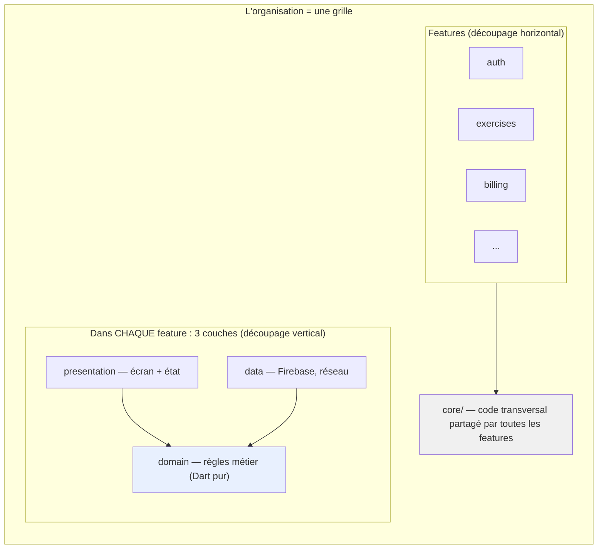

Une feature est une colonne complète (ses trois couches). `core/` est le socle partagé sous toutes les colonnes (section 15).

---

## 4. La règle d'or : le sens des dépendances

C'est la règle la plus importante du projet. Tout en découle. Elle tient en une phrase.

### 4.1 L'énoncé

**Les dépendances pointent toujours vers le centre : `presentation → domain ← data`.**

Concrètement :
- `presentation` connaît `domain` (elle l'utilise).
- `data` connaît `domain` (elle réalise ses contrats).
- `domain` ne connaît **personne**. Il ignore que `presentation` et `data` existent.

« Dépendre » veut dire « importer ». La règle est donc une règle sur qui a le droit d'écrire `import` de quoi. Elle est vérifiable automatiquement (lint).

### 4.2 La table des imports autorisés

| Couche | A le droit d'importer | N'a JAMAIS le droit d'importer |
|---|---|---|
| `domain` | `fpdart`, `freezed_annotation`, `equatable`, d'autres fichiers de son propre `domain` | `flutter`, `firebase_*`, `dio`, `riverpod`, `logger`, `data/`, `presentation/` |
| `data` | `cloud_firestore`, `cloud_functions`, `dio`, `logger`, les models, le `domain` de sa feature | `flutter`, `riverpod`, `presentation/` |
| `presentation` | `flutter`, `riverpod`, `go_router`, `logger`, le `domain` de sa feature | `cloud_firestore`, `dio`, `data/` directement |

Remarquez : la colonne de droite du `domain` est longue. C'est **voulu**. Le `domain` est protégé de tout. Sa pureté fait sa valeur.

### 4.3 Pourquoi cette règle (le raisonnement)

Imaginons l'inverse : le `domain` importe `cloud_firestore`. Alors :

- **Tester une règle exige Firebase.** Pour vérifier « le Mode 2 exige un abonnement », il faudrait lancer un émulateur. Le test devient lent et fragile, donc on cesse de le lancer.
- **Changer de base de données devient un cauchemar.** Chaque règle métier serait mêlée à Firestore et devrait être réécrite.
- **Lire une règle exige de comprendre Firestore.** La logique de votre produit n'est plus lisible isolément.

En gardant le `domain` pur, ces trois problèmes disparaissent. La règle d'or n'est pas une formalité : c'est ce qui rend les quatre objectifs (section 2) atteignables.

### 4.4 « Mais alors comment le domaine obtient-il ses données ? »

C'est la question qui vient naturellement. Si le `domain` ne connaît pas `data`, comment lit-il un exercice ? La réponse est le mécanisme d'inversion, expliqué en détail en section 6.2 : le `domain` **définit un contrat** (ce qu'on peut faire), et `data` **le réalise** (comment le faire). Le domaine commande sans savoir qui exécute.

---

## 5. Le vocabulaire complet

Avant le code, voici tous les termes utilisés dans le projet, définis simplement. Revenez-y dès qu'un mot n'est pas clair.

| Terme | Définition simple |
|---|---|
| **Entité** | Un objet métier pur (un `Exercise`, un `UserProfile`). Vit dans `domain`. Aucune connaissance de Firebase ni de JSON. |
| **Repository (contrat)** | Une interface abstraite, dans `domain`, qui déclare *ce qu'on peut faire* avec une catégorie de données (« obtenir un exercice »), sans dire comment. |
| **Repository (implémentation)** | La classe, dans `data`, qui *réalise* le contrat en parlant vraiment à Firebase. Suffixe `Impl`. |
| **Use case** | Une action métier, dans `domain` : une classe avec une méthode `call`. Porte une règle ou déclenche un effet externe. |
| **Datasource** | Dans `data`, l'accès brut à **une seule** source (Firestore, ou une Cloud Function). Ne décide rien, exécute. |
| **Model** | Dans `data`, une entité enrichie de `fromJson`/`toJson`. Convertit le JSON de Firebase en objet Dart. Ne sort jamais de `data`. |
| **Provider** | Un objet Riverpod qui fournit une valeur ou un état au reste de l'app. Vit dans `presentation`. |
| **Notifier** | Un provider qui gère un état d'écran modifiable (l'état du Mode 2, par exemple) et expose des méthodes pour le changer. |
| **`Either<Failure, T>`** | Un résultat qui contient **soit** un échec (`Failure`), **soit** une valeur (`T`). Remplace les exceptions qui remontent à l'écran. |
| **`Failure`** | Un échec métier présentable à l'élève (« pas de connexion », « abonnement requis »). |
| **`Exception`** | Une erreur technique brute, interne à `data`. Ne sort jamais de `data` : elle est traduite en `Failure`. |
| **`freezed`** | Un outil qui génère automatiquement les entités immutables (avec `copyWith`, égalité, sealed classes). |
| **sealed class** | Une classe dont on connaît **toutes** les sous-classes possibles. Permet au compilateur de vérifier qu'on traite tous les cas. |
| **`@riverpod`** | Une annotation qui génère un provider à partir d'une fonction ou classe. |
| **Cloud Function** | Du code qui tourne sur les serveurs de Firebase, pas dans l'app. Pour la logique sensible (appels IA, transactions, validation de paiement). |

Ces termes reviennent constamment. Le reste du document les utilise sans les redéfinir.

---

## 6. La couche `domain` — le cerveau métier

Le `domain` contient trois choses : des **entités**, des **contrats de repository**, et des **use cases**. C'est du Dart pur : si vous y voyez un `import` de Flutter ou Firebase, c'est un bug.

### 6.1 Les entités

Une entité est un objet métier immutable, généré avec `freezed`. Elle ne contient **pas** de `fromJson` : le domaine ignore que les données viennent un jour de JSON.

```dart
// features/exercises/domain/entities/exercise.dart
import 'package:freezed_annotation/freezed_annotation.dart';

part 'exercise.freezed.dart';

@freezed
class Exercise with _$Exercise {
  const factory Exercise({
    required String id,
    required String lessonId,        // l'exercice est rattaché à une leçon
    required List<String> notionIds, // notions évaluées (pour la santé scolaire)
    required ExerciseType type,
    required Difficulty difficulty,
    required List<ExerciseStep> steps,
  }) = _Exercise;
}

@freezed
class ExerciseStep with _$ExerciseStep {
  const factory ExerciseStep({
    required int index,
    required String prompt,           // le mini-énoncé de l'étape
    required List<String> hints,      // jusqu'à 3 indices progressifs
    required String courseExcerpt,    // la portion de cours associée
  }) = _ExerciseStep;
}

enum ExerciseType { qcm, shortAnswer, problem, openEnded }
enum Difficulty { easy, medium, hard }
```

Ce code pourrait s'exécuter dans une console Dart, sans Flutter. C'est le signe d'un domaine sain.

### 6.2 Les contrats de repository et l'inversion de dépendance

C'est le mécanisme qui répond à la question de la section 4.4. Le `domain` déclare un contrat — *ce qu'on peut faire*, sans *comment* :

```dart
// features/exercises/domain/repositories/exercise_repository.dart
import 'package:fpdart/fpdart.dart';
import '../../../../core/error/failures.dart';
import '../entities/exercise.dart';
import '../entities/completion_result.dart';
import '../entities/completion_submission.dart';

// CONTRAT abstrait. Vit dans le domaine. Aucune trace de Firebase.
abstract class ExerciseRepository {
  Future<Either<Failure, Exercise>> getExercise(String exerciseId);
  Future<Either<Failure, CompletionResult>> completeExercise(
    CompletionSubmission submission,
  );
}
```

La couche `data` (section 7) **réalise** ce contrat. Le « renversement » : c'est `data` qui dépend du `domain` (puisqu'elle implémente son contrat), jamais l'inverse.

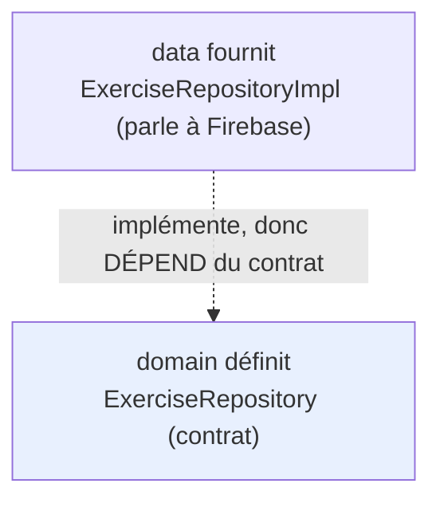

**L'analogie de la prise électrique :** le contrat est une prise murale standard. Le domaine (une lampe) sait tirer du courant de n'importe quelle prise conforme, sans savoir si l'électricité vient de Firebase, d'une autre API, ou d'un faux service de test. On change la centrale sans changer la lampe.

### 6.3 Les use cases

Un use case est une action métier : une classe avec une méthode `call`. Tous suivent un contrat de base commun :

```dart
// core/usecase/usecase.dart
import 'package:fpdart/fpdart.dart';
import '../error/failures.dart';

abstract class UseCase<Type, Params> {
  Future<Either<Failure, Type>> call(Params params);
}

class NoParams {
  const NoParams();
}
```

Exemple : le use case qui décide si l'élève peut lancer le Mode 2. Lisez-le — la règle métier y est exprimée en clair, sans une ligne de Firebase :

```dart
// features/exercises/domain/usecases/check_semi_assisted_access.dart
import '../../../billing/domain/entities/subscription_status.dart';
import '../../../billing/domain/repositories/subscription_repository.dart';

enum AccessDecision { granted, deniedNeedsPremium }

class CheckSemiAssistedAccess {
  CheckSemiAssistedAccess(this._subscriptionRepository);
  final SubscriptionRepository _subscriptionRepository;

  Future<AccessDecision> call() async {
    final status = await _subscriptionRepository.watchStatus().first;

    // LA RÈGLE MÉTIER, en clair : le Mode 2 est inclus dans le premium.
    if (status == SubscriptionStatus.active ||
        status == SubscriptionStatus.gracePeriod) {
      return AccessDecision.granted;
    }
    return AccessDecision.deniedNeedsPremium;
  }
}
```

Quand créer un use case, et quand ne pas en créer : voir la section 16 (point important pour éviter de multiplier des classes inutiles).

---

## 7. La couche `data` — l'accès aux données et à Firebase

La couche `data` contient les **models**, les **datasources**, et les **repository implementations**. C'est la **seule** couche autorisée à importer `cloud_firestore` ou `cloud_functions`.

### 7.1 Les models

Le model est l'entité du domaine + la sérialisation JSON, généré avec `json_serializable`.

```dart
// features/exercises/data/models/exercise_model.dart
import 'package:json_annotation/json_annotation.dart';
import '../../domain/entities/exercise.dart';

part 'exercise_model.g.dart';

@JsonSerializable(explicitToJson: true)
class ExerciseModel {
  ExerciseModel({
    required this.id,
    required this.lessonId,
    required this.notionIds,
    required this.type,
    required this.difficulty,
    required this.steps,
  });

  final String id;
  final String lessonId;
  final List<String> notionIds;
  final ExerciseType type;
  final Difficulty difficulty;
  final List<ExerciseStepModel> steps;

  factory ExerciseModel.fromJson(Map<String, dynamic> json) =>
      _$ExerciseModelFromJson(json);

  Map<String, dynamic> toJson() => _$ExerciseModelToJson(this);

  // Conversion model → entité. Le reste de l'app ne manipule QUE l'entité.
  Exercise toEntity() => Exercise(
        id: id,
        lessonId: lessonId,
        notionIds: notionIds,
        type: type,
        difficulty: difficulty,
        steps: steps.map((s) => s.toEntity()).toList(),
      );
}
```

**Règle : le model ne sort jamais de `data`.** Dès qu'une donnée remonte vers le domaine ou l'écran, c'est une entité (via `toEntity()`). Le JSON et le format Firebase restent confinés ici.

### 7.2 Les datasources

Un datasource fait **une seule chose** : accéder à **une seule** source. Il ne décide pas de la stratégie (cache ou serveur) — c'est le repository qui décide. Comme on utilise le cache de Firebase tel quel (section 12), le datasource fait des lectures Firestore standard.

```dart
// features/exercises/data/datasources/exercise_remote_datasource.dart
import 'package:cloud_firestore/cloud_firestore.dart';
import 'package:cloud_functions/cloud_functions.dart';
import '../models/exercise_model.dart';
import '../models/completion_result_model.dart';
import '../../../../core/error/exceptions.dart';
import '../../../../core/logging/app_logger.dart';

class ExerciseRemoteDataSource {
  ExerciseRemoteDataSource(this._firestore, this._functions, this._log);
  final FirebaseFirestore _firestore;
  final FirebaseFunctions _functions;
  final AppLogger _log;

  Future<ExerciseModel> getExercise(String exerciseId) async {
    _log.d('getExercise → lecture Firestore', data: {'exerciseId': exerciseId});
    // Lecture standard : le cache offline de Firebase agit automatiquement
    // (voir section 12). On ne gère pas de cache custom.
    final doc = await _firestore.collection('exercises').doc(exerciseId).get();

    if (!doc.exists) {
      _log.w('getExercise → exercice introuvable', data: {'exerciseId': exerciseId});
      throw const NotFoundException('Exercice introuvable');
    }
    return ExerciseModel.fromJson(doc.data()!);
  }

  Future<CompletionResultModel> completeExercise(
      Map<String, dynamic> payload) async {
    _log.d('completeExercise → appel Cloud Function', data: payload);
    try {
      final callable = _functions.httpsCallable('completeExercise');
      final res = await callable.call<Map<String, dynamic>>(payload);
      return CompletionResultModel.fromJson(res.data);
    } on FirebaseFunctionsException catch (e, st) {
      _log.e('completeExercise échoué', error: e, stackTrace: st);
      throw ServerException(e.message ?? 'Échec de la complétion');
    }
  }
}
```

Notez que le datasource **logge** ses opérations. Le logging est obligatoire partout (section 11).

### 7.3 Les repository implementations

Ils réalisent le contrat du domaine. Deux responsabilités : orchestrer les datasources, et **traduire les `Exception` techniques en `Failure` métier**. C'est le seul endroit de l'app où cette traduction a lieu.

```dart
// features/exercises/data/repositories/exercise_repository_impl.dart
import 'package:fpdart/fpdart.dart';
import 'package:cloud_firestore/cloud_firestore.dart';
import '../../domain/entities/exercise.dart';
import '../../domain/entities/completion_result.dart';
import '../../domain/entities/completion_submission.dart';
import '../../domain/repositories/exercise_repository.dart';
import '../datasources/exercise_remote_datasource.dart';
import '../../../../core/error/exceptions.dart';
import '../../../../core/error/failures.dart';
import '../../../../core/logging/app_logger.dart';

class ExerciseRepositoryImpl implements ExerciseRepository {
  ExerciseRepositoryImpl(this._remote, this._log);
  final ExerciseRemoteDataSource _remote;
  final AppLogger _log;

  @override
  Future<Either<Failure, Exercise>> getExercise(String exerciseId) async {
    try {
      final model = await _remote.getExercise(exerciseId);
      return Right(model.toEntity());
    } on NotFoundException catch (e) {
      return Left(NotFoundFailure(e.message));
    } on FirebaseException catch (e, st) {
      _log.e('getExercise → FirebaseException', error: e, stackTrace: st);
      return Left(ServerFailure(e.message ?? 'Erreur serveur'));
    } catch (e, st) {
      _log.e('getExercise → erreur inattendue', error: e, stackTrace: st);
      return Left(const UnknownFailure());
    }
  }

  @override
  Future<Either<Failure, CompletionResult>> completeExercise(
      CompletionSubmission submission) async {
    try {
      final model = await _remote.completeExercise({
        'exerciseId': submission.exerciseId,
        'sessionId': submission.sessionId,   // clé d'idempotence (section 17.6)
        'stepStatuses': submission.stepStatuses
            .map((k, v) => MapEntry(k.toString(), v.name)),
      });
      return Right(model.toEntity());
    } on ServerException catch (e) {
      return Left(ServerFailure(e.message));
    } catch (e, st) {
      _log.e('completeExercise → erreur inattendue', error: e, stackTrace: st);
      return Left(const UnknownFailure());
    }
  }
}
```

Au-dessus de la ligne `catch`, plus aucune exception ne circule : uniquement des `Either<Failure, T>`. C'est ce qui garantit qu'aucune erreur technique ne crashera l'écran de l'élève — crucial sur une connectivité instable.

---

## 8. La couche `presentation` — l'écran et l'état (Riverpod)

La couche `presentation` contient les **providers** (l'état, géré par Riverpod), les **pages** (les écrans), et les **widgets** (les composants). C'est la seule couche qui importe Flutter.

### 8.1 Pourquoi Riverpod

Riverpod gère l'état de l'application. On l'a choisi pour la durabilité du projet : dépendances explicites vérifiées par le compilateur, remplacement trivial en test (on substitue un provider par un faux en une ligne), et un écosystème bien maintenu. Riverpod sert aussi de système d'injection de dépendances (voir 8.4) — on n'ajoute donc pas `get_it`.

### 8.2 Le vocabulaire Riverpod minimal

- **Provider** : fournit une valeur au reste de l'app. Un widget le « lit » avec `ref.watch(...)`.
- **`@riverpod`** : génère le provider à partir d'une fonction/classe.
- **`Notifier`** : un provider d'état modifiable, avec des méthodes pour le changer.
- **`ref`** : permet à un provider d'en lire un autre.

### 8.3 L'état d'écran modélisé en sealed class

L'état d'un écran complexe (le Mode 2) se modélise en sealed class `freezed`. Chaque état possible est explicite ; le compilateur force l'écran à tous les traiter.

```dart
// features/exercises/domain/entities/semi_assisted_state.dart
import 'package:freezed_annotation/freezed_annotation.dart';
import 'exercise.dart';
import 'completion_result.dart';
import '../../../../core/error/failures.dart';

part 'semi_assisted_state.freezed.dart';

@freezed
sealed class SemiAssistedState with _$SemiAssistedState {
  const factory SemiAssistedState.checkingAccess() = CheckingAccess;
  const factory SemiAssistedState.accessDenied() = AccessDenied;
  const factory SemiAssistedState.loading() = Loading;
  const factory SemiAssistedState.inProgress({
    required Exercise exercise,
    required int currentStep,
    required Map<int, StepStatus> statuses,   // résolu / non-résolu par étape
    required Map<int, int> hintsRevealed,     // étape → nb d'indices montrés (max 3)
  }) = InProgress;
  const factory SemiAssistedState.completed(CompletionResult result) = Completed;
  const factory SemiAssistedState.error(Failure failure) = ErrorState;
}

enum StepStatus { solved, unsolved }
```

### 8.4 Le câblage par providers (l'injection de dépendances)

Chaque pièce (datasource, repository, use case) devient un provider qui dépend du précédent. Riverpod assemble le graphe tout seul. C'est ici que le contrat du domaine reçoit son implémentation data.

```dart
// features/exercises/presentation/providers/exercise_providers.dart
import 'package:riverpod_annotation/riverpod_annotation.dart';
import 'package:cloud_functions/cloud_functions.dart';
import '../../../../core/di/providers.dart';        // firestoreProvider
import '../../../../core/logging/logging_providers.dart'; // loggerProvider
import '../../domain/repositories/exercise_repository.dart';
import '../../domain/usecases/complete_exercise.dart';
import '../../data/datasources/exercise_remote_datasource.dart';
import '../../data/repositories/exercise_repository_impl.dart';

part 'exercise_providers.g.dart';

@Riverpod(keepAlive: true)
FirebaseFunctions functions(Ref ref) => FirebaseFunctions.instance;

@Riverpod(keepAlive: true)
ExerciseRemoteDataSource exerciseRemoteDataSource(Ref ref) =>
    ExerciseRemoteDataSource(
      ref.watch(firestoreProvider),
      ref.watch(functionsProvider),
      ref.watch(loggerProvider),
    );

// LE POINT DE CÂBLAGE CLÉ :
// le type exposé est le CONTRAT (domain), la valeur fournie est l'IMPL (data).
@Riverpod(keepAlive: true)
ExerciseRepository exerciseRepository(Ref ref) => ExerciseRepositoryImpl(
      ref.watch(exerciseRemoteDataSourceProvider),
      ref.watch(loggerProvider),
    );

@riverpod
CompleteExercise completeExercise(Ref ref) =>
    CompleteExercise(ref.watch(exerciseRepositoryProvider));
```

Le graphe d'injection se lit de bas en haut :

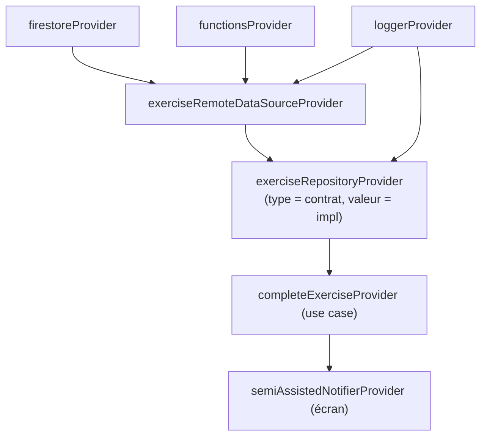

En test, on remplace n'importe quel provider par un faux en une ligne (`overrideWithValue`), ce qui rend toute la chaîne testable sans Firebase.

### 8.5 Le notifier d'écran

Le notifier orchestre les use cases et expose l'état. Il logge les transitions importantes.

```dart
// features/exercises/presentation/providers/semi_assisted_notifier.dart
import 'package:riverpod_annotation/riverpod_annotation.dart';
import '../../domain/entities/semi_assisted_state.dart';
import '../../domain/usecases/check_semi_assisted_access.dart';
import '../../../../core/logging/logging_providers.dart';
import 'exercise_providers.dart';

part 'semi_assisted_notifier.g.dart';

@riverpod
class SemiAssistedNotifier extends _$SemiAssistedNotifier {
  @override
  SemiAssistedState build(String exerciseId) {
    _checkAccessAndLoad(exerciseId);
    return const SemiAssistedState.checkingAccess();
  }

  Future<void> _checkAccessAndLoad(String exerciseId) async {
    final log = ref.read(loggerProvider);
    final access = await ref.read(checkSemiAssistedAccessProvider).call();

    if (access == AccessDecision.deniedNeedsPremium) {
      log.i('Mode 2 refusé : abonnement requis', data: {'exerciseId': exerciseId});
      // On NE CHARGE PAS l'exercice : économie de lecture et de data.
      state = const SemiAssistedState.accessDenied();
      return;
    }

    log.i('Mode 2 accordé : chargement', data: {'exerciseId': exerciseId});
    state = const SemiAssistedState.loading();
    final result =
        await ref.read(exerciseRepositoryProvider).getExercise(exerciseId);

    state = result.fold(
      (failure) => SemiAssistedState.error(failure),
      (exercise) => SemiAssistedState.inProgress(
        exercise: exercise,
        currentStep: 0,
        statuses: const {},
        hintsRevealed: const {},
      ),
    );
  }

  // --- Méthodes purement UI : pas de use case (voir section 16) ---

  void revealHint(int step) {
    final s = state;
    if (s is! InProgress) return;
    final shown = s.hintsRevealed[step] ?? 0;
    if (shown >= 3) return; // borne triviale, locale
    state = s.copyWith(hintsRevealed: {...s.hintsRevealed, step: shown + 1});
  }

  void markStep(int step, StepStatus status) {
    final s = state;
    if (s is! InProgress) return;
    state = s.copyWith(statuses: {...s.statuses, step: status});
  }

  // --- Action métier avec effet externe : passe par un use case ---

  Future<void> complete() async {
    final s = state;
    if (s is! InProgress) return;
    final log = ref.read(loggerProvider);
    log.i('Mode 2 : soumission finale', data: {'exerciseId': s.exercise.id});

    final result = await ref
        .read(completeExerciseProvider)
        .call(_buildSubmission(s));

    state = result.fold(
      (failure) {
        log.w('Mode 2 : complétion échouée', data: {'failure': failure.message});
        return SemiAssistedState.error(failure);
      },
      (completion) => SemiAssistedState.completed(completion),
    );
  }
}
```

### 8.6 L'écran : « bête » par conception

L'écran lit l'état et l'affiche ; il n'a aucune logique métier. Le `switch` exhaustif sur la sealed class est la clé : le compilateur **refuse de compiler** si un état n'est pas traité.

```dart
// features/exercises/presentation/pages/semi_assisted_page.dart
import 'package:flutter/material.dart';
import 'package:flutter_riverpod/flutter_riverpod.dart';
import '../../domain/entities/semi_assisted_state.dart';
import '../providers/semi_assisted_notifier.dart';

class SemiAssistedPage extends ConsumerWidget {
  const SemiAssistedPage({super.key, required this.exerciseId});
  final String exerciseId;

  @override
  Widget build(BuildContext context, WidgetRef ref) {
    final state = ref.watch(semiAssistedNotifierProvider(exerciseId));

    return switch (state) {
      CheckingAccess() => const _LoadingView(),
      AccessDenied()   => const PaywallView(),       // écran de la feature billing
      Loading()        => const _LoadingView(),
      InProgress(:final exercise, :final currentStep) =>
          _StepView(exercise: exercise, step: currentStep),
      Completed(:final result) => _ResultView(result: result),
      ErrorState(:final failure) => _ErrorView(message: failure.message),
    };
  }
}
```

---

## 9. Le câblage complet d'une fonctionnalité, maillon par maillon

Pour ancrer le tout, voici le trajet d'une action — **terminer un exercice** — à travers toutes les couches, du clic jusqu'à Firebase et retour.

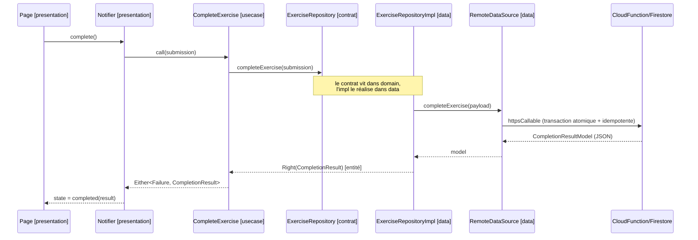

Observez le point essentiel : **ni l'écran ni le use case n'ont jamais parlé à Firebase.** Seul le datasource (couche `data`) l'a fait. À chaque frontière, l'erreur éventuelle est convertie en `Failure`, jamais en exception qui remonte.

---

## 10. La gestion des erreurs (jamais de crash devant l'élève)

### 10.1 Le principe

Aucune exception ne doit remonter jusqu'à l'écran. Une exception non gérée produit un crash ou un message technique incompréhensible (« FirebaseException: PERMISSION_DENIED »). Sur un marché à connectivité instable, les erreurs réseau sont fréquentes : il faut les transformer en messages clairs.

La solution : transporter le résultat de toute opération dans un objet `Either<Failure, T>` (du paquet `fpdart`) qui contient **soit** une `Failure` (échec), **soit** la valeur attendue. Convention : `Left` = échec, `Right` = succès.

### 10.2 Le catalogue des Failures (dans `core/`)

Implémenté en Story 0.4. Hiérarchie minimale alignée sur le pipeline BMAD (epic 0) :

```dart
// core/error/failures.dart
import 'dart:async';
import 'dart:io';
import 'package:equatable/equatable.dart';

sealed class Failure extends Equatable {
  const Failure(this.message);
  final String message;
  @override
  List<Object?> get props => [message];

  // Helper de traduction Exception → Failure.
  // À enrichir : Story 0.5 (DioException), Story 0.6 (FirebaseException/FirebaseAuthException).
  static Failure from(Object exception) {
    if (exception is TimeoutException) return const NetworkFailure();
    if (exception is SocketException) return const NetworkFailure();
    return const UnknownFailure();
  }
}

class NetworkFailure extends Failure {
  const NetworkFailure() : super('Pas de connexion internet');
}
class AuthFailure extends Failure {
  const AuthFailure([super.message = 'Authentification refusée']);
}
class ServerFailure extends Failure {
  const ServerFailure({required this.code, String message = '...'}) : super(message);
  final int code;
}
class CacheFailure extends Failure {
  const CacheFailure([super.message = 'Échec du cache local']);
}
class ValidationFailure extends Failure {
  const ValidationFailure({required this.field, required this.reason})
      : super('Champ « $field » invalide : $reason');
  final String field;
  final String reason;
}
class UnknownFailure extends Failure {
  const UnknownFailure() : super('Une erreur inattendue est survenue');
}
```

> Les `Failure` ne portent **jamais** la `Exception` source : on évite qu'une exception remonte par accident jusqu'à l'UI. Si un besoin métier l'exige plus tard (ex. `NotFoundFailure`, `AccessDeniedFailure` pour le paywall), elles seront ajoutées à la hiérarchie dans la story concernée.

### 10.3 Les exceptions internes (dans `core/`, confinées à `data`)

```dart
// core/error/exceptions.dart
class ServerException implements Exception {
  const ServerException(this.message);
  final String message;
}
class NotFoundException implements Exception {
  const NotFoundException(this.message);
  final String message;
}
```

### 10.4 Le trajet d'une erreur

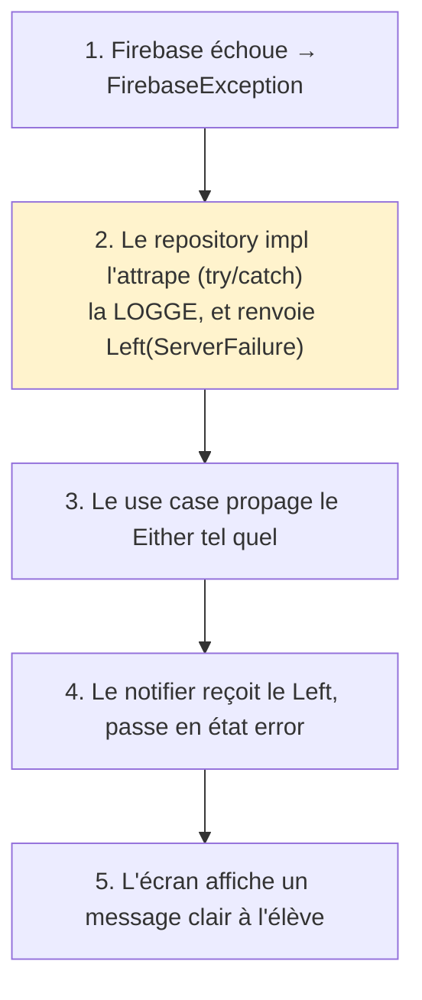

La traduction `Exception → Failure` se fait **uniquement** à l'étape 2, dans les repository impls. Au-dessus, plus aucune exception ne circule.

---

## 11. Le logging — tout doit être tracé (package `logger`)

**Décision de projet : tout est loggé.** Chaque opération significative (accès aux données, décision métier, transition d'état, erreur) produit un log. Sur un marché où les téléphones et les réseaux sont divers, les logs sont notre première source de diagnostic. On utilise le package **`logger`**.

### 11.1 Pourquoi un wrapper, et pas `logger` directement

On n'appelle jamais `Logger()` de la librairie directement dans le code métier. On passe par un wrapper maison `AppLogger`, pour trois raisons :

1. **Respecter la règle d'or.** Le `domain` ne doit importer aucun paquet externe. S'il a besoin de logger, il le fait via une abstraction (mais en pratique le domaine logge peu ; l'essentiel du logging est dans `data` et `presentation`).
2. **Centraliser la configuration.** Le format, les niveaux, le branchement vers Crashlytics en production se règlent à un seul endroit.
3. **Pouvoir changer de librairie.** Si on remplace `logger` un jour, on touche un seul fichier.

### 11.2 La configuration centrale

```dart
// core/logging/app_logger.dart
import 'package:logger/logger.dart';
import 'package:flutter/foundation.dart';

/// Wrapper unique autour du package `logger`.
/// Le SEUL fichier de l'app qui importe `package:logger`.
class AppLogger {
  AppLogger() : _logger = Logger(
          // En production, on masque les logs de debug.
          level: kReleaseMode ? Level.warning : Level.debug,
          printer: PrettyPrinter(
            methodCount: 1,        // 1 appel de pile pour les logs normaux
            errorMethodCount: 8,   // 8 pour les erreurs (stack trace utile)
            lineLength: 100,
            colors: true,
            printEmojis: true,
            dateTimeFormat: DateTimeFormat.onlyTimeAndSinceStart,
          ),
        );

  final Logger _logger;

  // d = debug (développement), i = info (événements normaux),
  // w = warning (anomalie non bloquante), e = error (échec).

  void d(String message, {Map<String, dynamic>? data}) =>
      _logger.d(_compose(message, data));

  void i(String message, {Map<String, dynamic>? data}) =>
      _logger.i(_compose(message, data));

  void w(String message, {Map<String, dynamic>? data}) =>
      _logger.w(_compose(message, data));

  void e(String message, {Object? error, StackTrace? stackTrace}) =>
      _logger.e(message, error: error, stackTrace: stackTrace);

  String _compose(String message, Map<String, dynamic>? data) =>
      data == null ? message : '$message | $data';
}
```

### 11.3 L'exposition via Riverpod

```dart
// core/logging/logging_providers.dart
import 'package:riverpod_annotation/riverpod_annotation.dart';
import 'app_logger.dart';

part 'logging_providers.g.dart';

@Riverpod(keepAlive: true)
AppLogger logger(Ref ref) => AppLogger();
```

Toute classe qui a besoin de logger reçoit `AppLogger` par injection (on l'a vu dans les datasources et repositories, section 7).

### 11.4 Les niveaux et quand les utiliser

| Niveau | Méthode | Quand l'utiliser | Exemple |
|---|---|---|---|
| Debug | `log.d()` | Détail technique utile en développement seulement | « lecture Firestore exerciseId=X » |
| Info | `log.i()` | Événement normal et significatif du parcours | « Mode 2 accordé », « paiement initié » |
| Warning | `log.w()` | Anomalie non bloquante, situation à surveiller | « exercice introuvable », « complétion échouée » |
| Error | `log.e()` | Échec réel, avec l'erreur et la stack trace | toute exception attrapée dans un repository |

### 11.5 La règle : que logger, où

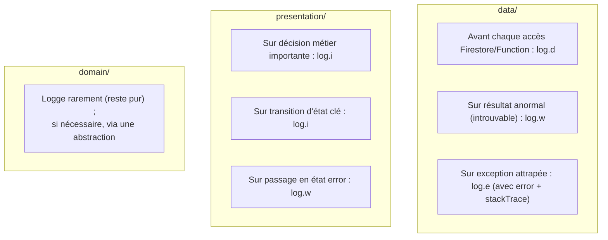

**Règle d'équipe :** toute opération qui touche le réseau, toute décision d'accès (premium, profil), tout paiement, tout appel IA, et toute erreur attrapée **doivent** produire un log. Une erreur attrapée sans log est un bug de revue.

### 11.6 Ce qu'on ne logge JAMAIS

Pour des raisons de sécurité et de vie privée, on ne logge jamais : mots de passe, jetons d'authentification, codes PIN de paiement, numéros de téléphone complets, contenu personnel sensible de l'élève. En cas de doute, on logge un identifiant (l'`exerciseId`, l'`uid`) plutôt que la donnée elle-même.

---

## 12. Le cache — on utilise uniquement celui de Firebase

**Décision de projet : on ne développe aucun système de cache. On s'appuie exclusivement sur le cache offline natif de Firestore.** Pas de cache custom en mémoire, pas de Hive, pas de gestion de version de contenu. Cette section explique ce que cela implique concrètement.

### 12.1 Ce que fait le cache Firestore, gratuitement

Sur Android et iOS, **la persistance offline de Firestore est activée par défaut**. Concrètement :

- Quand l'app lit un document, Firestore en garde une copie locale.
- Si l'appareil est **hors ligne**, les lectures sont servies depuis cette copie locale : l'élève peut continuer à consulter ce qu'il a déjà ouvert.
- Quand la connexion revient, Firestore **synchronise automatiquement** : les écritures locales partent vers le serveur, et les données locales se mettent à jour.

Tout cela **sans une ligne de code de notre part**. C'est le bénéfice de ce choix : simplicité maximale, zéro système à maintenir, comportement éprouvé.

### 12.2 Ce que cela implique pour notre code

La conséquence pratique est qu'on écrit des lectures Firestore **standard**, sans options de source particulières :

```dart
// Lecture standard. Le cache Firebase agit automatiquement en arrière-plan.
final doc = await _firestore.collection('exercises').doc(exerciseId).get();
```

On ne gère pas `Source.cache` ni `Source.server` manuellement. On laisse Firestore décider : il tente le serveur quand il est joignable, et retombe sur le cache local quand il ne l'est pas. C'est le comportement par défaut, et il convient.

### 12.3 Ce qu'il faut savoir et accepter avec ce choix

Pour que l'équipe ait les bonnes attentes, trois points à connaître :

**La synchronisation temps réel reste prioritaire.** Pour les données qui changent (l'abonnement, les crédits, la santé scolaire, les points), on utilise des **streams** Firestore (`snapshots()`), pas des lectures ponctuelles. Le cache Firestore alimente ces streams instantanément avec la dernière valeur connue, puis les met à jour dès que le serveur répond. C'est exactement ce qu'on veut : affichage immédiat, puis fraîcheur.

```dart
// Données mutables → toujours un Stream (snapshots), jamais une lecture figée.
Stream<SubscriptionStatus> watchStatus(String uid) {
  return _firestore.collection('subscriptions').doc(uid).snapshots()
      .map((doc) => /* … */);
}
```

**Le coût des lectures Firestore est à surveiller.** Firestore facture chaque lecture de document côté serveur. Le cache réduit ce coût pour les données déjà consultées, mais ne l'élimine pas. Règle de prudence : ne pas relire en boucle le même contenu statique dans un même écran ; charger une fois et garder la donnée dans l'état de l'écran le temps de l'affichage.

**Le contenu corrigé côté serveur se propage à la prochaine synchro.** Comme on ne gère pas de versioning, si l'équipe corrige un cours, l'élève verra la correction dès que Firestore resynchronise ce document (ce qui arrive naturellement avec les streams, ou à la prochaine lecture en ligne). C'est acceptable pour le MVP et cohérent avec la décision « on ne gère pas le cache ».

### 12.4 La règle simple à retenir

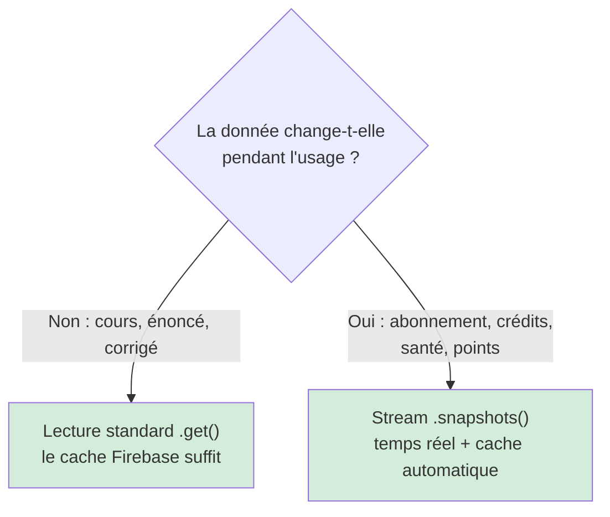

En une phrase : **lecture standard pour le statique, stream pour le mutable, et on laisse Firebase gérer le cache dans les deux cas.**

---

## 13. La sécurité — où vivent les vrais verrous

Principe souvent mal placé, à comprendre avant d'implémenter tout contrôle d'accès.

### 13.1 La vérification côté Flutter n'est PAS de la sécurité

Tout code qui tourne dans l'app, sur le téléphone de l'élève, est potentiellement contournable. Un contrôle « si premium, alors autoriser » qui vit **seulement** dans Flutter n'est pas un verrou : c'est une **optimisation d'expérience** (éviter d'afficher un écran inutile).

### 13.2 Les vrais verrous sont côté serveur

Trois mécanismes, tous fournis par Firebase :

**Règles de sécurité Firestore.** Elles s'exécutent sur les serveurs de Google, hors de portée du client. Une règle « seul un compte avec abonnement actif peut créer une session Mode 2 » est appliquée quoi qu'envoie l'app. C'est le verrou réel du gate premium.

**Firebase App Check.** Atteste que la requête vient bien de votre application authentique (et non d'un script), via Play Integrity sur Android et DeviceCheck/App Attest sur iOS. Protège surtout les endpoints coûteux — les appels IA — contre l'abus, ce qui protège vos marges.

**Confirmation de paiement par webhook serveur.** La bascule « premium = actif » n'est jamais décidée par ce que renvoie la page de paiement affichée dans l'app (manipulable). Elle est décidée par une Cloud Function qui reçoit et vérifie le webhook de l'agrégateur de paiement. L'app ne fait qu'écouter le résultat via le stream d'abonnement.

### 13.3 La répartition des responsabilités

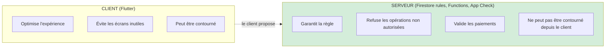

**Règle :** tout contrôle qui a une conséquence (débloquer du payant, créditer des points, lancer un appel IA facturé) doit avoir son verrou réel côté serveur. Le client peut en plus optimiser l'UX, mais jamais à la place du serveur.

---

## 14. La structure de dossiers complète, fichier par fichier

Voici l'arborescence avec le rôle de chaque élément. C'est le gabarit à dupliquer pour chaque nouvelle feature.

```
lib/
│
├── main.dart                              # init Firebase, ProviderScope racine, runApp
│
├── core/                                  # transversal — admission stricte (section 15)
│   ├── error/
│   │   ├── failures.dart                  # sealed Failure (échecs métier présentables)
│   │   └── exceptions.dart                # exceptions techniques (confinées à data/)
│   ├── logging/
│   │   ├── app_logger.dart                # ⚠ SEUL fichier important package:logger
│   │   └── logging_providers.dart         # loggerProvider (Riverpod)
│   ├── usecase/
│   │   └── usecase.dart                   # UseCase<Type, Params> + NoParams
│   ├── network/
│   │   ├── network_info.dart              # en ligne / hors ligne
│   │   └── api_client.dart                # Dio + intercepteurs (token, retry, log)
│   ├── di/
│   │   └── providers.dart                 # providers racines : firestoreProvider, dioProvider, functionsProvider
│   ├── router/
│   │   ├── app_router.dart                # GoRouter, toutes les routes
│   │   └── guards.dart                    # redirection profil incomplet + auth
│   ├── theme/
│   │   ├── app_theme.dart
│   │   └── tokens.dart                    # couleurs, espacements, typographies
│   ├── l10n/
│   │   ├── app_fr.arb                      # traductions françaises
│   │   ├── app_en.arb                      # traductions anglaises
│   │   └── (AppLocalizations généré par gen-l10n)
│   └── widgets/
│       ├── pedagogical_content.dart       # ⚠ SEUL fichier important flutter_smooth_markdown
│       └── app_async_view.dart            # rendu générique loading/error/data
│
├── features/
│   │
│   ├── exercises/                         # M4 — feature de référence (3 modes + examen)
│   │   ├── domain/                        # ── Dart pur : zéro import Flutter/Firebase ──
│   │   │   ├── entities/
│   │   │   │   ├── exercise.dart
│   │   │   │   ├── completion_submission.dart  # contient sessionId (idempotence)
│   │   │   │   ├── completion_result.dart
│   │   │   │   └── semi_assisted_state.dart     # sealed class des états d'écran
│   │   │   ├── repositories/
│   │   │   │   └── exercise_repository.dart      # CONTRAT abstrait
│   │   │   └── usecases/
│   │   │       ├── check_semi_assisted_access.dart  # règle « Mode 2 = premium »
│   │   │       ├── get_exercise.dart
│   │   │       └── complete_exercise.dart           # règle + effet externe
│   │   │       # PAS de RevealHint/GoNextStep : méthodes du notifier (section 16)
│   │   ├── data/                          # ── seul lieu qui parle à Firebase ──
│   │   │   ├── models/
│   │   │   │   ├── exercise_model.dart      # + fromJson/toJson + toEntity()
│   │   │   │   └── completion_result_model.dart
│   │   │   ├── datasources/
│   │   │   │   └── exercise_remote_datasource.dart  # Firestore + Cloud Function
│   │   │   └── repositories/
│   │   │       └── exercise_repository_impl.dart    # réalise le contrat, traduit erreurs, logge
│   │   └── presentation/                  # ── Flutter + Riverpod ──
│   │       ├── providers/
│   │       │   ├── exercise_providers.dart           # câblage DI
│   │       │   └── semi_assisted_notifier.dart        # état + méthodes UI
│   │       ├── pages/
│   │       │   └── semi_assisted_page.dart            # switch exhaustif (widget « bête »)
│   │       └── widgets/
│   │           ├── step_view.dart                     # utilise PedagogicalContent
│   │           └── hint_button.dart
│   │
│   ├── billing/                           # M14 — abonnement + crédits (FEATURE AUTONOME)
│   │   ├── domain/
│   │   │   ├── entities/
│   │   │   │   ├── subscription_status.dart  # none/active/gracePeriod/expired
│   │   │   │   ├── billing_plan.dart
│   │   │   │   ├── payment_intent.dart
│   │   │   │   └── credit_balance.dart
│   │   │   ├── repositories/
│   │   │   │   ├── subscription_repository.dart  # watchStatus() → Stream (mutable)
│   │   │   │   └── credit_repository.dart
│   │   │   └── usecases/
│   │   │       ├── watch_subscription.dart
│   │   │       ├── create_subscription.dart  # appel Cloud Function paiement
│   │   │       └── purchase_credits.dart
│   │   ├── data/
│   │   │   ├── models/
│   │   │   ├── datasources/
│   │   │   │   ├── subscription_remote_datasource.dart  # snapshots() Firestore
│   │   │   │   └── payment_function_datasource.dart      # Cloud Functions
│   │   │   └── repositories/
│   │   └── presentation/
│   │       ├── providers/
│   │       ├── pages/
│   │       │   ├── paywall_page.dart
│   │       │   └── payment_webview_page.dart  # webview_flutter
│   │       └── widgets/
│   │
│   ├── auth/                              # M1 — compte, profil scolaire, liaison école
│   ├── content/                          # M15 — cours, fiches, quiz, sujets
│   ├── academic_health/                  # M8 — santé scolaire (expose son repository)
│   ├── gamification/                     # M9 — points + 5 classements (streams)
│   ├── chat/                             # M6 — chat IA (utilise PedagogicalContent)
│   ├── notifications/                    # M16 — push + in-app
│   └── sharing/                          # M18 — deep links (go_router)
│
└── (M2 Langue : non-feature — core/l10n piloté par le sous-système du profil)
```

Note : **M2 Langue n'est pas une feature.** La langue dérive du sous-système choisi au profil, sans écran de réglage ; elle se gère dans `core/l10n` + `core/router`.

---

## 15. Le noyau partagé `core/` — ce qui a le droit d'y entrer

`core/` est le code transversal. Sans discipline, il devient un fourre-tout. On applique un critère d'admission strict.

### 15.1 Les deux conditions cumulatives

Pour entrer dans `core/`, un élément doit satisfaire **les deux** conditions :

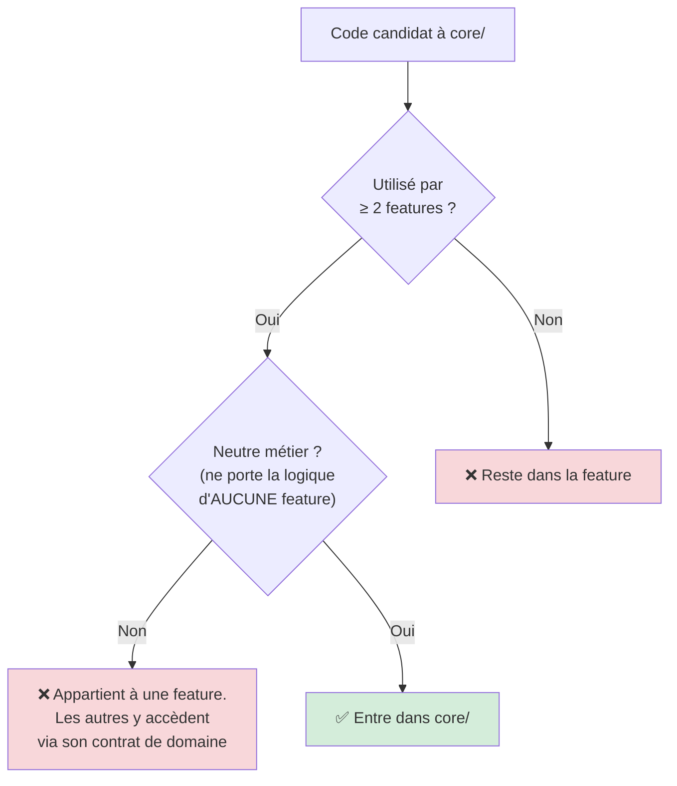

La condition 1 seule ne suffit pas : « utilisé deux fois » n'autorise pas l'entrée si le code porte une logique métier.

### 15.2 Le contre-exemple : la santé scolaire

Si `exercises` et `chat` ont tous deux besoin de mettre à jour la santé scolaire, la tentation est de mettre cette logique dans `core/`. **C'est une erreur** : la santé scolaire est la logique d'une feature (`academic_health`), pas un utilitaire neutre.

La bonne réponse : `academic_health` reste une feature, expose un contrat dans son `domain` (`AcademicHealthRepository`), et les autres features en dépendent via ce contrat. Une feature peut dépendre d'une autre par son interface de domaine ; ce n'est pas une raison de tout pousser dans `core/`.

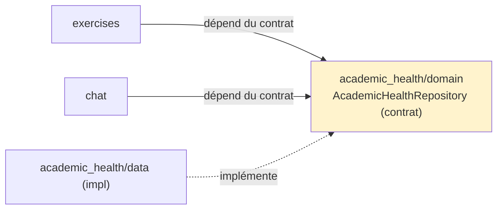

### 15.3 Ce qui est légitimement dans `core/`

`error/` (Failure, Exception), `logging/` (AppLogger), `usecase/` (contrat de base), `network/` (Dio), `di/` (providers racines), `router/` (navigation), `theme/`, `l10n/`, `widgets/` génériques. Tous passent les deux conditions : utilisés partout, neutres métier.

### 15.4 La règle pratique

> Avant de mettre quelque chose dans `core/`, demandez : « si je supprimais la feature X, ce code aurait-il encore un sens seul ? » Si non, il appartient à X. Les autres features y accéderont via le contrat de domaine de X.

---

## 16. La granularité : quand créer un use case, quand ne pas en créer

« Une action métier = un use case » est juste, mais appliqué mécaniquement, cela crée une explosion de classes vides (`RevealHint`, `GoNextStep`, `MarkSolved`…) qui n'enferment aucune règle. Voici le critère affiné.

### 16.1 Le critère

**Un use case existe pour porter une règle métier OU déclencher un effet externe (réseau, base, paiement, IA). Pas pour habiller un changement d'état purement local à l'écran.**

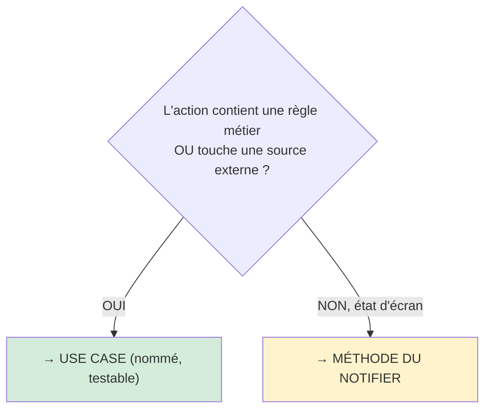

### 16.2 Application au Mode 2

| Action | Règle métier ? | Source externe ? | Verdict |
|---|---|---|---|
| Vérifier l'accès premium | Oui | Oui (abonnement) | **Use case** `CheckSemiAssistedAccess` |
| Charger l'exercice | Non | Oui (Firestore) | **Use case** `GetExercise` |
| Terminer + alimenter | Oui (idempotence) | Oui (Cloud Function) | **Use case** `CompleteExercise` |
| Révéler un indice (max 3) | Borne triviale | Non | **Méthode du notifier** |
| Étape suivante | Non | Non | **Méthode du notifier** |
| Marquer résolu/non-résolu | Non | Non | **Méthode du notifier** |

Trois use cases, pas six.

### 16.3 Le test mental

> Crée un use case quand tu écrirais un test métier pour l'action (« vérifier que l'accès est refusé si non premium »). Si le seul test imaginable est « vérifier que `currentStep` passe de 0 à 1 », c'est de la présentation : garde-le dans le notifier.

### 16.4 Le cas qui évolue

La borne « 3 indices max » reste dans le notifier tant qu'elle est triviale. **Le jour où elle devient « 3 en free, illimité en premium »**, elle touche l'abonnement (règle + source externe) → elle migre vers un use case. La granularité n'est pas figée.

---

## 17. Étude de cas complète : faire un exercice en mode « Semi-assisté »

Cette section rassemble toute l'architecture sur une fonctionnalité réelle. C'est la référence quand on implémente une feature similaire.

### 17.1 Le parcours fonctionnel

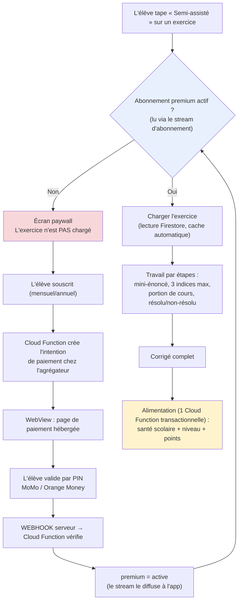

### 17.2 La traversée des couches

| # | Étape | Couche / lieu | Ce qui se passe |
|---|---|---|---|
| 1 | Tap « Semi-assisté » | `presentation` | Le notifier passe à `checkingAccess` |
| 2 | Vérifier premium | `domain` | `CheckSemiAssistedAccess` lit `SubscriptionRepository` (contrat) |
| 3 | Obtenir l'état | `data` (billing) | Stream Firestore de l'abonnement |
| 4 | Si non premium | `presentation` | État `accessDenied` → écran paywall ; **exercice non chargé** |
| 5 | Créer le paiement | `data` → Cloud Function | L'app n'appelle jamais l'agrégateur en direct |
| 6 | Page de paiement | `presentation` (billing) | `payment_webview_page.dart` |
| 7 | Confirmation | **serveur** | Webhook → Cloud Function → premium = active |
| 8 | Déblocage | `presentation` | Le stream émet `active`, le notifier réagit |
| 9 | Charger l'exercice | `data` | Lecture Firestore standard (cache Firebase automatique) |
| 10 | Afficher une étape | `presentation` | `_StepView` ; cours via `PedagogicalContent` |
| 11 | Révéler un indice | `presentation` (notifier) | `revealHint`, max 3 — pas de use case |
| 12 | Marquer résolu/non | `presentation` (notifier) | état local |
| 13 | Terminer | `domain` | `CompleteExercise` |
| 14 | Alimenter | `data` → Cloud Function | **transaction atomique + idempotente** |
| 15 | Afficher résultat | `presentation` | `_ResultView` ; santé/points se mettent à jour via leurs streams |

À aucun moment l'écran ou le domaine ne parlent à Firebase directement. Et chaque étape significative est loggée (section 11).

### 17.3 Pourquoi `billing` est une feature autonome

L'abonnement et les crédits servent **tous** les modes (Mode 1 paie le corrigé en crédits, Mode 2 exige le premium, Mode 3 paie en crédits), les fiches, et le mode examen. Si la logique d'abonnement vivait dans `exercises`, on la dupliquerait. En faisant de `billing` une feature autonome avec ses contrats, `exercises` n'en dépend que par l'interface `SubscriptionRepository`. La règle « le Mode 2 exige le premium » vit dans `exercises` (sa règle) ; le fait « l'élève est premium » est fourni par `billing` (son domaine).

### 17.4 Le gate d'accès : optimisation en haut, verrou en bas

Le `CheckSemiAssistedAccess` côté Flutter **n'est pas le verrou** — c'est une optimisation (éviter d'afficher un écran et de charger un exercice pour rien). Le vrai verrou est côté serveur : les règles Firestore refusent à un compte non-premium de créer une session Mode 2 ou de déclencher l'alimentation premium (section 13).

### 17.5 L'abonnement se streame, jamais ne se fige

L'état d'abonnement est **mutable** : un paiement peut se confirmer à tout moment côté serveur. On l'obtient donc via un **stream** (`watchStatus()`), jamais via une lecture figée mise en cache. C'est ce qui évite le bug « l'élève paie et reste bloqué devant le paywall ».

### 17.6 L'alimentation finale : trois risques neutralisés

Quand l'élève termine, trois écritures sont liées : santé, niveau, points.

**Risque 1 — incohérence.** Si les trois écritures ne sont pas dans **une seule transaction** Cloud Function, un crash réseau au milieu laisse l'élève avec des points mais sans mise à jour santé. **Solution : transaction atomique côté serveur — tout réussit ou rien.**

**Risque 2 — double comptage.** Un double-tap sur « soumettre » ou un retry réseau pourrait doubler les points. **Solution : idempotence.** Une clé de session unique (`sessionId`) : la Cloud Function ignore une alimentation déjà appliquée pour cette clé.

**Risque 3 — confiance.** Les deux risques, s'ils surviennent, minent la confiance dans les points et classements (un levier d'engagement central). Ce sont des risques produit, pas des détails.

### 17.7 Le rendu du contenu pédagogique

La portion de cours d'une étape (Markdown, formules LaTeX, schémas) s'affiche via le widget d'isolation unique :

```dart
// Dans _StepView — on n'importe JAMAIS flutter_smooth_markdown ici.
PedagogicalContent(data: step.courseExcerpt)
```

`PedagogicalContent` (dans `core/widgets/`) est le seul fichier qui connaît `flutter_smooth_markdown`. Ce paquet est jeune et à mainteneur unique ; s'il casse, on réécrit ce seul fichier sans toucher au reste de l'app.

---

## 18. Les tests

L'architecture rend trois niveaux de tests naturels.

### 18.1 Tests de domaine (les plus nombreux, les plus rapides)

Use cases et entités, en pur Dart, avec de faux repositories (`mocktail`). Aucun Firebase. Quelques millisecondes par test.

```dart
class MockSubscriptionRepository extends Mock implements SubscriptionRepository {}

void main() {
  late CheckSemiAssistedAccess useCase;
  late MockSubscriptionRepository repo;

  setUp(() {
    repo = MockSubscriptionRepository();
    useCase = CheckSemiAssistedAccess(repo);
  });

  test('refuse l\'accès si abonnement expiré', () async {
    when(() => repo.watchStatus())
        .thenAnswer((_) => Stream.value(SubscriptionStatus.expired));
    expect(await useCase.call(), AccessDecision.deniedNeedsPremium);
  });

  test('accorde l\'accès si abonnement actif', () async {
    when(() => repo.watchStatus())
        .thenAnswer((_) => Stream.value(SubscriptionStatus.active));
    expect(await useCase.call(), AccessDecision.granted);
  });
}
```

### 18.2 Tests de data

Repository impls avec datasources mockés : vérifier la traduction `Exception → Failure`.

```dart
test('getExercise traduit FirebaseException en ServerFailure', () async {
  when(() => remote.getExercise('ex1'))
      .thenThrow(FirebaseException(plugin: 'firestore'));
  final result = await repository.getExercise('ex1');
  expect(result.isLeft(), true);
});
```

### 18.3 Tests de présentation

Notifiers avec use cases mockés (override Riverpod en une ligne). On vérifie les transitions d'état. Peu de tests de widgets lourds, puisque les widgets sont « bêtes ».

### 18.4 Ce qu'on ne teste pas

Les widgets de pur affichage ligne par ligne, le code généré (`*.g.dart`, `*.freezed.dart`), les SDK tiers. L'effort va où vit la logique : le domaine d'abord.

---

## 19. Les conventions d'équipe et la checklist de revue

### 19.1 Les règles non négociables

1. Le `domain` n'importe jamais Flutter, Firebase, Dio, Riverpod, ni `logger`.
2. La traduction `Exception → Failure` se fait uniquement dans les repository impls.
3. `package:logger` n'est importé que dans `core/logging/app_logger.dart`.
4. `flutter_smooth_markdown` n'est importé que dans `core/widgets/pedagogical_content.dart`.
5. Aucun widget ni provider n'importe `cloud_firestore` directement : tout passe par un datasource.
6. Le mutable (abonnement, crédits, santé, points) s'obtient par **stream** ; le statique par lecture standard. On laisse Firebase gérer le cache.
7. Toute opération réseau, décision d'accès, paiement, appel IA, et erreur attrapée **produit un log**.
8. On ne logge jamais : mots de passe, jetons, codes PIN, numéros complets, données sensibles.
9. Le contrôle d'accès réel est côté serveur (règles Firestore + App Check) ; le check Flutter n'est qu'une optimisation.
10. Une action métier ou à effet externe = un use case. Les changements d'état purement UI = méthodes du notifier.
11. Les models ne sortent jamais de `data/` (`toEntity()` à la frontière).
12. Tout ajout à `core/` est utilisé par ≥ 2 features ET neutre métier.
13. L'alimentation multi-écritures (santé/niveau/points) est transactionnelle et idempotente côté serveur.

### 19.2 La checklist de revue (à copier dans le template de PR)

```
COUCHES & DÉPENDANCES
[ ] Le domain de cette PR n'importe ni Flutter, ni Firebase, ni Dio, ni Riverpod, ni logger
[ ] Exception → Failure uniquement dans un repository impl
[ ] Les models ne sortent pas de data/ (toEntity() à la frontière)
[ ] Le provider du repository expose le CONTRAT, fournit l'IMPL

LOGGING
[ ] package:logger n'apparaît que dans app_logger.dart
[ ] Toute opération réseau / décision d'accès / paiement / appel IA est loggée
[ ] Toute erreur attrapée est loggée (log.e avec error + stackTrace)
[ ] Aucune donnée sensible (PIN, jeton, mot de passe) n'est loggée

CACHE & DONNÉES
[ ] Le mutable (abonnement/crédits/santé/points) est un Stream, pas une lecture figée
[ ] Aucun système de cache custom n'a été ajouté (on utilise celui de Firebase)

SÉCURITÉ
[ ] Tout nouveau contrôle d'accès a un verrou serveur correspondant

GRANULARITÉ & CORE
[ ] Les nouveaux use cases portent une règle métier ou un effet externe
[ ] Les changements d'état UI sont des méthodes de notifier, pas des use cases
[ ] Tout ajout à core/ est utilisé par ≥ 2 features ET neutre métier

TESTS
[ ] Les nouveaux use cases ont des tests de domaine (cas succès + cas échec)
```

---

## 20. Le récapitulatif des paquets utilisés

| Domaine | Paquet | Rôle |
|---|---|---|
| État & injection | `flutter_riverpod`, `riverpod_annotation` | Gestion d'état + injection de dépendances |
| Navigation | `go_router` | Routes + deep links + gardes |
| Backend | `firebase_core`, `firebase_auth`, `cloud_firestore`, `firebase_storage`, `cloud_functions`, `firebase_messaging`, `firebase_analytics`, `firebase_crashlytics`, `firebase_remote_config`, `firebase_app_check` | Données, auth, logique serveur, push, mesure, sécurité |
| **IA** | **`firebase_ai`** | **Appels Gemini (text + multimodal + streaming) directement client-side via Firebase AI Logic — sécurité par App Check + Auth, pas de clé API à protéger côté serveur (cf. ADR-012)** |
| Cache | (natif Firestore) | Aucun paquet : cache offline Firebase |
| ~~Réseau~~ | ~~`dio`~~ | ~~Retiré 2026-06-04 (ADR-012)~~ : les SDK Firebase (`cloud_functions`, `firebase_storage`, `firebase_ai`) gèrent leur propre couche HTTP avec retry intégré. Pas d'usage HTTP custom prévu en V1 — `dio` ré-introduit si besoin émerge. |
| **Logging** | **`logger`** | **Logs structurés — wrappé dans AppLogger** |
| Erreurs fonctionnelles | `fpdart` | `Either<Failure, T>` |
| Modèles immutables | `freezed`, `freezed_annotation` | Entités, sealed classes, états |
| Sérialisation | `json_serializable`, `json_annotation` | fromJson/toJson des models |
| Contenu pédagogique | `flutter_smooth_markdown` | Markdown + LaTeX + Mermaid + streaming (wrappé) |
| Médias | `cached_network_image` | Cache des images de Storage |
| Capture (Mode 1) | `image_picker`, `flutter_image_compress` | Photo de la copie + compression |
| Paiement | `webview_flutter`, `url_launcher` | Pages de paiement des agrégateurs |
| i18n | `flutter_localizations`, `intl` | Bilingue FR/EN |
| Préférences | `shared_preferences` | Stockage clé-valeur léger |
| Visualisation | `fl_chart`, `lottie` | Graphiques de progression, animations |
| Génération de code | `build_runner`, `riverpod_generator`, `custom_lint`, `riverpod_lint` | Outils de dev (ne pèsent pas dans l'app) |

---

## Annexe — Les principes en cinq phrases

1. **Trois couches, dépendance vers le centre** : `presentation → domain ← data`.
2. **Le domaine est pur** : ni Flutter, ni Firebase, ni réseau, ni logger ; il commande via des contrats sans savoir qui exécute.
3. **Un dossier par fonctionnalité**, chacun avec ses trois couches ; `core/` dessous pour le transversal neutre.
4. **Tout est loggé** (via `logger`, wrappé dans `AppLogger`), et **le cache, c'est celui de Firebase** — on n'en développe aucun autre. Le mutable se streame, le statique se lit normalement.
5. **Le client optimise, le serveur garantit** — tout verrou qui compte vit côté serveur.

*Guide d'architecture · destiné à l'équipe de développement*
