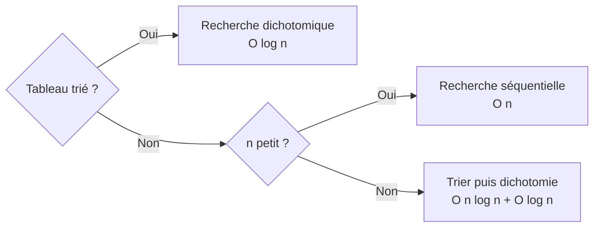

# Algorithmes de recherche — Tle / Premier cycle universitaire

> Cours de prise en main pour Story 0.19 (R2). Source pédagogique inventée
> — but unique : tester le rendu Markdown + **diagramme Mermaid** + **bloc
> de code** dans `PedagogicalContent`.

## 1. Problème de la recherche

On dispose d'un tableau $T$ contenant $n$ éléments et d'une valeur cible
$x$. La question est :

> **Existe-t-il un indice $i$ tel que $T[i] = x$ ?**

Selon que le tableau est trié ou non, l'algorithme optimal change.

## 2. Recherche séquentielle (linéaire)

C'est l'algorithme le plus simple : on parcourt le tableau du début à la
fin et on s'arrête dès qu'on trouve la valeur.

### 2.1 Pseudo-code

```text
ENTRÉE : tableau T de taille n, valeur cible x
SORTIE : indice i (0..n-1) si trouvé, -1 sinon

POUR i DE 0 À n-1 FAIRE
    SI T[i] = x ALORS
        RETOURNER i
    FIN SI
FIN POUR
RETOURNER -1
```

### 2.2 Implémentation Python

```python
def recherche_sequentielle(tableau, cible):
    """Retourne l'indice de `cible` dans `tableau`, ou -1 si absente."""
    for i, valeur in enumerate(tableau):
        if valeur == cible:
            return i
    return -1


if __name__ == "__main__":
    notes = [12, 8, 15, 9, 18, 11]
    print(recherche_sequentielle(notes, 15))  # 2
    print(recherche_sequentielle(notes, 20))  # -1
```

### 2.3 Complexité

- **Meilleur cas** : $O(1)$ — l'élément est en première position
- **Pire cas** : $O(n)$ — l'élément est en dernière position ou absent
- **Cas moyen** : $O(n)$ — en supposant l'élément équiprobablement réparti

## 3. Recherche dichotomique (binaire)

Quand le tableau est **trié**, on peut faire bien mieux en éliminant la
moitié des candidats à chaque étape.

### 3.1 Schéma de l'algorithme

```mermaid
flowchart TD
    Start([Début]) --> Init[g ← 0<br/>d ← n - 1]
    Init --> Test{g <= d ?}
    Test -- Non --> NotFound([Retourner -1])
    Test -- Oui --> Mid[m ← g + d / 2 entier]
    Mid --> Compare{T[m] = x ?}
    Compare -- Oui --> Found([Retourner m])
    Compare -- Non --> SubCompare{T[m] < x ?}
    SubCompare -- Oui --> Right[g ← m + 1]
    SubCompare -- Non --> Left[d ← m - 1]
    Right --> Test
    Left --> Test
```

### 3.2 Pseudo-code

```text
ENTRÉE : tableau T trié croissant de taille n, valeur cible x
SORTIE : indice i (0..n-1) si trouvé, -1 sinon

g ← 0
d ← n - 1

TANT QUE g <= d FAIRE
    m ← (g + d) DIV 2
    SI T[m] = x ALORS
        RETOURNER m
    SINON SI T[m] < x ALORS
        g ← m + 1
    SINON
        d ← m - 1
    FIN SI
FIN TANT QUE

RETOURNER -1
```

### 3.3 Implémentation Python

```python
def recherche_dichotomique(tableau, cible):
    """Tableau trié croissant. O(log n)."""
    gauche, droite = 0, len(tableau) - 1
    while gauche <= droite:
        milieu = (gauche + droite) // 2
        if tableau[milieu] == cible:
            return milieu
        if tableau[milieu] < cible:
            gauche = milieu + 1
        else:
            droite = milieu - 1
    return -1


if __name__ == "__main__":
    notes_triees = [3, 7, 9, 11, 12, 14, 18]
    print(recherche_dichotomique(notes_triees, 12))  # 4
    print(recherche_dichotomique(notes_triees, 13))  # -1
```

### 3.4 Complexité

À chaque tour, l'intervalle de recherche est divisé par 2 :

$$
n \to \frac{n}{2} \to \frac{n}{4} \to \dots \to 1
$$

Le nombre d'étapes maximum est donc $\lceil \log_2(n) \rceil$. Pour $n = 10^6$,
cela représente environ $20$ comparaisons — contre $10^6$ pour la recherche
séquentielle.

| Algorithme | Pré-condition | Pire cas | Mémoire |
| --- | --- | --- | --- |
| Recherche séquentielle | aucune | $O(n)$ | $O(1)$ |
| Recherche dichotomique | tableau trié | $O(\log n)$ | $O(1)$ itérative |

## 4. Choisir la bonne stratégie



## 5. Cas particuliers à surveiller

1. **Tableau vide** — les deux algorithmes doivent renvoyer $-1$.
2. **Élément dupliqué** — la dichotomie renvoie *un* indice où la valeur
   apparaît, pas nécessairement le premier. Si l'on veut le premier
   indice, il faut une variante (dichotomie sur la borne gauche).
3. **Cible aux bornes** — bien penser à tester $T[0]$ et $T[n-1]$
   dans les jeux de tests.
4. **Dépassement entier** — sur tableaux très grands en langage typé
   ($\text{C/C++/Java}$), $(g + d) / 2$ peut déborder. Préférer
   $g + (d - g) / 2$.

## 6. À retenir

1. La **recherche séquentielle** est universelle mais coûteuse en $O(n)$.
2. La **recherche dichotomique** est **exponentiellement plus rapide**
   ($O(\log n)$) mais demande un tableau trié.
3. Si on doit faire **beaucoup** de recherches dans un même tableau,
   trier une fois ($O(n \log n)$) puis faire des dichotomies est gagnant.
4. Pour des recherches sur clé arbitraire (texte), envisager les
   **tables de hachage** ($O(1)$ moyen).

> **Aller plus loin** : interpolation search (variante de dichotomie pour
> données uniformément distribuées) atteint $O(\log \log n)$ en moyenne.
