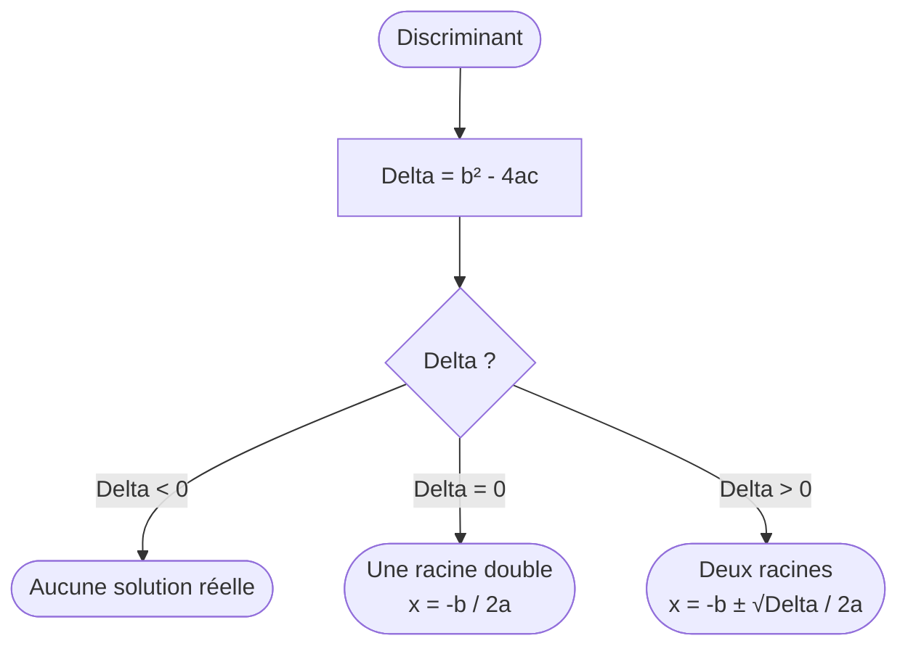

# Rendu avancé — démo Story 0.19.2

> Cours de prise en main pour valider les builders custom de `PedagogicalContent`
> après pivot vers `gpt_markdown` (ADR-014). Mix Markdown + LaTeX + image + Mermaid
> + code Python.

## 1. Image distante (raster)

L'image ci-dessous est servie via `CachedNetworkImage` (cache disque + placeholder
spinner). Le format `` permet de borner les dimensions.


## 2. Image SVG distante

Servie via `flutter_svg`. Détection sur l'extension `.svg`.


## 3. Formule LaTeX inline et display

La fonction $f(x) = ax^2 + bx + c$ admet un extremum en $x_0 = -\dfrac{b}{2a}$.

Forme canonique :

$$
f(x) = a \left( x + \frac{b}{2a} \right)^2 - \frac{b^2 - 4ac}{4a}
$$

## 4. Bloc code Python

Style monospace (JetBrains Mono), fond muted, en-tête langage, scroll horizontal
pour les lignes longues.

```python
def discriminant(a: float, b: float, c: float) -> float:
    """Retourne le discriminant Delta = b^2 - 4ac."""
    return b * b - 4 * a * c


def resolution_second_degre(a, b, c):
    delta = discriminant(a, b, c)
    if delta < 0:
        return []
    if delta == 0:
        return [-b / (2 * a)]
    racine = delta ** 0.5
    return [(-b - racine) / (2 * a), (-b + racine) / (2 * a)]
```

## 5. Diagramme Mermaid

Rendu serveur via `mermaid.ink` (un appel réseau par diagramme, cache disque
SVG). Fallback bloc code brut si offline (à constater visuellement).



## 6. Tableau récapitulatif

| Élément du markdown | Builder | Status |
| --- | --- | --- |
| Texte courant | par défaut gpt_markdown | ✅ |
| LaTeX inline `$...$` | `latexBuilder` natif (flutter_math_fork) | ✅ |
| LaTeX display `$$...$$` | `latexBuilder` natif | ✅ |
| Image raster | `imageBuilder` custom (CachedNetworkImage) | ✅ |
| Image SVG | `imageBuilder` custom (flutter_svg) | ✅ |
| Bloc code générique | `codeBuilder` custom (style Valide) | ✅ |
| Bloc Mermaid | `codeBuilder` custom → `mermaid.ink` | ✅ |
| Vidéo `` | non implémenté V1 | ❌ |
| `<details>`/`<summary>` | non testé V1 | ❌ |

## 7. À retenir

1. Le wrapper `PedagogicalContent` reste l'unique surface d'usage (ADR-014).
2. Les builders custom (image + code) appliquent les tokens `AppColors`/`AppSpacing`
   pour cohérence avec le design system Valide.
3. Mermaid via `mermaid.ink` : un seul appel réseau par diagramme, cache disque
   SVG (`flutter_svg` mémoïse). Acceptable NFR-4 pour des cours statiques.
