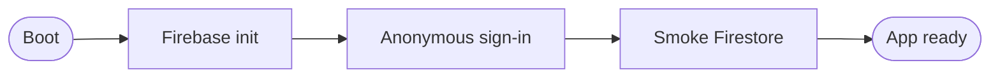

## Bienvenue

Voici une intégrale de référence :

$$\int_0^1 x^2 \, dx = \frac{1}{3}$$

Et le diagramme du flow de boot de l'app :

```mermaid
flowchart LR
    A([Boot]) --> B[Firebase init]
    B --> C[Anonymous sign-in]
    C --> D[Smoke Firestore]
    D --> E([App ready])
```
