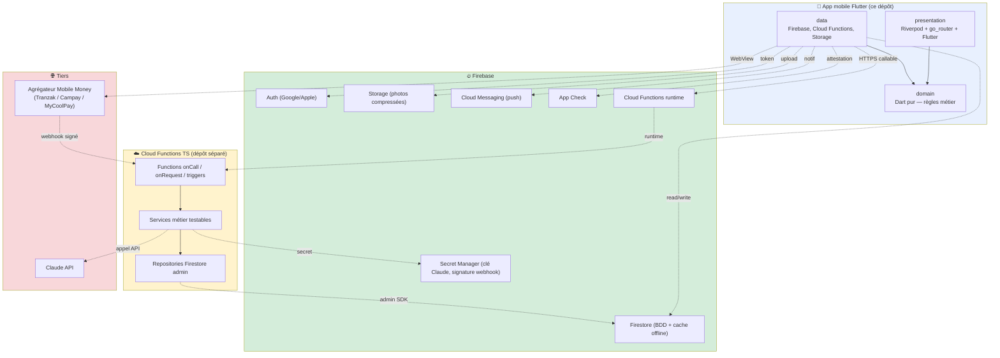
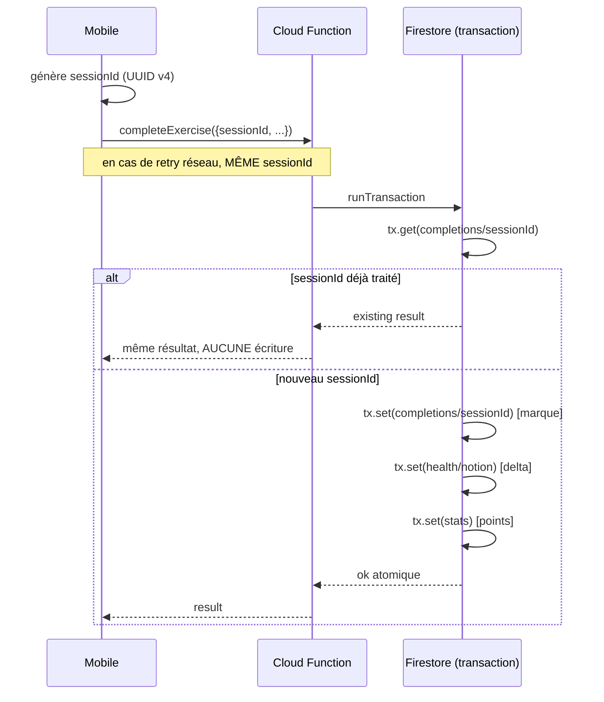

# Architecture Decision Document — Valide School MVP

> **Posture de ce document.** L'architecture de Valide est largement **déjà documentée et figée** dans trois documents techniques produits avant le démarrage BMAD. Ce `architecture.md` est un **document de consolidation** : il synthétise les choix structurants, formalise les décisions clés en ADRs, et **pointe vers les trois docs source pour les détails d'implémentation**. Il n'a pas vocation à dupliquer ce que les sources contiennent déjà.
>
> Les skills aval (`bmad-create-epics-and-stories`, `bmad-create-story`, `bmad-dev-story`) consomment ce document en priorité, puis descendent dans les docs source quand nécessaire.

---

## 0. Sommaire

1. [Contexte du projet](#1-contexte-du-projet)
2. [Vue d'ensemble de l'architecture](#2-vue-densemble-de-larchitecture)
3. [Sources documentaires figées](#3-sources-documentaires-figées)
4. [Stack technique — décisions consolidées](#4-stack-technique--décisions-consolidées)
5. [Architecture mobile en couches](#5-architecture-mobile-en-couches)
6. [Architecture backend en couches](#6-architecture-backend-en-couches)
7. [Frontière mobile ↔ backend](#7-frontière-mobile--backend)
8. [Pilier de cohérence : idempotence + transactions atomiques](#8-pilier-de-cohérence--idempotence--transactions-atomiques)
9. [Pilier de sécurité : où vivent les vrais verrous](#9-pilier-de-sécurité--où-vivent-les-vrais-verrous)
10. [Pilier d'observabilité : logging et monitoring](#10-pilier-dobservabilité--logging-et-monitoring)
11. [Structure du dépôt mobile](#11-structure-du-dépôt-mobile)
12. [Patterns d'implémentation transverses](#12-patterns-dimplémentation-transverses)
13. [Risques techniques identifiés](#13-risques-techniques-identifiés)
14. [Catalogue d'ADRs](#14-catalogue-dadrs)
15. [Mapping NFRs PRD → exigences techniques](#15-mapping-nfrs-prd--exigences-techniques)
16. [Validation et next steps](#16-validation-et-next-steps)

---

## 1. Contexte du projet

**Valide School** est une application mobile Flutter bilingue (FR/EN) pour les élèves du secondaire camerounais. Elle pratique le freemium par Mobile Money (MTN MoMo / Orange Money) avec un cœur de produit autour de la **pratique active** (3 modes d'accompagnement avec IA), de la **santé scolaire par notion**, et de la **gamification équilibrée**.

**Contraintes marché qui pilotent l'architecture** (cf. SPEC § Constraints, PRD § 10 NFRs) :

- Téléphones modestes (entrée et milieu de gamme Android, ~40 % de pénétration smartphone)
- Data limitée et coûteuse
- Connectivité instable
- Android-first ; iOS reporté à V2

**Périmètre de l'architecture documentée ici** : l'application mobile Flutter (ce dépôt). Le backend Cloud Functions, la console admin et la landing page vivent dans des dépôts séparés et ont leurs propres architectures, dont seul le **contrat partagé** est documenté ici (cf. § 7 et `doc/partage/CONTRATS-API.md`).

---

## 2. Vue d'ensemble de l'architecture



**Quatre composants logiques distincts**, dans **quatre dépôts séparés** :

1. **App mobile Flutter** — ce dépôt
2. **Cloud Functions TypeScript** — dépôt séparé
3. **Console admin** — dépôt séparé (stack non décidée)
4. **Landing page** — dépôt séparé (stack non décidée)

**Frontière de connaissance entre les 4** : le dossier `doc/partage/` co-maintenu (cf. § 7).

---

## 3. Sources documentaires figées

L'essentiel de l'architecture est **déjà rédigé** dans les documents suivants. Ce `architecture.md` ne les duplique pas — il les **consolide**, les **valide**, et y pointe.

| Document | Périmètre | Statut |
|---|---|---|
| [`doc/tech/Valide School App Architecture.md`](../../../doc/tech/Valide%20School%20App%20Architecture.md) | Clean Architecture mobile (3 couches × features) | 🟢 Validé — source de vérité pour l'app mobile |
| [`doc/tech/Valide School Package Architecture.md`](../../../doc/tech/Valide%20School%20Package%20Architecture.md) | Packages Flutter retenus avec justifications | 🟢 Validé |
| [`doc/tech/Valide Cloud Function Architecture.md`](../../../doc/tech/Valide%20Cloud%20Function%20Architecture.md) | Architecture serveur (Cloud Functions 2nd gen TypeScript) | 🟢 Validé |
| [`doc/partage/BASE-DE-DONNEES.md`](../../../doc/partage/BASE-DE-DONNEES.md) | Schéma Firestore complet (22 collections) | 🟡 Squelette à figer P1 |
| [`doc/partage/ALGORITHMES.md`](../../../doc/partage/ALGORITHMES.md) | 11 algorithmes métier (scoring, santé, idempotence…) | 🟡 Squelette à figer P3-P5 |
| [`doc/partage/CONTRATS-API.md`](../../../doc/partage/CONTRATS-API.md) | 12 Cloud Functions contractuelles | 🟡 À figer P1-P4 |
| [`doc/partage/DONNEES-REFERENCE.md`](../../../doc/partage/DONNEES-REFERENCE.md) | Matrice profil → matières/examens (MINESEC + GCE) | 🟡 À valider par enseignant |
| [`project_manage/planning-artifacts/ux-designs/ux-valide-mvp-2026-06-03/DESIGN.md`](../ux-designs/ux-valide-mvp-2026-06-03/DESIGN.md) | Tokens visuels (couleurs, typo, espacements, composants) | 🟢 Validé |
| [`project_manage/planning-artifacts/ux-designs/ux-valide-mvp-2026-06-03/EXPERIENCE.md`](../ux-designs/ux-valide-mvp-2026-06-03/EXPERIENCE.md) | Comportement, IA, flows, états, accessibilité | 🟢 Validé |

---

## 4. Stack technique — décisions consolidées

### 4.1 Stack mobile

| Domaine | Choix | Justification courte | ADR |
|---|---|---|---|
| Framework | **Flutter** (iOS + Android, base unique — V1 Android-first) | Base de code unique, performance native, écosystème mature | [ADR-001](adrs/ADR-001-flutter-clean-architecture.md) |
| State management | **flutter_riverpod** + `riverpod_annotation` | Dépendances explicites, testabilité native, gouvernance solide (vs GetX) | [ADR-002](adrs/ADR-002-riverpod-vs-getx.md) |
| Navigation | **go_router** | Deep links pour partage WhatsApp + notifications push ; gardes auth | — |
| Réseau | **dio** | Retry, intercepteurs, robustesse sur 3G dégradée (vs `http` natif) | — |
| Backend client | **Firebase complet** : Auth, Firestore, Storage, Cloud Functions, Messaging, Analytics, Crashlytics, Remote Config, App Check | Couverture complète + cache offline natif Firestore | [ADR-003](adrs/ADR-003-firebase-full-backend.md) |
| Contenu pédagogique | **flutter_smooth_markdown** (Markdown + LaTeX + Mermaid + streaming) — **wrappé** dans `core/widgets/pedagogical_content.dart` | Un seul package couvre tout ; package jeune → wrapping isole le risque | [ADR-009](adrs/ADR-009-flutter-smooth-markdown-wrapped.md) |
| Cache | **Cache offline natif de Firestore uniquement** | Zéro code custom, comportement éprouvé | [ADR-010](adrs/ADR-010-no-custom-cache.md) |
| Cache médias | `cached_network_image` | Le cache Firestore ne couvre pas les médias Storage | — |
| Mode 1 photo | `image_picker` + `flutter_image_compress` (WebP avant upload) | Économie data critique sur le marché | — |
| Paiement | `webview_flutter` + `url_launcher` | Ouverture page agrégateur + redirections | [ADR-007](adrs/ADR-007-mobile-money-via-aggregator.md) |
| i18n | `flutter_localizations` + `intl` (ARB FR/EN, `gen-l10n`) | Bilinguisme obligatoire | — |
| Tailles dynamiques | **flutter_screenutil** (.w / .h / .sp / .r) sur gabarit 375×812 | Téléphones variés entrée/milieu de gamme | — |
| Erreurs fonctionnelles | **fpdart** `Either<Failure, T>` | Pas d'exception qui remonte à l'écran | — |
| Logging | **logger** wrappé dans `AppLogger` | Seul fichier qui importe `package:logger` | — |
| Modèles immutables | `freezed` + `freezed_annotation` | Entités, sealed classes, états d'écran | — |
| Sérialisation | `json_serializable` + `json_annotation` | Conversion Firestore ↔ models | — |
| Visualisation | `fl_chart`, `lottie` (mesurés) | Graphiques progression, célébrations | — |
| Code gen | `build_runner`, `riverpod_generator`, `custom_lint` + `riverpod_lint` | Dev-only, ne pèse pas dans l'APK | — |

> **Détail complet** : voir [`doc/tech/Valide School Package Architecture.md`](../../../doc/tech/Valide%20School%20Package%20Architecture.md) (14 sections, 1 par domaine, avec justifications et arbitrages explicites).

### 4.2 Stack backend (rappel — autre dépôt)

| Domaine | Choix |
|---|---|
| Runtime | Cloud Functions 2nd gen, Node.js 22, TypeScript |
| Région | `europe-west1` (à valider sur latence Cameroun — AS-3 du PRD) |
| Validation | `zod` |
| IA | `@anthropic-ai/sdk` (clé via `defineSecret("CLAUDE_API_KEY")`) |
| Logging | `firebase-functions/logger` (structuré → Cloud Logging) |
| Tests | `vitest` (ou `jest`) + émulateur Firebase |

> **Détail** : [`doc/tech/Valide Cloud Function Architecture.md`](../../../doc/tech/Valide%20Cloud%20Function%20Architecture.md).

### 4.3 Stack admin et landing — à décider

Décisions ouvertes (cf. CONTRIBUTING.md § 17 — points 1 et 2). Ne **bloquent pas** le démarrage de l'app mobile. Recommandation préliminaire pour info :

- **Admin** : Next.js + shadcn/ui (TS, partage `shared-types` avec backend)
- **Landing** : Astro (statique, SEO, performance)

---

## 5. Architecture mobile en couches

### 5.1 La règle d'or

**`presentation → domain ← data`** : les dépendances pointent toujours vers le centre.

- `domain` ne connaît **personne**. Dart pur. Aucun import de Flutter, Firebase, Dio, Riverpod, `logger`.
- `data` connaît `domain` (réalise ses contrats).
- `presentation` connaît `domain` (utilise ses entités et use cases).

> Cette règle est verrouillée par lint (`custom_lint` + règles maison) et par revue de code (cf. CONTRIBUTING.md § 7.3).

### 5.2 Découpage par feature (vertical)

Le code est rangé d'abord par **fonctionnalité métier**, chacune avec ses 3 couches :

```
lib/features/
├── auth/              # M1 — compte, profil scolaire, liaison école
├── content/           # M15 — cours, fiches, quiz, sujets
├── exercises/         # M4 — Mode 1, 2, 3 + examen
├── billing/           # M14 — abonnement + crédits
├── academic_health/   # M8 — santé scolaire (expose son contrat)
├── gamification/      # M9 — points + 5 classements
├── chat/              # M6 — chat IA
├── notifications/     # M16 — push + in-app
└── sharing/           # M18 — deep links
```

Le détail de chaque feature (gabarit `domain/data/presentation`, contenu de chaque sous-dossier) suit le pattern décrit en section 14 de [`Valide School App Architecture.md`](../../../doc/tech/Valide%20School%20App%20Architecture.md).

### 5.3 `core/` — transversal, admission stricte

Pour entrer dans `core/`, un élément doit satisfaire **les deux** conditions cumulatives :

1. Utilisé par ≥ 2 features
2. Neutre métier (ne porte la logique d'aucune feature)

Contenu confirmé :

```
core/
├── error/             # Failure (sealed) + Exception interne
├── logging/           # AppLogger (seul fichier qui importe package:logger)
├── usecase/           # UseCase<Type, Params> + NoParams
├── network/           # NetworkInfo + ApiClient (Dio + intercepteurs)
├── di/                # Providers racines (firestoreProvider, dioProvider, etc.)
├── router/            # go_router + gardes (profil incomplet, auth)
├── theme/             # AppTheme + tokens.dart (alignés DESIGN.md)
├── l10n/              # ARB FR/EN + AppLocalizations (gen-l10n)
└── widgets/
    ├── pedagogical_content.dart  # SEUL fichier qui importe flutter_smooth_markdown
    └── app_async_view.dart       # rendu générique loading/error/data
```

### 5.4 Sealed classes pour les états d'écran

Chaque écran complexe modélise son état en sealed class `freezed`. Le compilateur force le `switch` exhaustif. Exemple type : `SemiAssistedState = CheckingAccess | AccessDenied | Loading | InProgress | Completed | ErrorState`.

> **Pattern complet** : section 8.3 de [`Valide School App Architecture.md`](../../../doc/tech/Valide%20School%20App%20Architecture.md).

---

## 6. Architecture backend en couches

> Rappel — autre dépôt. Synthèse pour orienter les datasources côté mobile.

Trois niveaux par Cloud Function :

1. **Function** (point d'entrée mince, ~30 lignes max) — sécurité + validation `zod` + délégation → service
2. **Service** (logique métier en TS pur) — testable sans Firebase
3. **Repository / Client** (accès externe) — Firestore admin, Claude SDK, agrégateur

Pattern d'idempotence (cf. § 8) : `runTransaction` avec garde `sessionId` à l'intérieur.

> **Détail** : [`Valide Cloud Function Architecture.md`](../../../doc/tech/Valide%20Cloud%20Function%20Architecture.md), particulièrement sections 6, 9, 10, 11.

---

## 7. Frontière mobile ↔ backend

### 7.1 Le contrat est la frontière

L'app mobile **n'importe jamais** le code backend. Elle dialogue par **contrat** via les Cloud Functions et les schémas Firestore documentés dans `doc/partage/`.

Côté mobile, chaque datasource correspondant à une Cloud Function importe le **type de payload** depuis un model Dart qui est le miroir du type TypeScript côté backend. Synchronisation manuelle, validée par tests de contrat (fixtures JSON partagées).

### 7.2 La surface partagée `doc/partage/`

Quatre fichiers co-maintenus par les équipes mobile et backend, consommés par admin et landing :

| Fichier | Rôle |
|---|---|
| [`BASE-DE-DONNEES.md`](../../../doc/partage/BASE-DE-DONNEES.md) | Schéma Firestore (22 collections) |
| [`ALGORITHMES.md`](../../../doc/partage/ALGORITHMES.md) | 11 algorithmes métier |
| [`CONTRATS-API.md`](../../../doc/partage/CONTRATS-API.md) | 12 Cloud Functions (entrée / sortie / erreurs) |
| [`DONNEES-REFERENCE.md`](../../../doc/partage/DONNEES-REFERENCE.md) | Matrice profil → matières/examens |

**Règle** (cf. CONTRIBUTING.md § 13) : toute PR mobile qui touche le schéma Firestore, un algorithme ou un contrat doit mettre `doc/partage/` à jour dans la même PR, avec accord backend.

> **ADR dédié** : [ADR-005](adrs/ADR-005-shared-surface-doc-partage.md).

### 7.3 Mapping use case mobile → Cloud Function

| Use case mobile (`domain/usecases/`) | Cloud Function | Phase MVP |
|---|---|---|
| `CompleteExercise` | `completeExercise` | P3 |
| `SubmitQuiz` | `submitQuiz` | P3 |
| `CorrectMode1` | `correctMode1` | P3 |
| `CheckSemiAssistedAccess` | (lecture stream Firestore + check local) | P3 (verrou réel P4) |
| `CreateSubscription` | `createSubscription` | P4 |
| `PurchaseCredits` | `purchaseCredits` | P4 |
| `CheckPremiumAccess` | `checkPremiumAccess` (rare — surtout lecture stream) | P4 |
| `AskTutor` (streaming) | `askTutor` | P6 |
| `ChatMessage` (streaming) | `chatMessage` | P6 |
| `SubmitExam` | `submitExam` | P6 |
| `CreateSharingLink` | `createSharingLink` | P6 |
| `RequestAccountDeletion` | `requestAccountDeletion` | P1 |

> **Détail des contrats** : [`doc/partage/CONTRATS-API.md`](../../../doc/partage/CONTRATS-API.md).

---

## 8. Pilier de cohérence : idempotence + transactions atomiques

**Le mécanisme transversal le plus critique** de l'architecture. Mal implémenté = points doublés, crédits doublés, santé scolaire faussée → perte de confiance produit.

### 8.1 Le pattern



### 8.2 Trois règles non négociables

1. **`sessionId` généré côté mobile**, identique pour tous les retries de la même action.
2. **Garde `tx.get(completionRef)` à l'intérieur** de `runTransaction`. Pas de check hors transaction (sinon condition de course sur double-tap simultané).
3. **Écritures liées toutes dans la même transaction** : santé + niveau + points + marque d'idempotence. Tout réussit, ou rien.

### 8.3 Application

| Action rejouable | Clé d'idempotence | Documents écrits ensemble |
|---|---|---|
| Compléter exercice | `sessionId` mobile | `completions/{sessionId}` + `health/*` + `stats` |
| Compléter quiz | `sessionId` mobile | idem |
| Compléter examen | `sessionId` mobile | idem |
| Débit Mode 1 | `sessionId` (même que complétion) | `credits` + `credits/transactions/{sessionId}` |
| Débit Mode 3 (1 par session, pas par message) | `sessionId` mobile | idem |
| Webhook paiement | `aggregator_event_id` (pas un sessionId) | `webhook_events/{eventId}` + `subscriptions/{uid}` ou `credits/{uid}` |

> **Détail** : [`doc/partage/ALGORITHMES.md § 9`](../../../doc/partage/ALGORITHMES.md), `Valide Cloud Function Architecture.md § 9`.

> **ADR dédié** : [ADR-008](adrs/ADR-008-idempotency-via-sessionid.md).

---

## 9. Pilier de sécurité : où vivent les vrais verrous

### 9.1 Principe

**Tout ce qui tourne dans l'app mobile est contournable.** Un check « si premium, autoriser » écrit en Dart est une optimisation UX, pas un verrou.

### 9.2 Trois mécanismes serveur, tous Firebase

| Mécanisme | Couvre | Application Valide |
|---|---|---|
| **Règles Firestore** | Accès direct à Firestore depuis l'app | Création de doc `users/{uid}/sessions/{X}` avec `type:"mode2"` conditionnée à `subscriptions/{uid}.status == "active"` |
| **App Check** (`enforceAppCheck: true`) | Origine de l'appel aux Cloud Functions | Toute Function sensible (paiement, IA, alimentation) |
| **Webhook avec vérification de signature** | Confirmation paiement | Le webhook agrégateur vérifie signature avant toute action ; le client ne décide jamais du statut premium |

### 9.3 Secrets

| Secret | Stockage |
|---|---|
| Clé Claude API | Firebase Secret Manager (`defineSecret("CLAUDE_API_KEY")`) |
| Secret de signature agrégateur | Firebase Secret Manager |
| `google-services.json`, `GoogleService-Info.plist`, keystore Android | `.gitignored`, partagé via canal sécurisé équipe |

**Ne jamais** : commit de secret, log de PIN/jeton/numéro complet/contenu personnel sensible.

> **Détail** : `Valide Cloud Function Architecture.md § 12`, `Valide School App Architecture.md § 13`, CONTRIBUTING.md § 11.

---

## 10. Pilier d'observabilité : logging et monitoring

### 10.1 Logging mobile

- Package : `logger`, **uniquement** importé dans `core/logging/app_logger.dart`.
- API : `log.d()` (debug), `log.i()` (info), `log.w()` (warning), `log.e()` (error avec error + stackTrace).
- En release : niveau forcé à `warning` (debug masqué).
- **Règle d'équipe non négociable** (cf. CONTRIBUTING.md § 6.1) : toute opération réseau, décision d'accès, paiement, appel IA et erreur attrapée **doit** produire un log. Erreur attrapée sans log = bug de revue.
- **Jamais loggué** : mots de passe, jetons, codes PIN, numéros complets, contenu personnel sensible.

### 10.2 Logging backend

- Package : `firebase-functions/logger` (structuré → Cloud Logging).
- Chaque Function logge : début (avec identifiants), décisions métier, appels externes (IA, paiement), issue, erreurs.

### 10.3 Monitoring prod

- **Mobile** : Firebase Crashlytics (crashs + erreurs non fatales) + Firebase Analytics (funnels).
- **Backend** : Cloud Logging (Google Cloud Console) + alertes sur erreurs critiques.
- **Corrélation** : `uid` + `sessionId` loggés des deux côtés pour tracer un incident bout-en-bout.

> **Détail** : `Valide School App Architecture.md § 11`, `Valide Cloud Function Architecture.md § 13`.

---

## 11. Structure du dépôt mobile

```
lib/
├── main.dart                              # init Firebase, ProviderScope, runApp
│
├── core/
│   ├── error/{failures, exceptions}.dart
│   ├── logging/{app_logger, logging_providers}.dart
│   ├── usecase/usecase.dart
│   ├── network/{network_info, api_client}.dart
│   ├── di/providers.dart
│   ├── router/{app_router, guards}.dart
│   ├── theme/{app_theme, tokens}.dart      # tokens alignés DESIGN.md
│   ├── l10n/{app_fr.arb, app_en.arb}
│   └── widgets/{pedagogical_content, app_async_view}.dart
│
└── features/                              # 9 features alignées sur les CAP du SPEC
    ├── auth/                              # CAP-1 — M1
    ├── content/                           # CAP-2 — M15
    ├── exercises/                         # CAP-3 + CAP-6 — M4
    ├── billing/                           # CAP-4 — M14
    ├── academic_health/                   # CAP-5 — M8
    ├── gamification/                      # CAP-5 — M9
    ├── chat/                              # CAP-6 — M6
    ├── notifications/                     # M16
    └── sharing/                           # CAP-6 — M18
```

Chaque feature suit le gabarit `domain/` + `data/` + `presentation/` détaillé en section 14 de `Valide School App Architecture.md`.

---

## 12. Patterns d'implémentation transverses

### 12.1 Le pattern de feature complète (référence)

Pour ancrer, le trajet d'une action « terminer un exercice » à travers toutes les couches est décrit en détail dans la section 17 de [`Valide School App Architecture.md`](../../../doc/tech/Valide%20School%20App%20Architecture.md) (étude de cas Mode 2 « Semi-assisté »). C'est le **gabarit de référence** pour toute nouvelle feature.

### 12.2 Granularité use case

Un use case existe pour porter une **règle métier** OU déclencher un **effet externe** (réseau, base, paiement, IA). Pas pour habiller un changement d'état purement local à l'écran. Détail et test mental : section 16 de l'archi mobile.

**Application aux Modes 1/2/3 :** `CheckSemiAssistedAccess`, `GetExercise`, `CompleteExercise` sont des use cases. `revealHint`, `markStep`, `goToNextStep` sont des **méthodes du notifier** Riverpod, pas des use cases.

### 12.3 Pattern de stream pour le mutable

Toute donnée qui change pendant l'usage est un **stream Firestore** (`.snapshots()`), pas une lecture figée. Cf. règle § 12 de l'archi mobile.

- `subscriptions/{uid}` → stream (le webhook bascule le statut côté serveur)
- `credits/{uid}` → stream
- `users/{uid}/health/{notionId}` → stream
- `users/{uid}/stats` → stream
- `users/{uid}/notifications` → stream

### 12.4 Pattern de lecture standard pour le statique

`cours`, `énoncés`, `corrigés`, `catalogue de matières` → lecture standard `.get()`. Le cache Firestore offline gère automatiquement.

### 12.5 Pattern de rendu de contenu pédagogique

**Tout** rendu de texte enrichi + LaTeX + Mermaid passe par le widget unique `PedagogicalContent` (cf. § 17.7 de l'archi mobile). Aucun écran n'importe `flutter_smooth_markdown` directement.

```dart
// Dans tout écran qui affiche du contenu pédagogique
PedagogicalContent(data: lesson.content)
PedagogicalContent.streaming(stream: chatStream)   // Mode 3, chat M6
```

### 12.6 Pattern de gestion d'erreur

Aucune exception ne remonte à l'écran. Chaîne :

```
1. Firebase échoue → FirebaseException
2. Repository impl attrape (try/catch), LOGGE, renvoie Left(ServerFailure)
3. Use case propage le Either tel quel
4. Notifier reçoit le Left, passe en état error
5. Écran affiche un message clair non-technique en FR ou EN selon sous-système
```

Catalogue de `Failure` en `core/error/failures.dart` (cf. § 10 archi mobile).

### 12.7 Pattern de tailles dynamiques

Pas de pixels en dur. Tout passe par `flutter_screenutil` :

```dart
SizedBox(height: 24.h)
Text("...", style: TextStyle(fontSize: 16.sp))
borderRadius: BorderRadius.circular(12.r)
```

Initialisation `ScreenUtilInit(designSize: Size(375, 812), ...)` à la racine (gabarit aligné DESIGN.md).

Tester sur **≥ 2 gabarits** : petit (360×640) et standard (393×873).

---

## 13. Risques techniques identifiés

### 13.1 Risques élevés

| # | Risque | Impact | Mitigation |
|---|---|---|---|
| R1 | **Agrégateur Mobile Money** — dépendance externe critique pour P4 | Bloque la monétisation | Démarche d'ouverture compte marchand dès J1 ; comparaison Tranzak / Campay / MyCoolPay sur webhook signé + fiabilité (cf. PRD OQ-10) |
| R2 | **`flutter_smooth_markdown` jeune (0.7.x, mainteneur unique)** | Si abandonné, rendu LaTeX/Mermaid à reprendre | Wrappé dans `PedagogicalContent` — remplacement à un seul endroit (ADR-009) |
| R3 | **Latence `europe-west1` depuis Cameroun** | UX dégradée | À mesurer en P1 (AS-3 PRD) ; basculer région si nécessaire |
| R4 | **Conformité curriculum officiel non validée** | Contenu inadapté → désaffection | `DONNEES-REFERENCE.md` à valider par enseignants FR + EN fin P1 (AS-4) |

### 13.2 Risques moyens

| # | Risque | Impact | Mitigation |
|---|---|---|---|
| R5 | **Coût Firestore** sur le contenu statique relu fréquemment | Marges érodées | Cache offline natif + si confirmation post-MVP, basculer contenu lourd vers base locale (drift / hive) |
| R6 | **Coût IA Claude** sur le chat et Mode 3 | Marges | App Check + quotas + limite tokens par requête (cf. § 9) |
| R7 | **Synchronisation types Dart ↔ TS** dans `shared-types` / `CONTRATS-API.md` | Dérive silencieuse → bugs runtime | Maintenance manuelle + tests de contrat avec fixtures JSON partagées |
| R8 | **Couverture Google Sign-In insuffisante** sur la cible | Friction d'inscription | AS-6 PRD ; ajout auth téléphone OTP candidate V2 |

### 13.3 Risques faibles (surveillance)

| # | Risque | Impact | Mitigation |
|---|---|---|---|
| R9 | Taille de l'APK > 30 MB | NFR-1 violé | Mesure systématique en CI ; lazy-load Firebase modules + `flutter_smooth_markdown` ; AAB / split per ABI |
| R10 | Performance ouverture cours sur entrée de gamme | NFR-2/SM-5 PRD | Tests sur Android Go-class en P2 et P6 |

---

## 14. Catalogue d'ADRs

15 décisions structurantes formalisées dans `adrs/`. À étendre au fil du projet à chaque décision technique non triviale.

| ID | Titre | Statut |
|---|---|---|
| [ADR-001](adrs/ADR-001-flutter-clean-architecture.md) | Flutter + Clean Architecture en 3 couches × features | 🟢 Accepté |
| [ADR-002](adrs/ADR-002-riverpod-vs-getx.md) | Riverpod retenu vs GetX | 🟢 Accepté |
| [ADR-003](adrs/ADR-003-firebase-full-backend.md) | Backend tout-Firebase | 🟢 Accepté |
| [ADR-004](adrs/ADR-004-bmad-method.md) | Méthode BMAD v6.8.0 pour le pilotage | 🟢 Accepté |
| [ADR-005](adrs/ADR-005-shared-surface-doc-partage.md) | `doc/partage/` comme surface partagée 4 dépôts | 🟢 Accepté |
| [ADR-006](adrs/ADR-006-subsystem-fixed-at-signup.md) | Sous-système figé définitivement à l'inscription | 🟢 Accepté |
| [ADR-007](adrs/ADR-007-mobile-money-via-aggregator.md) | Paiement Mobile Money via agrégateur tiers | 🟢 Accepté |
| [ADR-008](adrs/ADR-008-idempotency-via-sessionid.md) | Idempotence via `sessionId` dans la même transaction Firestore | 🟢 Accepté |
| [ADR-009](adrs/ADR-009-flutter-smooth-markdown-wrapped.md) | `flutter_smooth_markdown` wrappé dans un widget unique | 🟢 Accepté |
| [ADR-010](adrs/ADR-010-no-custom-cache.md) | Pas de cache custom — uniquement cache Firestore natif | 🟢 Accepté |
| [ADR-011](adrs/ADR-011-cross-platform-v1-android-ios-tablet.md) | Périmètre V1 Android + iOS (phone + tablet) | 🟢 Accepté |
| [ADR-012](adrs/ADR-012-firebase-ai-logic-replace-claude.md) | Firebase AI Logic (Gemini) remplace Claude+Dio streaming pour l'IA | 🟢 Accepté |
| [ADR-013](adrs/ADR-013-freemopay-as-momo-aggregator.md) | Freemopay v2 retenu comme agrégateur Mobile Money V1 | 🟢 Accepté |
| [ADR-014](adrs/ADR-014-gpt-markdown-replaces-smooth-markdown.md) | `gpt_markdown` remplace `flutter_smooth_markdown` | 🟢 Accepté |
| [ADR-015](adrs/ADR-015-catalogue-firestore-runtime-activation.md) | Catalogue scolaire Firestore + activation runtime via `isActive` | 🟢 Accepté |

---

## 15. Mapping NFRs PRD → exigences techniques

Pour chaque NFR du PRD, où elle est appliquée dans l'architecture.

| NFR PRD | Exigence technique | Composant |
|---|---|---|
| NFR-1 (APK < 30 MB) | AAB + split per ABI, lazy-load Firebase, `flutter_smooth_markdown` en lazy-load | Build, `core/widgets/pedagogical_content.dart` |
| NFR-2 (démarrage < 3 s) | Initialisation Firebase paresseuse, splash ≤ 2 s, ProviderScope avec `overrides` minimal | `main.dart` |
| NFR-3 (Firebase chargé au plus près) | Imports module par module dans les datasources concernés | Pattern de feature |
| NFR-4 (compression photos Mode 1) | `flutter_image_compress` WebP qualité 80, max 200 KB | `features/exercises/data/datasources/` (Mode 1 photo) |
| NFR-5 (pas de cache custom) | Cache Firestore offline natif uniquement (ADR-010) | Tous datasources Firestore |
| NFR-6 (tout est loggué) | `AppLogger` injecté partout, logs sur réseau/décision/paiement/IA/erreur | `core/logging/` + tous les repositories impls et notifiers |
| NFR-7 (pas d'exception à l'écran) | `Either<Failure, T>` partout, traduction `Exception → Failure` dans repo impls | `core/error/` + tous les repository impls |
| NFR-8 (idempotence serveur) | `sessionId` mobile + `tx.get` dans `runTransaction` côté serveur (ADR-008) | Cloud Functions + mobile use cases |
| NFR-9 (vrai verrou serveur) | Règles Firestore conditionnées au statut premium, check Flutter = optim UX | `firestore.rules` (backend) + `CheckSemiAssistedAccess` (mobile) |
| NFR-10 (App Check actif) | `enforceAppCheck: true` sur toute Function sensible + `firebase_app_check` côté mobile | Cloud Functions + `main.dart` init |
| NFR-11 (webhook signature vérifiée) | Vérification première étape du `paymentWebhook` | Cloud Functions |
| NFR-12 (pas de secret dans l'app) | Clé Claude + secrets agrégateur en Secret Manager | Backend uniquement |
| NFR-13 (cohérence multi-écritures) | `runTransaction` Firestore unique pour santé + niveau + points | Cloud Functions |
| NFR-14 (bilingue intégral) | Fichiers ARB FR + EN, `gen-l10n`, pas de chaîne en dur | `core/l10n/` |
| NFR-15 (retry réseau, messages clairs, état restituable) | Dio retry + Failure avec messages localisés + sauvegarde locale via stream Firestore | `core/network/` + `core/error/` + datasources |

---

## 16. Validation et next steps

### 16.1 Verdict de cohérence

✅ **L'architecture est consistante avec les artefacts amont :**

- Toutes les 6 capabilities du SPEC sont couvertes par les 9 features mobile.
- Tous les 44 FRs du PRD ont un emplacement architectural (couche + feature).
- Tous les 15 NFRs cross-cutting ont une exigence technique mappée (§ 15).
- Les tokens UX (`DESIGN.md`) sont consommés via `core/theme/tokens.dart`.
- Les flux (`EXPERIENCE.md`) sont implémentables avec les patterns décrits.
- La surface partagée (`doc/partage/`) couvre la frontière mobile ↔ backend.

✅ **L'architecture est implémentable :**

- 3 docs source rédigées en détail.
- 10 ADRs formalisés.
- Risques techniques identifiés avec mitigation.
- Stack figée, packages choisis avec justification.

### 16.2 Open Questions résiduelles (héritées du PRD)

Sont non-bloquantes pour démarrer la Phase 1. À résoudre au fil :

- **OQ-10 PRD** (choix agrégateur Mobile Money) — **bloquante P4**, à résoudre dès J1
- **AS-3** (latence `europe-west1`) — à mesurer P1
- **AS-4** (matrice profil → matières validée par enseignants) — à valider fin P1
- **AS-6** (couverture Google Sign-In) — à mesurer post-lancement
- Décisions admin / landing stack — non-bloquantes pour mobile

### 16.3 Prochaine étape BMAD

**`/bmad-create-epics-and-stories`** avec John (PM) consomme :

- Ce `architecture.md`
- Le `prd.md`
- Le SPEC + companions (`phases-mvp.md` notamment)
- `DESIGN.md` + `EXPERIENCE.md`
- La surface partagée

Et produit des **fichiers Epic** (un par phase / par feature) avec des **stories prêtes à coder** pour Amelia.

Tu peux aussi décider de :

- Lancer **`bmad-check-implementation-readiness`** d'abord, pour un audit cross-équipe avant epics
- Faire valider `architecture.md` par un pair (un autre dev mobile / backend si tu as l'équipe)

### 16.4 Liste de contrôle pour la skill `bmad-create-epics-and-stories`

Quand John commencera, il aura besoin de :

- [x] PRD avec 44 FRs
- [x] Architecture avec features et ADRs
- [x] DESIGN.md + EXPERIENCE.md
- [x] Surface partagée (BDD + algos + contrats + données réf)
- [ ] Catalogue de contenu pédagogique minimal pour démontrer le parcours (à produire en parallèle par l'équipe pédagogique)
- [ ] Décision agrégateur Mobile Money (pour les stories P4)

---

*Architecture consolidée le 2026-06-03. Maintenue dans ce fichier ; les détails d'implémentation vivent dans `doc/tech/` (3 docs source), `doc/partage/` (surface partagée) et `adrs/` (ADRs).*
